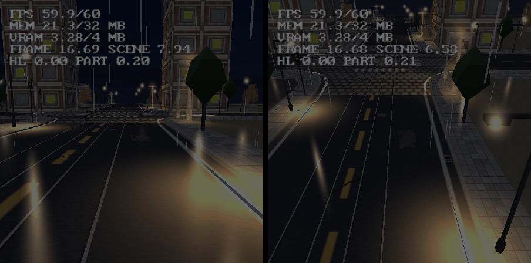
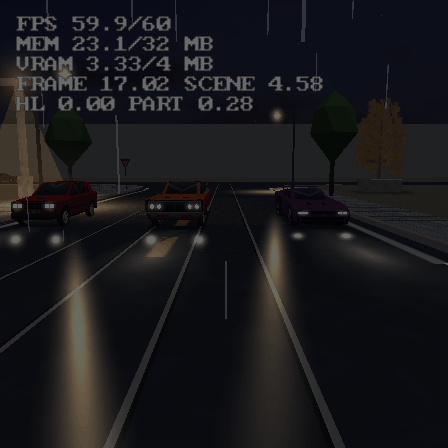
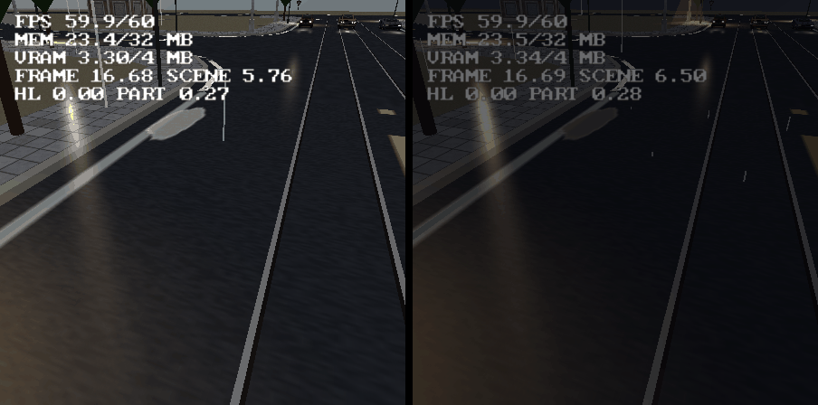

# Weather and lit street lamps

Weather is a per-scene setting, plus a flow node, that makes it rain: drops fall
around the camera, the asphalt turns dark and wet, puddles fill by the kerbs, and
every street lamp and every lit car lamp reflects in the road as a long streak.
The street lamps that
[road furniture](roads.md#street-furniture-format-101) places light the street at
night: each one throws a pool of warm light onto the road under it and glows with
a halo. Both are built the cheap PS2 way. The pools are decals baked on the host,
and the halos and reflections are a few sprites rebuilt each frame. The wet
asphalt is one colour per frame shared by every road chunk.

## Authoring

**Scene > Scene Preferences > Weather and street lamps**:

- **Weather**: *Dry* or *Rain*. This is what the scene starts with on every load.
  A scene that starts in the rain also starts with wet streets.
- **Rain intensity** (0-100%) sets how many drops fall and how wet the roads
  get.
- **Street lamps**:
  - *Auto* (the default) follows the sun of the scene's
    [day/night cycle](day-night-cycle.md). Lamps come on in the dusk, fully lit
    at 3 degrees below the horizon and off at 6 above. A cycle that does not run
    uses the hour it is baked at. A scene without a cycle is daytime, so its
    lamps stay off.
  - *Always on* keeps the lamps lit.
  - *Off* bakes no pools for the scene at all.

The three are scene fields (`weather`, `weatherIntensity`, `streetLamps`, format
107), each written only when it differs from its default, so an untouched scene
saves byte-identical.

**Set Weather** (flow node, *Scene* category) changes the weather at runtime. It
takes three settings:

- *Weather*: Dry or Rain.
- *Intensity*: 0..100%.
- *Seconds*: how long the rain takes to reach the new intensity.

The roads follow at their own pace. They get wet over about 6 s of rain
(`kWeatherSoakSeconds`), and dry over about 40 s once it stops
(`kWeatherDrySeconds`). They never get wetter than the rain makes them. A
0-second transition switches at once, wet roads included, which is the way to set
a scene up from On Start. The node writes straight into the game's weather state,
not through ScriptContext.

[Live Logic](live-logic.md) hot-patches it (`OP_SetWeather`, the native node's
own `weather::request` call), with one condition: the running build must carry
the weather runtime, which is there when some scene rains or some graph already
had a Set Weather at build time. Such a build writes a `weather` line into
`src/gen/livelogic.built`. Without it the editor reports the graph as *Set
Weather (this build has no weather runtime yet)* and the first Set Weather in a
project needs one build.

The lamps that light are the road furniture's lamp lines. A lamp placed as an
ordinary scene object (Big City's are) is still only a model. To light those,
place them as furniture, or use point lights with ground pools
([flashlight.md](flashlight.md), "light pools").

## What runs where

### The pools (host-baked, streamed with the furniture)

`roadlight::bakePools` (`src/roadlight.cpp`) lays one pool under each lamp. The
head is the built-in lamp's unshaded lens, found by its colour among the
instance's own triangles; for an `.obj` lamp it is the furthest reach of the
model's top quarter. The pool is a disc of radius 1.1 x the head's height above
the surface (2..9 units), laid out to 85% of that radius, because the corona
sprite it is drawn with is black beyond.

The disc lies 0.05 above the drawn surface, the highest of the road, junction
patches, pavements and terrain under it. That puts it over the node paint (0.02)
and the road details (0.03). It starts as one quad and is split, up to twice
(4 x 4 cells), only where it cannot follow the surface. The budget is
asymmetric:

- a pool may float up to 0.12 over the street, because the light then lands a
  hair off in screen space;
- it may never dip more than 0.03 under its lift, because hidden light is a
  hole in the pool.

A vertex takes the highest surface within 0.6 of it, so the triangle across a
kerb floats over the road edge instead of diving under the pavement. A cell at
the depth cap that still dips (a kerb runs through it) is raised by its worst
dip. A lamp over flat road is one quad (6 vertices).

The pools ride in the furniture's own table:

- They are extra **`ROAD_FURN` rows** with a `light` column. A light row's
  colour word is its texture coordinate: 12 bits of U and 12 of V
  (`roadlight::packUv`).
- They are chunked by **96-unit cells** (`kPoolCell`). A pool chunk is a handful
  of quads, and every chunk drawn is one more submit.
- They upload through the furniture's own upload block, with one changed line
  set (`roadfurn::uploadSource(true)`). So a streamed project builds them as
  **ordinary furniture items** (`RS_FURN`), and with
  [tables on disk](roads.md#tables-on-disk-format-104) they are pages of
  `bin/roadfile/roads.bin` like any other furniture row.
- On the console a pool chunk is owner -7 with `ProcChunk::lampLight` set. Its
  bag is additive (FIX 128), z-tested, never z-written and unfogged, textured
  with `hud/flare-corona.png` (the beams' and stars' sprite, so no new
  texture). It carries **no per-vertex colour**. Its colour bag points at one
  `roadLampPoolColor_`, so the night level is one colour per frame.
- `renderProcChunks` skips the pools, and `renderRoadLamps` draws them after the
  whole scene. The asphalt under them is then already in the frame, whichever
  order the [interleaved passes](interleaved-passes.md) chose. A pool chunk has
  a frustum reject and a 90-unit draw distance.

`ROAD_LAMPS` (scene_data.hpp, kept in the ELF even with tables on disk) holds
one 10-float row per lamp:

- the scene;
- the head;
- the surface point under the head;
- that surface's least-squares slope;
- the pool radius.

`// scene N: L lit lamps, pools V vertices in C chunks` in `scene_data.hpp` is
the bake's count.

### Halos and wet reflections (per frame, one bag)

`renderRoadLamps` walks the scene's run of `ROAD_LAMPS` and builds one additive
bag through the corona sprite:

- **a halo** for each lamp within 160 units in front of the camera. It is a
  camera-facing quad of half size 0.55 + 0.011 x distance, so a far lamp stays a
  point of light. It is pulled 0.7 toward the camera so its own head does not cut
  it, and fades out past 110 units. At most 64 a frame.
- **a reflection streak** for each lamp within 55 units, when the road is wet.
  It lies on the lamp's surface plane (the baked slope, so no height query
  per frame). It runs along the line from the point under the lamp toward the
  camera and is centred where a mirror would show the lamp: the foot plus
  `d x h / (h + eye)`. It is the corona sprite stretched along that line. On
  screen it reads as the vertical streak under every light on a wet street, the
  classic trick. At most 32 a frame, brightness x wetness.
- **car-light streaks**, described below, in the same bag.

### Car lights on a wet road (per frame, the same bag)

On a wet road every car whose lamps are on mirrors them, the street lamps'
streak at a car lamp's height. The hook is generic: **every vehicle whose lamps
are on** draws, whoever switched them on. That can be the player's toggle, a
definition that starts lit (`headlights`), or traffic switched on at night.

- **The headlights** draw while the lights are on.
- **The tail lamps** draw while the lights or the brake are on. A braking car
  with its lights off still mirrors its brake lights.
- **A broken lamp** draws nothing.
- **A dry road** draws nothing at all.

The geometry is one function in the shared core, `weatherCarStreaks`
(`src/weather_core.inl`). The console calls it and `--vehicle-check` counts its
output. It works like this:

- The lamps are the model's measured lamp boxes (`lampFront`/`lampRear`, from
  the lamp-named materials). Without them, the tail-lamp glow's shape-blind
  guess stands in.
- The streak lies on the road under its axle (the wheels' own contact heights),
  tilted with the car's pitch, so it needs no height query.
- It runs from just in front of the lamp toward the viewer and is centred on the
  mirror point. A low lamp mirrors close to its car, so a car's streak hugs its
  own bumper.
- Only the faces turned toward the camera draw, so a car costs two quads, and
  four at most.

`renderRoadLamps` loops the vehicles (the driver's car first) and puts the
quads into the coronas' additive bag through the corona sprite. The headlights
are warm white, the tail lamps dim red, flaring when braking. The budget is
`kWeatherCarStreakMax` (24 quads a frame, every car together). Cars beyond 45
units draw none. The streaks are dimmer by day: x(0.45 + 0.55 x the lamps'
level).

The block is spliced into `renderRoadLamps` only in a project that has vehicles
and weather (`templates::projectHasWetCarStreaks`). That project also loads and
bakes the corona sprite, even with no street lamps.

### Puddles (host-baked decals, one colour)

A puddle is a [road detail](roads.md#road-details-format-99): a host-baked
decal in an owner -6 chunk, blended and laid kDetailLift over the drawn road.
It is streamed, and stored in `roads.bin` with tables on disk, like any other
detail. Puddles need no new setting:

- **They ride the road's Details density.** A road with details > 0 gets
  puddles in a project with weather (`templates::projectHasPuddles`). A puddle
  is a detail, and the density is the "how lived-in is this street" knob, so a
  second slider would mostly be set to the same value.
- **They are placed last**, after every other decal. A project that gains
  weather keeps every manhole, gully, patch, crack and stain exactly where it
  was. `--vehicle-check` compares the two bakes byte for byte.

Where they go (`roaddetail::build`, a second pass over the roads):

- **Beside the gullies.** A gully is where a street drains, so on a kerbed road
  each gully gets a puddle on its uphill side (35-80% of them, by density).
- **Along the low edge.** At every candidate (one every 9..36 units by density),
  the drawn road's height at both edges picks the lower one.
- **In a wheel rut** now and then, a lane centre +-0.9.
- **Never on a crest.** A spot higher than the mean of the road 5 units either
  way along it sheds the water and is skipped.
- **Clear of everything else.** The details' footprint and clearance test
  applies (never on a node patch, its paint, a spill or another road). So does
  an exact rectangle overlap test against every placed decal (0.1 apart). The
  details' circles would keep a long thin puddle away from the gully that
  drains it.
- **Deterministic** from the road's stable id and `roadDetailSeed`.

The puddles are 1-2.4 units long and 0.5-1 across. The pieces follow the road
surface to 5 mm.

The puddles have their own texture, `res/materials/roads/road-puddles.png`. It
is 64 x 64, four lobed soft-edged puddles in a 2 x 2 grid, and 16 RGBA entries,
so the 4-bit bake keeps it as drawn (2 KB of VRAM).
`roaddetail::ensurePuddles` writes it only when it does not exist, so a repaint
is kept. The shape is in the alpha. The grey is 112 inside and rises to 176
along the shore, a glint at the wet edge that makes the puddle read as water and
not as a stain.

On the console:

- **The rows.** The puddle chunks are extra `ROAD_DETAILS` rows, chunked by
  64-unit cells (`kPuddleCell`), after each scene's decals. They carry a `wet`
  column, and the column exists only in a project with puddles, so every other
  project's table keeps its exact text.
- **The upload.** `dr.wet` sets `ProcChunk::puddle` and picks `ROAD_PUDDLE_TEX`.
  Both lines sit inside the text the road streaming cuts from the details
  upload, so a streamed chunk is built by the same lines.
- **One colour a frame.** `procFinishChunks` points every puddle chunk's colour
  bag at one `roadPuddleColor_`, the wet tint's arrangement. `updateWeather`
  sets it once a frame from `weatherPuddleColor`: dark water, plus a third of
  the sky colour the frame clears with (the grade's compensation taken back
  out), plus at night a warm share of the lit street (x the lamps' level).
  Its alpha follows `weatherPuddleLevel(wetness)`: 0 below 0.35 wetness, full
  (116/128) at 0.85, smoothstepped. The puddles fill after the road is wet
  and empty well before it is dry.
- **Not drawn while dry.** A puddle chunk with alpha 0 is not submitted
  (`renderRoadChunks`). Nothing is rewritten per vertex, ever.
- **Reflections.** A street lamp's or a car's streak that crosses a puddle draws
  over it, because the streaks are drawn after the whole scene. Puddles draw in
  the road pass, so the reflection views see them too.

`// scene N: P puddles (T tried, C on a crest), V vertices in K chunks` in
`scene_data.hpp` is the bake's count.

### Wet asphalt (one colour)

With weather in the project, `procFinishChunks` points the colour bag of every
plain asphalt chunk at one `roadWetTint_`. That covers owner -3, textured, not a
spill or a soft edge, every vertex the uniform 128 grey. `updateWeather` sets
the tint once a frame: `128 - wet x (58, 55, 46)`, darker and a little cooler.
Dry is 128, exactly the old picture. Nothing is rewritten per vertex, ever. The
single colour also takes the colour stream off those bags.

Node paint whose colour is that same grey darkens with the asphalt. Kerbs, rails,
untextured pavements, details and furniture keep their own colours.

### Rain

`updateRain` keeps 240 drops in a 22 x 22 x 14-unit box round the camera. A drop
falls at 17 units/s and drifts a little. Each drop wraps round the camera in all
three axes, so a car at 26 units/s drives through the rain rather than out of it.
Nothing is respawned, there is no RNG per frame and no height query. The drops
are drawn by the particles' VU1 billboard program as one bag, the rain emitter's
streak shape: 3.2 cm wide, 0.75-1.2 long, hanging from world-up, alpha-blended.
The bag's count is `240 x intensity`.

### The state machine (one source, two homes)

`src/weather_core.inl` holds `WeatherState` (the rain ramp and the wetness lag)
and `weatherLampLevel` (the lamps' level from the sun), plus the puddles'
`weatherPuddleLevel`/`weatherPuddleColor` and the cars' `weatherCarStreaks`. The
editor compiles it
(`roadlight::WeatherSim`, `roadlight::lampLevelFromSun`, used by the viewport and
the check). The codegen pastes the same bytes into the generated
`inc/daynight.gen.hpp`, inside `namespace weather` (embedded by CMake, the
`roadstream_core.inl` arrangement). Next to it:

- `SCENE_WEATHERS`, `SCENE_WEATHER_INTENSITIES`, `SCENE_LAMP_MODES` and
  `SCENE_LAMP_STATIC` (the level at a non-running cycle's baked hour);
- `weather::g_state`, `reset(scene)` (called by `loadScene` next to
  `daynight::reset`) and `request()` (Set Weather).

Once a frame, `updateWeather` runs in the game loop after the particles. It:

- ticks the state, with dt 0 while paused;
- finds the scene's lamps;
- computes the lamp level, multiplied by the night grade's compensation
  (`daynight::g_comp`) so emissive light is not darkened twice;
- sets the pool colour and the wet tint;
- moves the rain.

### Zero cost when unused

Everything above is gated:

- a project with **furniture lamps** (in a scene whose lamps are not Off) gets the
  pool rows, `ROAD_LAMPS`, the corona texture load and the lamp runtime;
- a project with **weather** (a scene that rains or a Set Weather node) gets the
  wet tint and the rain;
- weather **plus road details** gets the puddles (their rows, the `wet` column,
  their texture);
- weather **plus vehicles** gets the car-light streaks (and the corona sprite).

A project with neither keeps its exact generated source. That was checked by
`--refresh-gen` of every example: only the Motor District (it has furniture
lamps) changed, plus the format number in showcase's replay header. The hooks are text patches in
`roadlight::patchTemplate`, the details-and-furniture pattern.

## The editor

The viewport previews the same lamps from the same bake (`syncRoadDraws` calls
`roadlight::lampsOf` and `bakePools` over the same surface):

- pools, halos and, on a wet scene, streaks are drawn when the previewed hour is
  night. That is the scene's cycle at its slider time, or the Ambience Editor's
  previewed preset, or the scene's lamps set to *Always on*;
- a wet scene's asphalt and junction patches are drawn with the console's tint;
- a wet scene's puddles are drawn from the same `roaddetail::build` (always
  baked in the viewport, because they are placed after every other decal and so
  change nothing), coloured by the same `weatherPuddleColor` over a sky that
  runs from a day blue to night with the lamps' level.

Cars do not exist in the viewport, so it draws no car-light streaks.

Two things the preview does not show. It does not reproduce the grade's
compensation, because the editor has no grade to cancel. It also does not show
rain, which only exists at runtime. The preview was compiled and wired, not
looked at: the editor GUI was not launched for this change (see the backlog).

## What it costs

Measured in PCSX2 (emulated EE timing, so rough). The scene is the Motor District
main scene at night (the pause-menu night, the district's own spotlights on), with
a frozen walker on Garage boulevard at (-3, -35) looking north (eye 2.2, pitch 8)
and interleaving pinned off. Each arm is three `--profile-frame` captures:

| arm | `Road_lamps` | `Rain` | `Total` | HUD MEM | HUD FPS |
|---|---:|---:|---:|---:|---:|
| lamps Off (no pools, no lamp runtime) | - | - | 10.6-12.0 ms | 21.2 MB | 59.9 |
| lamps on, dry | 0.52-0.53 ms | 0.03 ms | 12.0-12.6 ms | 21.5 MB | 59.9 |
| lamps on, rain | 0.72-0.78 ms | 0.12-0.13 ms | 12.1-13.7 ms | 21.3 MB | 59.9 |

- **The bake**: 50 lamps, 3 342 pool vertices in 7 chunks (67 a lamp on the
  district's rolling streets). EE RAM grows about 0.3 MB.
- **The frame**: the lamp row is about +0.5 ms, and +0.25 ms more with the wet
  streaks. Rain is about +0.1 ms. `Total` moves within its own noise and the
  frame rate does not move. The row's bracket drains the pipeline (`costEnd`), so
  it includes the GS filling the additive quads near the camera. How much of it
  is EE work was not split.
- **Big City** (1.4 km, streamed roads, tables on disk) is tested with lamps added
  as furniture every 25 units (alternating sides) on its 110 ordinary roads and a
  night cycle at a baked hour, in the Ravager at spawn:

  | | HUD MEM |
  |---|---:|
  | no furniture lamps | 18.5 MB |
  | lamp posts with lamps Off | 19.7 MB |
  | lit | 20.2 MB |

  So the pools and `ROAD_LAMPS` cost +0.5 MB. The bake is 1 404 lamps and
  58 248 pool vertices (41 a lamp on the flat city), and the pools add 8 300 of
  the 93 063 resident road vertices at spawn. `Road_lamps` reads 0.60-0.63 ms
  (it walks all 1 404 lamps for the halos), the HUD reads 59.9 FPS, and
  `roads.bin` grows from 9.4 to 10.4 MB.

**Puddles and car-light streaks (2026-10-03)** were measured as an editor A/B:
the same night-and-rain fixture (`"weather": 1`, `"streetLamps": 1`, the
`district-night` default 1, a frozen walker, interleaving off) built once by the
editor before this change and once after, three `--profile-frame` captures per
arm:

| pose | arm | `Roads` | `Road_lamps` | `Total` | HUD MEM | HUD VRAM |
|---|---|---:|---:|---:|---:|---:|
| (1.5, -62) facing the parked Ravager, eye 1.6: traffic and the Ravager lit, one puddle | before | 1.01-1.13 ms | 0.42-0.44 ms | 8.6-9.0 ms | 23.0-23.3 MB | 3.32 MB |
| | after | 1.02-1.14 ms | 0.46-0.52 ms | 8.3-9.0 ms | 23.1-23.4 MB | 3.33 MB |
| (0, -46) up Garage boulevard, eye 5, pitch 26: several puddles | before | 2.12-2.28 ms | 0.68-0.70 ms | 12.6-13.1 ms | | |
| | after | 2.30-2.34 ms | 0.72-0.86 ms | 12.1-14.2 ms | | |

- **The bake**: the district (details 0.8 on its twelve kerbed streets) gets 70
  puddles from 236 candidates (36 on a crest), 1 536 vertices in 17 chunks. The
  other 255 decals are unchanged.
- **The frame**: puddles cost about +0.1-0.2 ms in `Roads` with several puddle
  chunks in view (each chunk is one blended submit), and nothing while dry. The
  car streaks cost about +0.04-0.1 ms in `Road_lamps` for the half dozen lit
  cars. `Total` moves within its own noise, and the HUD stays at 59.9 FPS. EE
  RAM grows about 0.1 MB, and VRAM by the 2 KB puddle texture.

Nothing here was measured on a physical PS2.

## Limits

- A puddle mirrors no image: it is one colour (water, the sky colour, the lit
  street) with a glint along its shore. The reflections in it are the streaks
  that cross it. At night it reads as a faint warm sheen, best where a streak
  lands in it.
- Puddles exist only on roads with details > 0 (they ride that density), never
  on a node patch, and they do not change grip.
- Car-light streaks are flat on the road plane under each axle. They do not
  follow a kerb or a crest within their 1-4 units, and a car beyond 45 units
  draws none. The car's own headlight pool (docs/vehicles.md) is unchanged and
  ignores the wetness.
- No rain splashes and no spray behind cars. Not built: the tyre smoke pool
  (docs/particles.md) could carry a spray puff per wheel, but it is a
  per-definition pool that every car's smoke shares, and nothing was measured.
- The halo/streak pass walks every lamp of the scene each frame. That is fine at
  hundreds of lamps; a city of many thousands wants the lamps bucketed by cell.
- Pools do not land on objects and do not light the models. The lamps are not
  dynamic lights.
- Reflection views (the env probe) draw the wet tint and the puddles, because
  both are in the road pass. They do not draw pools, halos, streaks or rain.
  Those are per-frame bags built for the main camera (camera-facing quads and
  streaks toward that eye), so a reflection view would need its own rebuild per
  view. That is not cheap, so it was left out.
- Rain falls through bridges and roofs. There is no occlusion test.
- The drawn height of a pool beside a kerb floats up to the kerb's height over
  the road edge (see "The pools").
- Live Logic can hot-patch Set Weather only in a build that already carries the
  weather runtime (see "Authoring").

## Verification

`--vehicle-check` **"wet roads and lamps"** checks the following:

- **Lamps and pools:**
  - every furniture lamp becomes a light, its head about 5.2 above the surface;
  - every pool vertex lies kPoolLift over the drawn surface and never under it;
  - no sample of a pool sinks under its lift;
  - every pool is centred under its lamp, with UVs spanning it;
  - a lamp over flat ground is one quad;
  - chunks hold whole pools, within budget, one 96-unit cell each;
  - the bake is deterministic bit for bit, and the packed UV round-trips.
- **The weather state machine:** the rain ramps linearly and the roads soak
  after it, then dry slowly; 0 seconds switches at once; the intensity is
  clamped; dt 0 holds; the lamp level is off by day, on at night and monotone
  through the dusk.
- **Puddles** (the road-details fixture, a kerbed T with zebras and a kerbless
  cross street on rolling ground):
  - puddles are placed, and none without weather;
  - every other decal is byte-identical with and without them;
  - the bake is deterministic bit for bit;
  - every sample of every puddle lies on its own road, kDetailLift over it, on no
    node patch and no paint;
  - none sits on a crest, most hug the kerb or edge, and on kerbed roads at
    least a quarter lie beside a gully;
  - the chunks are whole and within budget, with UVs inside the texture;
  - the texture has 16 RGBA entries at most;
  - the level and alpha are 0 below 0.35 wetness and full above 0.85, and the
    colour is lighter under a day sky than at night.
- **Car-light streaks** (the core's `weatherCarStreaks`):
  - a camera ahead gets 2 headlight streaks, one behind 2 tail-lamp streaks,
    lying on the road between the lamp and the eye;
  - none on a dry road, with the lamps off, with broken headlights or 80 units
    away;
  - braking with the lights off gives the 2 brake streaks;
  - a model with no measured lamps falls back to the guess;
  - 20 lit cars ask for 40 quads against the 24-quad budget;
  - the splice lands only with vehicles and weather, and leaves no marker
    behind either way.
- **Live Logic**: a build with weather writes and reads back its `weather` line,
  and Set Weather compiles to `OP_SetWeather` with its three values.
- **The codegen:**
  - lamps generate the pools, the table and the runtime;
  - a streamed project builds the pools with its furniture items, and every
    streaming anchor holds;
  - with tables on disk, every furniture row, pools included, is a `roads.bin`
    item;
  - rain generates the tint and the drops;
  - rain on a road with details generates the puddle rows (`wet` column), the
    texture, the shared colour and the dry skip; a streamed project builds them
    with their detail items, and with tables on disk every detail row, puddles
    included, is a `roads.bin` item;
  - Set Weather compiles to a request;
  - no lamps and no weather generates none of it (details without weather get no
    puddles and the old three-column rows), and lamps Off bakes no pools;
  - the game header carries the core with no block comments.

In PCSX2 the Motor District was checked at night, at night in the rain and with a
Set Weather (rain, 100%, 8 s) on On Start, which rained and soaked the road after
25 s. Big City was checked as above.

The puddles and car-light streaks were checked in PCSX2 on the night-and-rain
fixture above (the two pictures, the A/B table). A build with Live Logic on
compiled the interpreter's Set Weather case for the console. A Set Weather
actually patched into a running game was not exercised, because that needs the
editor GUI's Live Logic tick.
