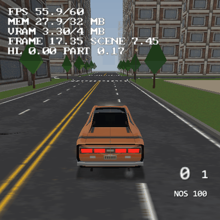

# Big City

A procedurally generated city, about 1.4 kilometres across, built to find out how
TyraX and the PS2 behave on a map this large. Open `big-city.tyra` in TyraX and
build the project. You start in the Ravager next to the central plaza; drive
anywhere inside the ring road (Square gets you out).



It fits in the EE's 32 MB because almost nothing in it is resident at once:
the roads stream by distance ([road streaming](../../docs/roads.md#road-streaming-format-102),
260 units, their baked rows [read from a file](../../docs/roads.md#tables-on-disk-format-104)
piece by piece instead of sitting in the ELF) and the buildings, trees, lamps and parked cars live in 200-unit
district layers that load and unload around the car
([auto-streamed layers](../../docs/streaming-layers.md#a-city-districts-plus-road-streaming)).
The first version of this city, 1 km across with everything resident, used
27.9 MB and was the largest that fitted.

## What is in it

Everything is written by [`authoring/generate-city.py`](authoring/generate-city.py)
from one seed. With the shipped knobs:

- **120 roads, 56 km of centre line**: a perturbed grid of fourteen avenues
  and streets per axis (4-lane straight avenues, 2-lane gently wobbling streets),
  a closed superellipse **ring road** (6 lanes, radius 700), a **diagonal
  boulevard** whose every grid node is a six-armed node and which carries a
  **double tram line**, a shorter second diagonal ending in a five-armed node, a
  sinuous **river boulevard** crossing the grid at oblique angles, mid-block
  **lanes** (T's at both ends, or dead ends with one T), four **spurs** that
  leave the ring and split into **Y forks** at the map edge, closed cobble
  **park paths**, and a **double-track railway** arc outside the ring: Spur 2
  crosses it at a level crossing and Spur 1 flies over it on a **bridge** with
  piers.
- **Kerbs and road details** (manholes, gullies, patches, cracks) on every
  road, **pavements** along every lane and the diagonals, zebra crossings on
  downtown roads; stop/edge-line paint downtown only. Until the road tables
  moved out of the ELF (format 104) kerbs, pavements and details were on the
  *core* roads only (`KERBS_DOWNTOWN_ONLY`).
- **2 420 objects** (the roads among them): 1 462 buildings (lean
  Kenney-derived shells plus generated stacked towers up to 80 m downtown,
  tapering to lofts and workshops outside), 176 block plinths, 449 trees (parks,
  plaza, core avenues), 145 street lamps, 28 parked cars, 21 benches, the plaza,
  the player and the car, in **51 district layers**.

All the road features come from [docs/roads.md](../../docs/roads.md). The
buildings, trees and benches are the Motor District's CC0 Kenney assets
([`res/models/urban/LICENSE.txt`](res/models/urban/LICENSE.txt)); the stacked
towers, the 14-triangle trees and lamp and the 36-triangle parked car are
written by the generator. The Ravager is copied from
[vehicle-playground](../vehicle-playground/README.md).

## Regenerating

```sh
python authoring/generate-city.py --editor ../../build/tyrax-editor.exe
tyrax-editor --build examples/big-city
```

`--editor` also makes the 6-lane ring texture with `--road-texture` and runs
`--resave`, so every file is exactly what the editor would write. The script is
deterministic: same seed and knobs, same files. It only rewrites the `main`
scene's objects, its terrain and layer list and a handful of settings (fog,
view distance, road streaming, batching, lighting); vehicles, input, menus and
fonts in the `.tyra` are left alone. Every knob is documented at the top of the
script and can be overridden for one run, e.g. `--set GRID_LINES=10 --set
RING_RADIUS=500.0 --set TERRAIN_SIZE=1340` for the 1 km city. `road_object()`
is the one place a road's fields are written.

## Optimisation, up front

- **Streaming is the memory budget.** `ROAD_STREAM = 260` (the project's road
  stream radius) and `STREAM_LAYERS` with `DISTRICT_SIZE = 200` and
  `STREAM_MARGIN = 150`: each district's zone reaches 292 units from its centre
  and unloads at 344. Set `ROAD_STREAM=None` and `STREAM_LAYERS=False` and the
  city no longer fits (the 1 km one does, at 27.9 MB).
- **Fog and draw distances** are the LOD. Fog 90 to 220 units; buildings
  drawn to 230 (downtown towers 300, for the skyline), trees 110, lamps 70,
  parked cars 80, benches 55. Kerb, rail and detail chunks keep their own short
  draw distances; the roads stream at 260, past the fog.
- **Terrain streaming**: a 240-unit chunk ring, terrain LOD from 110, and a
  20-unit grid (the city is flat, so more cells would only cost RAM).
- **Cheap props**: every instanced vertex costs EE RAM (below), so the street
  trees and lamps are 14 triangles each instead of the 152/192 of the Kenney
  ones (`LOWPOLY_PROPS`), and street furniture follows the core roads only.
- **Off**: static batching does nothing here (layered objects are never
  batched: `Static batching: 0 objects in 0 batches`), conservative occlusion
  culling (measured on the 1 km city: 3.6 ms to build the visibility buffer,
  nothing saved, because the occluders, the buildings, are themselves never
  culled) and baked GI/AO/shadows (bake time on 2 400 objects).

## Measured (PCSX2, 2026-10-03)

The pose tables and the streaming paragraph below were taken on the city with
kerbs on the core roads only and the road tables in the ELF (1.172-1.173). The
shipped city (kerbs everywhere, tables on disk) is under **Tables on disk**
further down: about 0.8 MB more at spawn than these, after the file took
1.7 MB off.

Debug build, NTSC progressive, HUD numbers after the scene settled. The parked
poses are a frozen walker (`POSE`, eye 1.8, heading 0) with `interleavePasses`
pinned off and three `--profile-frame` captures each (the profile drains the
pipeline, so its Total is attribution, not frame time).

**The shipped 1.4 km city:**

| pose | HUD FPS | SCENE ms | profile Total ms | `Roads` ms | MEM |
|---|---:|---:|---:|---:|---:|
| car at spawn, downtown avenue | 59.9 | 4.82-5.00 | | | 19.9-20.3 / 32 MB |
| downtown (-42, -100) | 59.9 | 6.92 | 14.2-15.0 | 2.3-2.6 | 20.7 |
| midtown (-326, -100) | 59.9 | 4.77 | 11.9-13.4 | 1.6 | 19.0 |
| ring road, city edge (-697, -100) | 59.9 | 2.36 | 6.9-8.0 | 0.9 | 15.8 |
| raised, eye 40 over downtown, 12 degrees down | 59.9 | 5.96 | 14.3-17.3 | 2.2 | 19.9 |
| driving south from spawn, 26 units/s | 48-58 | 7.5-8.1 | | | 20.4-21.6 |

**The same 1 km city, before and after** (same seed, `GRID_LINES=10`,
`RING_RADIUS=500.0`, `TERRAIN_SIZE=1340`, no layers):

| | MEM at spawn | MEM driving | downtown FPS / SCENE | downtown `Roads` | downtown `Total` |
|---|---:|---:|---:|---:|---:|
| everything resident | 27.9 MB | 28.6-29.1 MB | 30.0 / 12.76 ms | 8.5-8.6 ms | 17.2-18.1 ms |
| roads streamed (260) | 21.8 MB | 20.8-22.7 MB | 59.9 / 7.23 ms | 3.1 ms | 12.8-13.9 ms |
| roads and districts | 17.8 MB | 17.9-18.7 MB | | | |

(The downtown row of the first table in the old README read 59.9 FPS with
interleaving on `auto`; pinned off, as here, the road pass waits for VU1 and
the unstreamed city drops to 30.)

**Streaming while driving** (`ROADSTREAM` lines): the 1.4 km city keeps 465 of
its 2 377 road items (35 814 vertices, 288 KB of height index) resident at
spawn, 120-330 at the city edge. Built and dropped 200-540 items per 150 busy
frames, about 1.2 ms of EE time a frame on average, the worst frame 4.1-5.6 ms
(one dense strip chunk; docs/roads.md "Road streaming", Limits). The car's
wheels stayed on the asphalt the whole way (`VEHCONTACT ... roadlift1000
119-140`), and districts load and unload around it (`LAYER 24 load`, `LAYER 18
unload`, ...).

**Boot**: the road plan takes 1.4 s and the first ring 0.4 s (`ROADSTREAM
plan ... ms 1376`, `ROADSTREAM load ... ms 443`, reading 588 items / 927 KB of
road rows in 103 ms); the ELF is 5.1 MB plus a 6.0 MB `bin/roadfile/roads.bin`.

**Tables on disk** (format 104, 2026-10-03, the same 30 s R2 drive from spawn
for every arm, HUD readings; docs/roads.md "Tables on disk"):

| configuration | ELF + road file | MEM spawn | MEM driving | FPS driving | worst stream frame |
|---|---:|---:|---:|---:|---:|
| core-road kerbs, tables in the ELF (the 1.173 city) | 6.86 MB | 18.2 | 16.6-18.9 | 40-60 | 5.5 ms |
| core-road kerbs, tables on disk | 4.92 + 2.0 MB | 16.5 | 14.9-17.3 | 39-60 | 5.4 ms |
| **shipped: kerbs and details on every road** | **5.10 + 6.0 MB** | **19.0** | **16.7-19.8** | **38-60** | **6.1 ms** |
| plus pavements on every street | 5.19 + 16.4 MB | 22.5 | 20.1-26.2 | 32-60 | 6.3 ms |

The reader kept up at 26 units/s: 4-10 item-frames late per 150 busy frames
(all in the first seconds), 0.2-0.7 ms of reader time per item, 8.7-15.7 MB/s
for the synchronous reads at load (PCSX2 host:).

The acceptance lines from `bin/log.txt`:

```
ROADFILE open host:/roadfile/roads.bin items 4488 KB 5893
ROADS scene 0 chunks 2084 vertices 212514 (streamed)
ROADSTRIP scene 0 strips 1 packages 3739 triangles 107907
ROADSTREAM plan scene 0 items 5495 cells 29x29 radius 260 keep 300 spill vertices 0 ms 1376
ROADSTREAM load resident 708/5495 vertices 58833 index KB 385 ms 443
ROADFILE load reads 588 KB 927 read ms 103 KB/s 8952 errors 0
```

## Limits found

**EE RAM is the wall, long before frame time.** An out-of-memory scene load is
a black screen after `VEH controls card`, with nothing in `bin/log.txt`; only
the EE console says `std::bad_alloc` (run a PCSX2 of your own with `-datapath
<dir> -logfile <dir>\emulog.txt`, so you do not switch logging on for every
other emulator on the machine). The emulator's `MEM` readout, by configuration:

| configuration | MEM |
|---|---:|
| 1 km, everything resident (the first version) | 27.1-27.9 MB |
| 1 km, roads streamed | 20.8-22.7 MB |
| 1 km, roads and districts streamed | 17.8-18.7 MB |
| **shipped: 1.4 km, roads and districts streamed** | **15.8-21.6 MB** |
| 1.4 km, kerbs and furniture on every road (4 946 objects, 212 514 road vertices, 11.8 MB ELF) | 30.7 MB at spawn |
| 1.4 km, plus pavements on every street (659 334 road vertices, 20.8 MB ELF) | out of memory at load |
| **format 104, tables on disk**: kerbs and furniture on every road (4 946 objects, 6.0 MB ELF) | 26.0 at spawn, 27.7 driving, 30 FPS downtown |
| format 104: plus pavements on every street (730 014 road vertices, 6.1 MB ELF) | 29.5 at spawn, `std::bad_alloc` seconds into the drive |
| format 104: pavements and kerbs everywhere, core-only trees and lamps (2 420 objects, 5.2 MB ELF) | 22.5 at spawn, 26.2 driving, 32 FPS downtown |
| 1.4 km, everything resident | out of memory (the first version's finding) |
| **1.173, shared model geometry**: shipped 1.4 km city, downtown walker / car at spawn / driving | **18.4 / 18.2 / 17.0-19.1 MB** (19.9 / 19.6 / 18.0-20.7 with `instanceSharing` off) |

The last row is [instance sharing](../../docs/instance-sharing.md): a
streamed layer is never batched, so every resident instance used to carry its
own world-space copy of its model; now it draws the model's one shared mesh
and keeps only its (pooled) colours. About 1.5 MB at every pose, the same
frame time and picture.

What that works out to:

- **The ELF was the next wall, and is gone for the roads.** Streaming freed
  the expanded runtime copies, but the baked road tables were `.rodata`:
  kerbs and furniture everywhere took the ELF from 6.9 to 11.8 MB, pavements
  everywhere to 20.8 MB. Since format 104 they are read per item from
  `bin/roadfile/roads.bin`, and the ELF stays at 5-6 MB whatever the roads
  carry. The wall is now the RESIDENT road (pavements everywhere: ~120 000
  resident road vertices downtown) and the per-object cost of 4 900 objects.
- **A static object cost roughly 70-110 bytes of EE RAM per vertex it draws**
  before 1.173, whatever the object was: the 28-triangle tree about 9 KB, a
  22-triangle building about 6 KB, because each instance kept its own expanded
  vertex, colour and UV arrays (and a batch a merged copy with up to as much
  slack again). Since 1.173 an instance draws its model's one shared mesh and
  keeps only its lit colours, pooled by content (351 arrays for 667 parts at
  the downtown pose); what is left per object is bookkeeping - about 650 bytes
  per mesh part and a kilobyte per object (docs/instance-sharing.md). Layers
  are what make even that affordable: only the districts near the car hold
  theirs.
- **Road surfaces cost about 60 bytes per vertex** while resident, plus the
  baked tables. Road streaming keeps about a third of the network (at 260
  units) and its per-chunk height index costs ~8 bytes per resident vertex.
- **A `.glb` placed as a plain model object loads as an animated DynamicMesh,
  once per instance** (`Frames count should be greater than 1 for DynamicMesh`
  in the log). 143 parked cars using the vehicles' far `.glb` models hung the
  first boot after 77 of them; the parked car is a 36-triangle OBJ now.
- **The road height index held only 1 024 proc chunks** in the first version
  (10 bits of chunk index); now 13/19 bits, and a streamed project indexes
  each chunk on its own anyway.
- **Kerb chunks are small**: at 32-unit cells, kerbs on every street were 1 210
  chunks of about 80 vertices each, and every chunk is a separate submit and
  allocation.
- **Zones must be sized from the draw distances**: 300-unit districts with a
  160 margin (the first try, with every road still resident) kept most of the
  city resident at the centre and ran out of memory at 1.4 km. 200 with 150,
  plus road streaming, works.

## Not verified

- A physical PS2 (emulator only): the streaming frame cost and the
  unbatched-city submit count are PCSX2 numbers.
- Driving every street: the pad drives were straight runs down an avenue (and
  a turn that ended in a tree); the parked-car freeze has no far AI car to
  freeze in this city.
- Pop-in of a far building as its district loads: the zone reaches 292 units
  and the buildings draw to 230 through fog that ends at 220, so a building at
  a district's far corner can appear inside the fog band. Not looked for.

## Files

| File | What it is |
|---|---|
| `authoring/generate-city.py` | The generator and every knob |
| `objects/*.json`, `big-city.tyra` | Its output (plus the vehicle, input and menu setup in the `.tyra`) |
| `res/models/urban/city-*.obj` | Generated towers, trees, lamp and parked car |
| `res/materials/roads/` | Seeded road, pavement and rail textures, plus the generated `road-6lane` |
