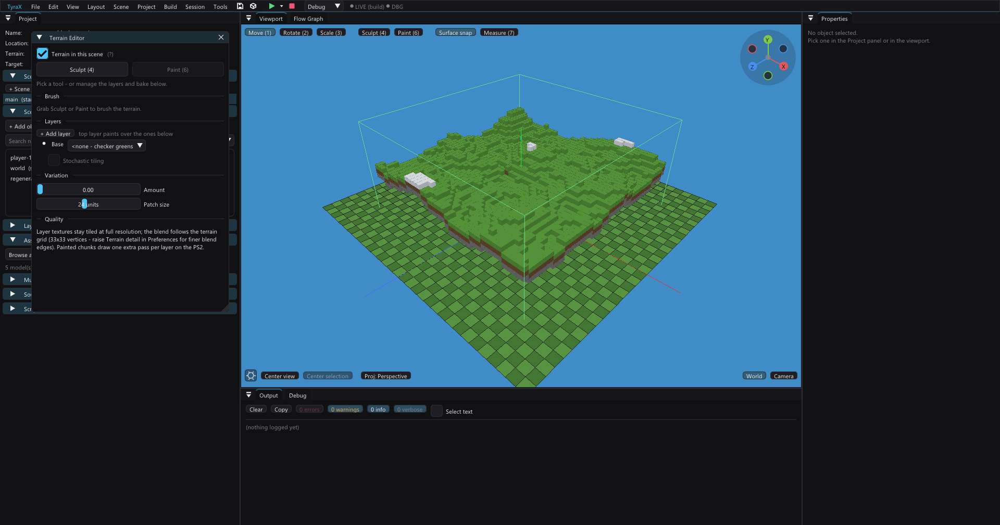

# blocks-terrain example

A world made of cubes, **generated on the PlayStation 2 itself** — nothing on
the disc except the graph that describes it and five one-cube models.

Open `blocks-terrain.tyra` in the editor and Build & Run (`F5`), or build
headless: `tyrax-editor.exe --build <this folder> --run`.



**TRIANGLE builds a new world** — not a reload. The graph runs again on the EE
with a fresh seed; the old geometry is thrown away and a different landscape
merged in its place, in a fraction of a second.

## What it demonstrates

[Runtime procedural generation](../../docs/procedural-runtime.md) — a Procedural
volume in **Runtime** mode, compiled into the game and evaluated by the console:

| | |
|---|---|
| block size | 1.5 units (deliberately shorter than the 1.8 player) |
| lattice | 44 × 44 columns, up to 14 blocks tall |
| blocks emitted | ~2 400 |
| chunk meshes / draw calls | ~9 (24-unit chunks) |
| PS2 frame rate (PCSX2, software renderer) | **50 FPS** — the PAL cap |

The interesting number is the missing one: a 44 × 44 × 14 field is 27 000
cubes, and 2 400 of them exist. The rest are never generated at all — nothing
can see them.

The cubes also **occlude each other**: corners walled in by neighbours darken,
open ones stay bright. That comes out of the same solid-cell field the walker
stands on, computed once per generation, and it is what stops a landscape of
untextured cubes reading as flat cardboard — turn *Ambient occlusion* off in
*Tools > Ambience Editor* and the whole world goes matte. See
[ambient occlusion](../../docs/procedural-runtime.md) for how it works and what
**AO strength** does to it.

## How the graph works

`Blocks Fill` builds the columns from four octaves of Perlin noise and emits one
point per **visible** block, each carrying `depth` (0 = the top of its column),
`height` (world Y) and `faces` (a 6-bit mask of which of its faces a neighbour
doesn't cover). Five ordinary `Filter by Attribute` branches decide what each
block is made of, and two `Merge Points` put them back together:

```
Blocks Fill ─┬─ depth 0, height ≥ 18 ── Pick Asset (snow)  ─┐
             ├─ depth 0, height ≤ 6  ── Pick Asset (sand)  ─┼─ Merge ─┐
             ├─ depth 0, in between  ── Pick Asset (grass) ─┘         ├─ Merge ─ Output
             ├─ depth 1              ── Pick Asset (dirt)  ─┐         │
             └─ depth ≥ 2            ── Pick Asset (stone) ─┴─ Merge ─┘
```

Nothing in that chain is block-specific — it's the same filter/pick vocabulary
a forest uses, reading two attributes one source node happened to write. The
merge honours the `faces` mask, dropping any triangle whose outward normal
points at a face a neighbour covers: on flat ground a block costs two triangles
instead of twelve.

## Walking on it

The block field is also the world's **collision**: one 32-bit word per column,
bit *i* = level *i* is solid. The walker reads its floor, ceiling and walls out
of that. Exactly one block is climbable in a stride — which is why the cubes
are 1.5 units under a 1.8-unit player; with 2-unit cubes every step up would be
a wall.

The flat terrain underneath is the bedrock the lowest layer sits on; the blocks
are what you actually stand on.

## The files

- `build-scene.py` — authors the volume, its graph and the regenerate button
  into the `.tyra`. A graph this size is unpleasant to build by hand in the
  node editor and impossible to review as JSON; this script is its readable
  form. Re-run it after `tyrax-editor --new` to rebuild the example from
  scratch.
- `res/models/block-*.obj` + `blocks.mtl` — five flat-coloured **unit** cubes.
  Unit, because the procedural instance scale is the block size directly; flat
  colours, because a block world is thousands of merged faces and a texture
  would sit in GS VRAM forever for no gain at this scale.

## Things worth trying

- Raise **Emit depth** on the Blocks Fill node from 3 to 5: the cliff faces
  fill in, and the instance count climbs.
- Set **Relief** to 0 for a flat slab, or **Feature size** to 12 for badlands.
- Switch the volume to **Baked** in the Procedural window and press *Bake now*:
  the same graph, written to disc as ordinary chunk meshes. You lose the fresh
  world per run and the block collision; you gain a scene that costs the
  console nothing at load.
