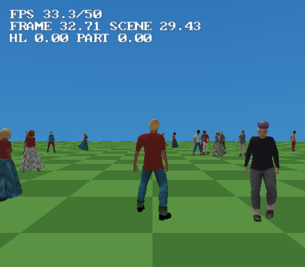

# character-generator example

Six people, all made by *Tools > Character Generator* - the
[character generator](../../docs/character-generator.md) end to end: bodies,
faces, skin and makeup from sliders, clothes and hair from the CC0 wardrobe,
motion-captured clips (the women move with the feminine *Movement style*, the
men with the masculine one - Auto, from Gender), and nothing hand-made.

Open `character-generator.tyra` in the editor and Build & Run (`F5`), or build
headless: `tyrax-editor --build <this folder> --run`.

## What to do

The game opens in the **Character Creator**: dress `hero` before you play.
Up/Down picks a row, Left/Right changes it - **who** (the hero, her, or the clerk), four colour
looks, five hairstyles, three hats, three sets of glasses, or none - L1/R1
turn them round, Cross keeps it and Circle puts back what they wore. **Select** opens it again
any time. That is the player's own flow graph (On Start and On Button Select
into a Character Creator node), and `hero.chargen.json` lists the choices in
its `"options"` (docs/character-generator.md, "In-game character creator").

The **CHARACTER** row swaps the whole model, between three: the hero, the
same person as a woman, and the clerk. `"bodyChoice": true` in the hero's
recipe makes the generator write `hero-alt.glb` beside `hero.glb` (same vest,
clothes, options and colour looks); the clerk is on the Player's *Characters
to choose from* (Inspector) - an ordinary model of the cast, with no creator
options, so her other rows show `-`. Only one body is in memory: a choice is
loaded in the background (the row shows it with a spinner while the old one
keeps idling), then swapped in and the old one freed; it sticks across scenes
and in saves (docs/character-generator.md, "Choosing a character").

The screen itself is the `character` **menu**, picked in the node's *Menu*:
restyle it in *Tools > Menu Editor* like any other menu - stylesheet, labels,
row order, position (docs/character-generator.md, "The creator as a menu").
Clear the node's *Menu* and you get the built-in screen instead.


You **are** a generated character. The third-person camera sits behind `hero`:
walk (left stick) and he walks, push to full tilt and he runs, let go and he
idles. Nothing is scripted - `hero.glb` contains clips named `idle` / `walk` /
`run` / `jump`, which is what the generated game's third-person locomotion
looks for.

The five bystanders are ordinary **Model** objects, each autoplaying a
different clip from the library: the dockhand stands with his arms folded, the
kid dances, the punk talks with his hands, the clerk and the elder idle.
Walk up to any of them and they look at you, blinking as they do; the punk's
jaw moves with his talking clip, the kid's ponytail and the elder's long skirt
swing. Nothing scripts that either: it is the generated rig's face and spring
bones (docs/character-generator.md, "A living face", "Spring bones").

Behind them stands a **crowd of eight commuters**: one character
(`commuter.glb`) in six colour schemes, made with the generator's *Crowd...*
button. They share one mesh, one atlas and one skin per frame; each colour
scheme is a 1 KB palette (`commuter_skin.v<k>.png` beside the model, fitted at
build time - docs/character-generator.md, "Crowds"). Pick one and look at
*Palette variant* in Properties. They do not stand still: each one has
*Wander* set, so they walk between random spots near where they were placed,
stop a while and pass each other on the right
(docs/navigation-ai.md, "Wandering").

## The crowd scene

Press **R2** for the second scene, `crowd`: a plaza of 18 pedestrians - the
commuter, a shopper and a pensioner, six of each in six colour schemes -
walking between random spots, stopping, passing each other on the right.
Three models, three atlases and a 1 KB palette per person; R2 goes back.



It is also the example's performance case (docs/character-generator.md,
"Cost on the console"): every walker of a model walks in step so they share
one skin per clip, only the five nearest characters keep a live face, each
person has a 4 m mesh LOD, and the project turns on mesh LOD (6 m) and
animation LOD (10 m). All three are built on the generator's **crowd body**
(`"detail": 0` in their recipes - ~1600 triangles naked against the cast's
~3300). Measured in PCSX2 (debug build): ~20 ms a frame walking through the
crowd, 44 FPS, and four minutes of walking leave the EE at 22 of 32 MB.

The hero stays on the **standard** body here. The hero body (`"detail": 2`,
~9500 triangles) works as the player - but in this scene, with 18 skinned
pedestrians, a few minutes of walking ran the EE's 32 MB out (see
docs/character-generator.md, "Detail"), so the example does not ship it.

## Your own clothes: the hero's puffer vest

The hero's orange vest is not from the kit: it is a garment made outside the
editor and imported with *Outfit > Your own clothes* (docs/character-generator.md,
"Your own clothes"). `tools/make_puffer_vest.py` builds it in Blender on the
generator's reference man (`tyrax-editor --chargen-reference <dir>`): his
torso without the arms, pushed out in quilted bands, a stand-up collar, a zip
- 1544 triangles and a 256 texture, written to
`res/models/characters/custom/puffer_vest.obj` / `.png`. The hero's recipe
wears it in the **over** slot, on top of the kit's polo:

```json
"customWear": [{"mesh": "res/models/characters/custom/puffer_vest.obj",
                "texture": "res/models/characters/custom/puffer_vest.png",
                "slot": "over", "color": [-1,-1,-1]}]
```

It follows the hero's muscular build (the conform pass keeps it out of the
body), sits through every clip and colour look, and costs its triangles in
the accessory part. To remake it:

```
blender -b --factory-startup --python tools/make_puffer_vest.py -- reference-male.glb res/models/characters/custom puffer_vest
```

## The cast

Every character has its **recipe** beside it: `res/models/characters/<name>.chargen.json`.
*Open recipe...* in the generator loads one for editing; the command line
rebuilds the model from it, byte for byte:

```
tyrax-editor --chargen res/models/characters/hero.chargen.json res/models/characters/hero.glb
```

| | Body | Wears | Atlas | Triangles |
|---|---|---|---|---|
| `hero` | man, 1.82 m, muscular | an orange **puffer vest of his own** over a polo (recoloured navy), cargo pants, boots, short hair - plus 7 creator options and 3 colour looks | 256 | ~6100 as worn (11 753 in the file: the vest, every option, its hat twin and scalp cap) |
| `clerk` | woman, 1.65 m, mostly East Asian | trouser suit (recoloured navy; the blouse and scarf keep theirs), T-bar shoes, square frames, a bun, lipstick | 128 | 4401 |
| `dockhand` | man, 1.76 m, older, heavy | work overalls, ankle boots, newsboy cap, buzz cut, stubble | 128 | 4368 |
| `kid` | child, 1.30 m | striped T-shirt (pattern), jean shorts, canvas shoes, ponytail | 128 | 4211 |
| `punk` | man, 1.78 m | casual outfit, black hero boots, 3D glasses, green messy hair | 128 | 4212 |
| `elder` | woman, 1.58 m, 90 | sweater, long skirt, flats, round glasses, grey bun | 128 | 4496 |
| `commuter` x 8 (+ 6 in `crowd`) | man, 1.78 m, crowd body | T-shirt, trousers, sneakers, short hair - five palette variants plus the original | 128 | 2504 |
| `shopper` x 6 (`crowd`) | woman, 1.66 m, crowd body | fitted T-shirt, long skirt, ballet flats, short bob, lipstick | 128 | 2775 |
| `pensioner` x 6 (`crowd`) | man, 1.72 m, 82, crowd body | sweater, cargo pants, loafers, newsboy cap, grey buzz cut | 128 | 2728 |

Shirts, trousers and suits are **shells** - the body itself, pushed out and
painted - so they add no triangles (and skin under a mesh garment is not drawn); the counts above are a 3348-triangle woman's body
or a 3320-triangle man's (the crowd body's ~1600 for the last three), plus hair, shoes, hats, glasses and skirts. Those
mesh items share ONE accessory texture, so each character is two draw parts:
the body with its atlas, and everything else. The hero's creator options are
the exception - each is its own part and texture, so the game can show one per
slot; a hidden one is neither drawn nor skinned. The hero carries a 256 atlas
because he is on screen up close; the rest are a crowd at 128, which is what
keeps six characters well inside the GS VRAM budget. All six are pinned to
8-bit textures in the project (`textureQuality`) - skin bands badly at the
project's default 16 colours.

## Making your own

*Tools > Character Generator*: move sliders, or press **Randomize** until
someone interesting turns up, then **Add to scene**. That writes a plain `.glb`
and its recipe into `res/models/characters/` and drops in a Model object -
from there it is an ordinary [animated model](../../docs/animated-models.md),
so the Animation Editor, the `.tskl` bake with its distance LODs, Live Link and
the NPC AI all work on it without knowing it was generated.

Everything the generator uses is CC0 (MakeHuman's data and asset packs,
Quaternius' Universal Animation Library) and embedded in the editor - see
[Credits](../../README.md#credits).
