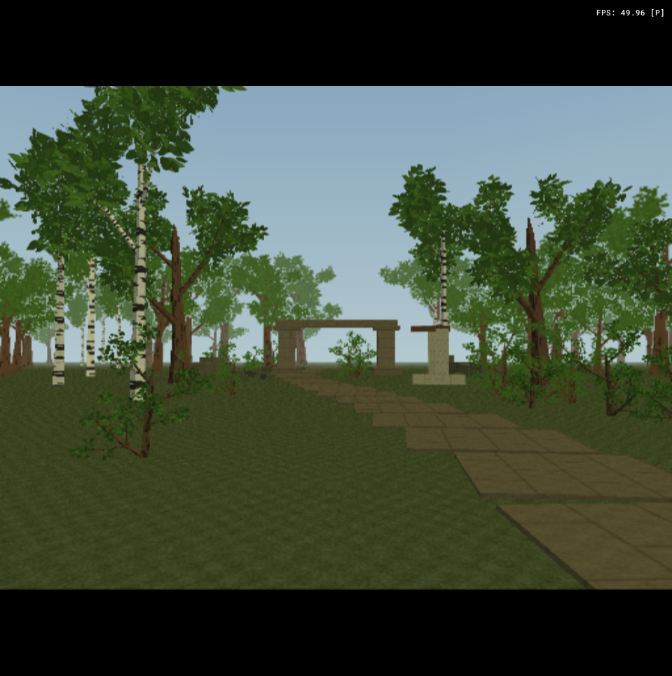

# Impostor grove

A walkable morning woodland with a winding stone avenue and an abandoned gate,
demonstrating offline tree impostors on PlayStation 2.



Open `impostor-grove.tyra` in TyraX and Build/Run. Walk along the avenue with the
left stick, look with the right stick. The editor's **View: Entrance view** camera
reproduces the entrance composition. No external art downloads are required. The **Waystone** beside the avenue is
a non-tree, two-material OBJ using the universal capture path. Select it and click
**Properties > Bake impostor** to try the feature on an existing model.

## What to inspect

- 108 canopy trees and 30 shrubs share four generated assets. Near trees have
  897/1016/1016 triangles and shrubs have 740; each distant model draws **2**, selected from 4 shrub / 8 canopy captures.
- Trees switch at 30 world units, shrubs at 16, the waystone at 18. Returning within 90% restores
  full geometry. Four transitions per scene render bound the rebuilding work.
- The original model remains the collision identity. Foliage in this example has
  collision disabled so the experiment isolates rendering; the ruined gate and
  paving remain ordinary solid primitives.
- Fog begins at 48 units: the 30-unit canopy transition is visible before fog
  hides the forest. Walk both directions to judge the silhouette change.
- The far models are cylindrical billboards with source-colour captures.
  The selected view follows the camera relative to the tree yaw. Top-down views,
  sector changes and close inspection still expose the approximation. The example does not enable AO, GI or temporal upscaling.

## Reproduce the assets and layout

Run these from the repository root with a C++20 compiler and Python/Pillow:

```
g++ -std=c++20 -O2 -Isrc -Ivendor/stb examples/impostor-grove/authoring/generate_assets.cpp src/treegen.cpp src/treeimpostor.cpp src/modelimpostor.cpp src/objparser.cpp -o <temporary-executable>
python examples/impostor-grove/generate_scene.py examples/impostor-grove
<temporary-executable> examples/impostor-grove
```

The scene generator replaces this fixture's referenced object records; run it on
a copy if you have edited the map. Then use `--resave` and `--build` to refresh
the project and its generated files. The seed and all tree parameters are in the
generator sources. Run the scene generator first: it authors the waystone OBJ.
The C++ helper reads the exported tree OBJs and waystone through the same universal
baker as the Properties button. Keep host C++ helpers under `authoring/`, outside both the
project root and `src/`: the PS2 Makefile discovers game sources under `src/`.

For an A/B, copy the project to a short temporary path, freeze the Player's
`walkSpeed` and `lookSpeed` at zero, and set each object's `impostorDistance` to
zero for the full-model control. Build each version and capture the same camera.
Enable **Show FPS**, **Show memory** and **Show profiler** in Preferences for
rendering diagnostics. The shipped composition keeps the HUD clear. The profiler records `IMPOSTOR object=... far=...` transitions in
`bin/log.txt`. Asset loading and initial representation selection happen before
these transition messages, so their absence at rest is expected.

See [the feature guide](../../docs/impostors.md) and
[the assessed rendering directions](../../docs/rendering-directions.md).

## Verification

Verified with a Windows Release editor build and the PS2DEV Docker build in
PCSX2. The UI export/save test retained the far asset and 42-unit distance;
round-trip serialization and a missing-replacement fallback were checked.
Canopy atlases are 512x256, shrubs 512x128 and Waystone 512x512, all with binary alpha. A forward/back
pad walk logged both near-to-far and far-to-near transitions.

The original crossed-card A/B memory numbers do not describe this revised atlas.
The shipped map disables AO: its extra terrain pass is a substantial cost here.
Linux editor compilation and measurements on physical PS2 hardware remain untested.

## Single-tree silhouette comparison

[Full mesh](comparison-near.png) / [eight-view impostor](comparison-far.png),
captured in PCSX2 from the same camera. The trunk and major leaf groups align;
small gaps and individual leaves soften. This compares silhouette under the same morning ambience rather than
claiming identical shading or eliminating the hard transition.

To reproduce on a copy, retain only Player and Canopy 006. Put the Player at
`[0,0,-30]`, rotation `[-5,0,0]`, with zero walk/look speeds and keyboard/mouse
disabled. Put Canopy 006 at the origin, unit scale, zero rotation and white tint.
Keep the morning ambience from the example; the tree is before its fog start.
Build once with its impostor distance 10, once with 0. The normal grove retains
its original lighting and camera and contains differently rotated trees.

The revised grove was also checked after a sideways/forward/back pad walk.
PCSX2 VRAM telemetry stayed at 16 resident textures, about 97 KB free and no
texture evictions during this run. This is one fixture, not a general budget guarantee.

Universal capture verification: the Properties button saved a non-tree two-material
OBJ with a 20.25-unit default distance. Host checks verified exact Kd colours,
textures resolved beside an override MTL, deterministic captures and missing-texture/
reflective-material failures preserving the previous output.

Selection: click Waystone in the viewport or scene list to see its full world
bounding box. Mesh hits take priority over empty tree bounds; repeated clicks
cycle overlapping objects. See [object selection](../../docs/object-selection.md).

The forest-floor material tiles at 0.5 repeats per world unit (one tile per two
units). The original 16 repeats/unit produced flat-looking ground at map corners
in PCSX2. A frozen-camera A/B at (48, 0, 48) restored texture detail by changing
only this material scale. The scene generator retains the corrected scale.

The mixed-count setup uses 4 views for shrubs, 8 for canopy trees and 16 for
Waystone. In Properties select **Capture views**, leave **Impostor GPU** on and
click **Bake impostor** to rebake one model; Tree Generator has the matching
controls. The status identifies GPU or CPU fallback. The reproducible asset
helper below uses the CPU reference and emits the same capture counts.
