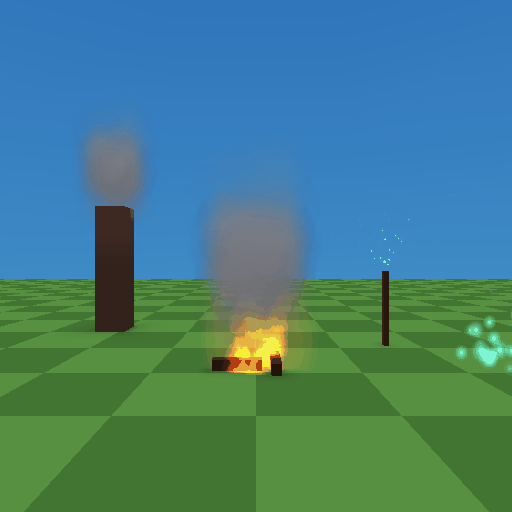

# particle-lab

The particle library's reference scene ([docs/particles.md](../../docs/particles.md)):
every particle in it comes from four effects made once in *Tools > Particle
Editor*, each with a texture the editor generated.



## What's in the scene

| effect | used by | what it shows |
|---|---|---|
| **Campfire** | `campfire` | ONE emitter, four **layers**: the flame (Fire motion, additive, a generated 4-frame *Flame* flipbook), rising **Embers**, a faint additive **Glow** and **Smoke** that reuses the Wood smoke texture |
| **Wood smoke** | `chimney-smoke` | a Custom effect (rising, growing, low opacity); its texture is shared with the campfire's smoke layer |
| **Torch sparks** | `torch-sparks` | Sparks motion, additive, a generated *Glow* texture (32x32) |
| **Magic motes** | `magic-motes` | a slow buoyant Custom cloud, additive cyan glow |

The emitters are linked by name (*Properties > Particle emitter > Library*);
their own knobs are greyed out and show the effect's values. The generated
textures live in `res/materials/particles/`.

## Things to try

- Open *Tools > Particle Editor*, pick **Campfire** and click through its
  layers (Main / Embers / Glow / Smoke); move the Smoke layer's *Offset* up.
- Drag the `campfire` emitter (click its flame badge in the viewport): all four
  layers travel with it.
- Change **Campfire**'s *Generate* recipe (turbulence, heat, seed) and release
  the slider: the flame texture is re-baked and the viewport updates.
- Untick *Additive* on Campfire to see why fire wants it.
- **New effect... > Smoke**, then **Place in scene**.

## Build & run

```bash
tyrax-editor --bake-particles examples/particle-lab   # re-bake the textures (optional)
tyrax-editor --build examples/particle-lab --run
```

The player spawns facing the fire; nothing needs a pad.
