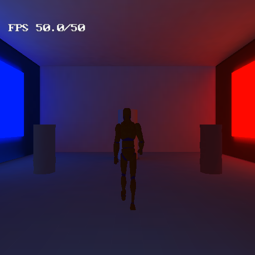
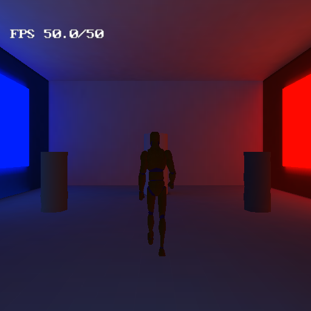
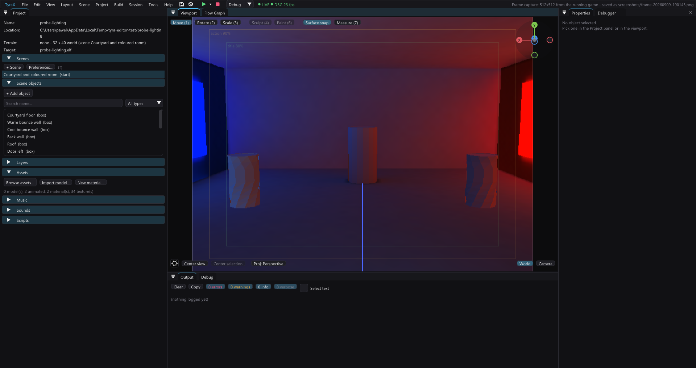

# Probe lighting — animated receivers under directional baked GI

Walk from a blue-sky courtyard into a roofed room with warm and cool side
sources. The humanoid avatar and three neutral twisting meshes read the
existing RGB L1 probe grid. Each RGB channel keeps the full signed directional field. The cylinder at the back is an explicitly dynamic-lit rigid
reference, using the same full RGB SH reconstruction.

Left stick walks, right stick orbits, Cross jumps. Walk through the doorway,
approach each side source, and turn: the light should stay on the side facing
the source. The side panels are **baked emissive area lights**, not live point
lights; the coloured walls also contribute bounce. This intentionally gives
the directional test a clear signal, rather than claiming all colour is bounce.

The cached `.res-baked/gi/scene0.gi` ships with the example. Open and build;
rebake after scene edits with the GI window or:

```text
tyrax-editor --bake-gi examples/probe-lighting --gpu
```

The geometry is deliberately simple. Bloom, AO, live shadows and terrain are
off so they cannot obscure the probe response. The floor is a solid box.
The avatar is Quaternius's CC0 `UAL1_Standard.fbx`, copied unchanged from the
foot-ik-stairs branch. It uses `Idle_Loop` and `Walk_Loop`, scale 1 and a 180°
model-forward correction. The player uses the full mesh; the side receivers
stay lightweight controls. Foot IK is not required by this lighting demo.
The wobbler comes from gi-showcase; its material was made neutral to expose
the incoming light's colour. See [asset credits](../../THIRD-PARTY-LICENSES.md).

## What this demonstrates, and what it does not

The GPU performs the offline bake. PS2 does one weighted probe lookup per
visible animated instance per render pass, then evaluates all twelve RGB SH L1 coefficients on VU1.
Instances may share a pose, but retain separate lighting bags. The normal
matrix removes uniform instance scale, so a larger avatar does not receive a
stronger directional term merely because it is larger.

This is **full signed RGB SH L1**, including opposing coloured directions.
It is not L2 or full PRT: there is no animated self-shadowing or runtime bounce
tracing. See [global illumination](../../docs/global-illumination.md#directional-lighting-on-animated-receivers).

## Reproducible old/new comparison

Copy the project to a short scratch path and refresh generated files. Then run:

```text
python examples/probe-lighting/authoring/make_comparison.py SCRATCH_PROJECT
tyrax-editor --build SCRATCH_PROJECT --run
```

The helper takes ownership of the scratch `src/terrain_game.cpp`, freezes poses
and makes **L1 toggle the old dominant lobe / full RGB SH**. Both arms
retain the corrected normal matrix to isolate the direction change. Start in
the new mode. Move into the room, release the sticks, capture a frame, press
L1 and capture again. `PROBECOMPARE` in `bin/log.txt` records the mode and each
instance's mode and sample position; the camera and pose stay identical.
The helper refuses to alter this checked-in example or already-owned source.
Restore the generated source in the scratch copy before testing animation.

For a no-GI control, disable GI in another scratch copy and build. For a normal
transform check, compare the same receiver at uniform scales 1 and 2 under
the same field: its light direction and normal-matrix column lengths must
remain unchanged. Nonuniform scale/shear is not covered by that guarantee.


## Verification

Windows Release editor and PS2 Docker builds pass. The VU checks include
signed chromatic input and an independent numeric oracle for opposing
normals, a rotated normal matrix, saturation and the classic fallback.
The software-rendered PCSX2 fixture was walked through the doorway.

The fixed-pose L1 toggle compares the dominant lobe against full RGB SH at
the same camera, pose and mesh LOD. These captures are lighting comparisons,
not animation benchmarks. The full-SH/old/full-SH toggle changed 14,398 pixels
and returned to a byte-identical full-SH image:

| Dominant lobe | Full RGB SH L1 |
| --- | --- |
|  |  |



The engine now skins each bit-identical bind corner once, copying its posed
position and normal to duplicates. It preserves every render vertex, hard
normal, UV and animation frame; the map costs four bytes per corner. The
humanoid's measured skin time fell from about **10.8 to 5.6 ms** (pose evaluation
about 0.36 ms). The ordinary one-avatar walk improved from 25 to roughly 42-50 FPS in the
observed captures (48 FPS in the settled final room view). This is not a
guarantee of a locked 50 FPS.
`TYRA_SKEL_PROFILE` enables per-instance timing logs and is off in normal builds.
These are PCSX2 observations, not physical PS2 timing claims.

Three humanoids with meshLod 1.5 passed the doorway walk. A separate test forced
all three LOD tiers every 120 frames and ran beyond 2400 ticks. The earlier hang
was not reproduced; no specific hang fix is claimed. The final demo keeps its
full-resolution avatar, so LOD is not hiding its animation cost. No physical
PS2 or Linux run was performed. L2, contact shadows and nonuniform-scale normal
correction remain future work.


Version 1.74.1 fixes intermittent receiver flashes: the mode-adjusted lighting
colours now live in the DMA packet, rather than in a temporary stack array
referenced after its lifetime. Update/rebuild the engine as well as the game.

Verified the 1.74.1 fix with Windows Release and PS2 Docker builds, a doorway
walk and two temporal captures (30 samples at 2 Hz, then 150 at 10 Hz) in
PCSX2 software mode. Normal animation continued without receiver flashes;
the user also confirmed that the visible flicker disappeared.

The 1.76.0 integration retains the configurable GPU impostors from main and
refreshes this example against the combined runtime.
The merged version passed the Windows Release build, --vu-check, a PS2 Docker build and a PCSX2 doorway walk with a captured frame.
