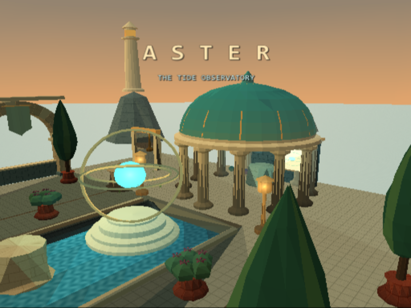
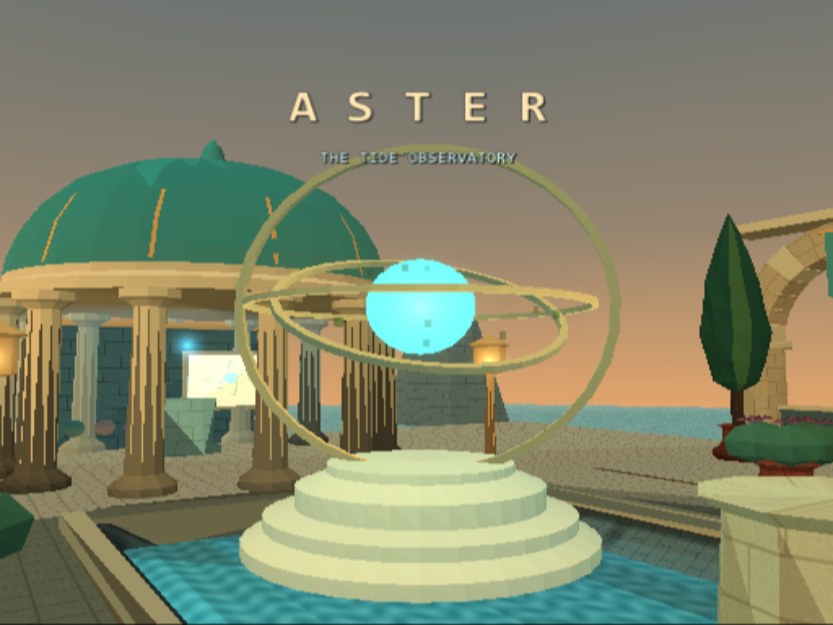
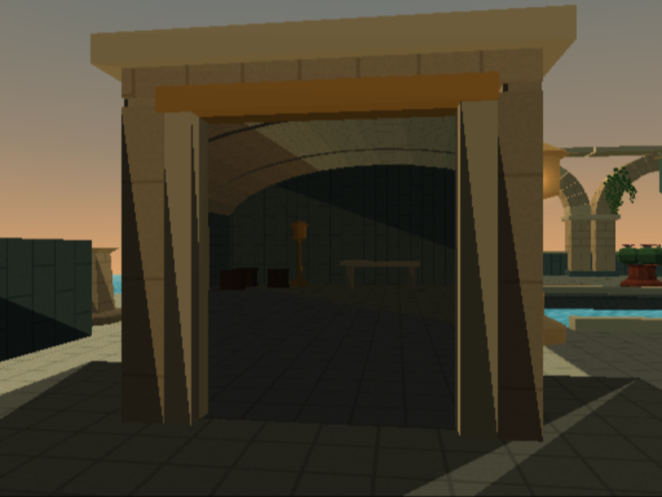
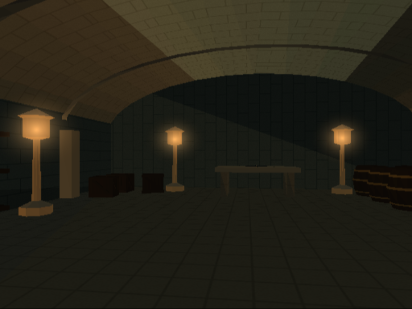
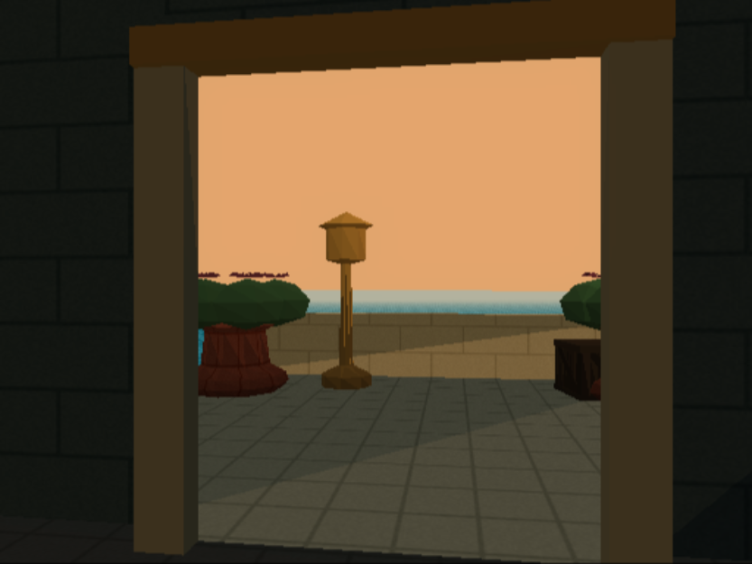
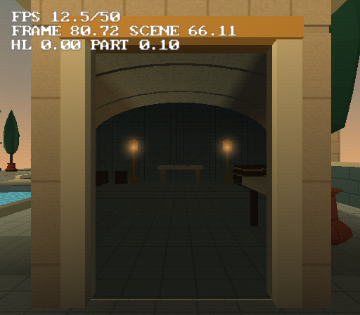
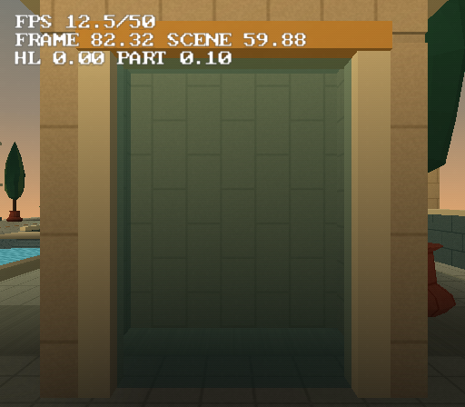
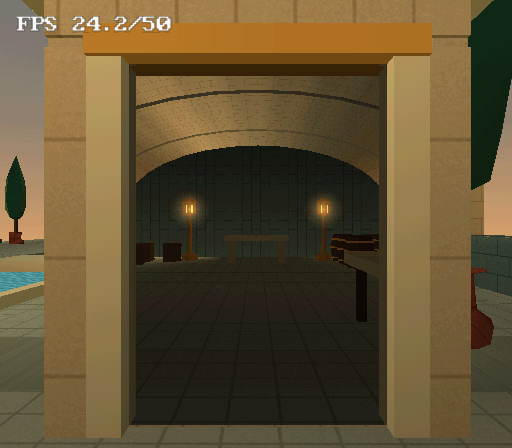
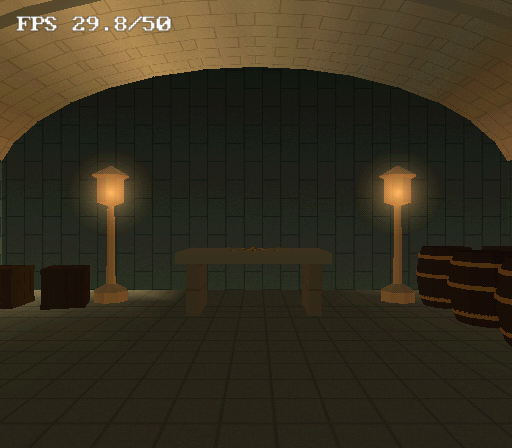

# Aster — The Tide Observatory

Aster is a playable coastal observatory: limestone arcades, copper roofs,
formal gardens, a tidal channel and a brass planetarium. A short lens hunt
and working instruments are woven into one coherent place.





Open `showcase.tyra` in TyraX, or build and launch it:

```powershell
build/tyrax-editor.exe --build examples/showcase --run
```

On Linux use `build/tyrax-editor` with the same arguments. Docker and a
configured PCSX2 installation are required for the game build and launch.

## Explore

The arrival film returns control at the entrance. Follow either promenade;
the crossing connects them halfway along. Three brass lenses sit on optical
benches at **(-8, 17)**, **(8, 1)** and **(-8, -17)** (world X/Z). Collect
them, then use the central instrument at **(0, -6)**. It explains what is
missing if approached early. Lenses disappear on pickup and cannot be counted
twice. Their visibility and the expedition's progress travel in save slots.

| Control | Action |
|---|---|
| Left / right stick | Walk / look |
| R2 / Cross | Sprint / jump |
| Square | Use a lens, stand, keeper or instrument; pick up a weight |
| Circle | Throw a held weight; toggle the visitor's flashlight |
| Select | Replay the 22-second guided film |
| Start | Pause and open the expedition save menu |

The calibration court is east of the entrance. The hovering keeper patrols
the east garden and offers a clue. The grouped pavilion is currently near **(9.78, 17.73)**,
with its opening facing south. Approach from the arrival court and walk north
through the frame. Its placement can be changed as one group. The roughly **2 × 4m exterior** opens into a **14 × 18m cellar**,
twelve metres below the island, with a six-metre vaulted ceiling. Repeated
ribs, stocked shelves and the far instrument table reveal its depth through
the small doorway. The return view follows the pavilion's placement and uses an explicit list
of arrival-court scenery. Inside the rotunda, the silver instrument
traces reflections and the gold instrument shows a second camera's view.
A save point waits at the entrance. Films use the engine's skippable-sequence
controls and return the gameplay camera afterward.







## What is running

| Feature | Where to see it |
|---|---|
| Imported geometry and mesh LOD | Complete arcades, profiled columns, dome, planters and props |
| CC0 import and cutout textures | Quaternius ivy, supply crates and survey cart |
| Skeletal animation and navigation | The keeper's retained `Idle` action, rig and three-waypoint patrol |
| Terrain and collision | A support heightfield follows the paved island; mesh collision preserves arch openings; four invisible walls protect the perimeter |
| Baked GI and probe lighting | Warm architecture, shaded colonnades and the keeper; the GI cache ships with the project |
| Dynamic lights and bloom | The planetarium core, blue vault light and warm lanterns |
| Reflective materials | Gold, copper and water sample the live sky; moving brass rings use a cheaper matte surface |
| Spatial portals | A small sea-facing pavilion opens into a much larger vaulted cellar; bounded destination lists preserve both views |
| VU0 ray tracing | The silver lens: a 32px experiment with analytic sphere targets, drawn within 15m |
| Live camera textures | The gold monitor watches the moving core and rings |
| Particles | A small firefly field around the celestial mechanism |
| Flow graphs and save values | Single-use pickups, three-lens gate, completion state and information stands |
| Physics and pickup/throw | Three calibration weights and a backstop |
| Camera and object animation | Arrival, tour and alignment films; the finale changes the core's scale and colour |
| Audio and reverb | Original stereo composition, pickup chimes and the rotunda's hall reverb |
| UI | Title typography, contextual prompts, clues, pause and memory-card saves |

The scene stays resident. Streaming districts have their own dedicated
examples elsewhere in the repository.

## Art and reproducibility

The architectural module is an **8.4m bay**, with a 4m arch spring line. Walking
slabs end at Y=0, foundations extend below the sea, and curbs close on the
promenade edges. Columns and dome share a measured circular footprint. The
channel water uses 2m patches; paving UVs are authored in metres. The sea is a
single surface with 20m patches, with no nearly coplanar underside. Neither
water mesh uses LOD simplification. Both use a procedural ripple texture and
the live sky reflection material; this is stylized water, not fluid simulation.
Their authored base color uses the pre-lit route to avoid the island's finite
GI probe grid producing broad triangular light patches across the open sea.
The calibration guide and shortened backstop keep the entrance court clear;
weights sit outside the portal's approach. The
lighthouse base intersects its supporting rock instead of resting on its tip.

Meshes share positions and use deliberate UV seams. Untextured surfaces have
constant UVs so the LOD welder can collapse their interior edges; lathed stone
has continuous cylindrical UVs. Decorative per-face UV islands on a plain
column had prevented its LOD tiers from being produced.

The recipe joins 192 static pieces into eight district meshes.
The resulting scene has 81 runtime objects. Walking slabs and interactive
props remain independent. District meshes retain their full geometry; smaller
props use mesh LOD. The rotating matte rings use the engine's transform fast
path. These choices reduce submissions and avoid rebuilding reflective ring
geometry every frame.

The cellar, pavilion shell and forecourt occupy separate district meshes. The inward view
lists the whole cellar and its four lamp coronas; the return view adds the sea,
two horizon stacks, the neighbouring entry pier and the seaward colonnade to
the forecourt mesh and lamp. The return view also renders the live sky and
terrain so the horizon matches the main view. The underground view disables
terrain rendering. The
cellar has a real opening in its collision mesh; the support heightfield is
lowered below its floor so walking collision does not push visitors upstairs.
Surface model floors remain in place; an invisible support box keeps the
tidal channel shallow above the lowered heightfield. Seven vertical GI probe levels cover
the cellar as well as the garden, with warm baked lights and local reverb.
The forecourt, seaward colonnade and sea pivots sit east of the exit plane, preserving their
world geometry while keeping portal dead-zone filtering from rejecting them.
The pavilion shell stays outside the return target list, so its backing wall
cannot cover the view from the virtual camera behind the doorway.

The committed `.tyra`, object JSON, `res/` sources and `terrain-Aster.heights`
open and build without Python, Blender, downloads or `C:/Assets`. Generated
C++ and model binaries are derived data. The optional authoring recipe needs
Python 3 and Pillow:

```powershell
python examples/showcase/build-showcase.py
build/tyrax-editor.exe --bake-gi examples/showcase
build/tyrax-editor.exe --build examples/showcase --run
```

**Re-running the recipe replaces the authored scene and graphs.** Keep manual
editor changes in version control first. GI is explicitly baked and committed
in `.res-baked/gi/scene0.gi`; re-bake after geometry or lighting changes.
A normal build does not invent a fresh GI solution.

Optional CC0 preparation steps reproduce the checked-in imported assets:

```powershell
python examples/showcase/prepare-assets.py C:/Assets
blender --background --python examples/showcase/prepare-keeper.py -- C:/Assets
```

Both accept any asset-root path on either platform. The first preserves prop
geometry/UVs, centres origins at their feet and replaces absolute material
references. The second keeps the keeper's rig/actions, limits its mesh to
approximately 1,000 triangles and embeds 128px textures. Architecture,
botanical meshes, instruments, surface textures and music are original to
this example. Imported art is Quaternius CC0; see
[THIRD-PARTY-NOTICES.txt](THIRD-PARTY-NOTICES.txt) and `res/aster/CC0-*.txt`.

## Budgets and verification

Remote pad and Live Debugger remain enabled for unattended checks. Live Link,
Live Logic and time-machine recording are off. Performance HUD counters are
off for presentation; pass `--profile` to the Python recipe to enable all three
counters, then rebuild. Optical experiments have bounded target lists; the
raytraced lens does not trace the whole garden from the entrance. PCSX2 tests
rendering and controls; its measurements do not establish real-console speed.

Use `--ui-script` to inspect the saved project, then run
`build/tyrax-editor.exe --pad examples/showcase "press select; wait 23; neutral"`
to exercise the running guided film. Inspect
`bin/log.txt`, walk both promenades, test the early-use gate and all pickups,
align the instrument, pass through both portals and throw a weight. Saving
and reopening must preserve every graph link: ordinary action nodes have no
execution output, so sibling actions fan out from a trigger or control node.

Validation on Windows / PCSX2 (software renderer): release editor compilation,
Docker PS2 build, GI bake, project re-save with all 37 graph links retained,
arrival/tour rendering, pad movement and two lens pickups, and a moving keeper.
Live Debugger trigger tests covered the remaining pickup, early-use rejection,
duplicate collection and the successful alignment (`lenses=3`, `aligned=1`).
The pad-driven save/load menu restored a one-lens save after collecting another
lens. WASAPI reported nonzero output from the emulator's audio session.
The profiling build measured 25 FPS in the wide garden view and 50 FPS on the
north promenade; these are emulator observations, not a hardware benchmark.
The boundary update was checked with the editor's real UI (insert, toggle,
undo, save and re-open), refreshed GI, a Docker build and pad movement against
the perimeter. Portal traversal and low-angle sea views were exercised in
PCSX2. A full pickup/throw circuit remains a manual acceptance check. The
images above are unretouched game captures, not editor renders or concept art.

The enlarged-cellar update was checked with a fresh Release editor and Docker
PS2 build, a new GI bake, all 37 graph links retained, and pad movement through
the east-facing entrance into the cellar and back onto the forecourt. Both
destination views were captured in PCSX2, including the props and sea in the
return view. The ocean pivot change was checked to preserve every world-space
vertex. The vault end walls overlap its crown to close sky/water gaps above
the door and storage wall. Time-machine recording remains disabled.

The portal-light update adds the destination Point Lights to both view lists.
PCSX2 checks covered the coronas before and after walking through the doorway,
the bounded sea/sky return view, and return traversal. The editor's actual
portal picker was used to add a Point Light and save it; the serialized list
was checked before restoring the authored list. Fresh Release and Docker PS2
builds, the GI bake and all 37 graph links were checked again.

The **Portal pavilion** object group contains the pavilion mesh and surface portal.
Select either to move or rotate the entrance as one assembly; the cellar stays
in place. The building mesh now has its pivot at the doorway, preserving every
world-space vertex. See [Object groups](../../docs/object-groups.md). The next build refreshes GI after moving it. Portal views use explicit object
lists: the cellar and its four lamps inward, 18 arrival-court objects outward.
Update the return list if you move the pavilion to a different part of the map.

Grouping validation covered real editor actions: create/rename, a rigid 90-degree
rotation with mixed object orientations and a light, independent copy/delete,
undo/redo across reload, ungroup without transform changes, and paired-portal
copy reference remapping. The merged Release editor and Docker PS2 build passed;
Aster was re-baked and entered through the grouped portal in PCSX2.

## Lighting and portal maintenance

The **Aster golden hour** ambience preset preserves the authored sky, sun, fog
and AO values. **Re-bake stale global illumination** is enabled, so moving the
portal pavilion refreshes GI on the next build. Both portals use **explicit object lists**, with **All objects in view** off.
The inward list contains only the cellar and four lamp effects; the return list
contains the terrace, nearby architecture, props and sea. This avoids drawing
and exit-clipping the whole island merely to see into the cellar. Imported
mesh bounds and exit-plane clipping still keep the doorway clear. The canal end stones sit 2 cm below the
terrace surface to avoid coplanar faces at the overlap.

`district-pavilion` is also the fixture behind the 1.81.0 collision fix: it is
ONE merged mesh holding the back wall, the side walls, the door jambs and the
roof, so its world collision box straddles the portal plane (it reaches about
two units in front of it) and seals the 2.3 x 3.3 opening. The player walked
through it because mesh collision resolves per triangle, while a thrown or
physics-driven object hit the box and bounced. See
[the doorway rule](../../docs/portals.md) — an obstacle now also opens when
its box contains the point where the motion pierces the opening, not only
when the box is wholly behind the plane.

Static vertex colours interpolate on PS2. Hard-normal imported assets remain
faceted, and the district meshes use probe GI: their repeating shared UVs do
not provide per-texel scene AO. See [GI routing](../../docs/global-illumination.md).

Large walking surfaces are tessellated into approximately 2 m cells, retaining
the original tiled UV coordinates and collision surface. This gives probe
lighting more samples across a terrace instead of only its
four distant corners. The compass rose uses brass/gold halves: its former dark
halves looked like black holes or clipped triangles when viewed close up.
The faster VU1 clipping mode is retained; switching to EE clipping did not
change those authored compass shapes.

Portal clipping also retains its result while the source geometry and exit
plane are unchanged (1.77.2). Looking around no longer re-clips the entire cellar
or drains DMA per material. Shading, GI and the existing pavilion transform are
unchanged by this performance adjustment.

For the 1.77.2 PCSX2 regression check, a frozen camera facing the cellar measured
10.0 FPS before, 11.1 FPS with lists alone and 25.0 FPS with cached clipping.
The frozen return view measured 50 FPS. These are two views, not a minimum FPS
for the entire island; physical-console performance is recorded below.
See [portal measurements](../../docs/portals.md#imported-mesh-bounds-1771).

Baseline physical PS2 verification (1.77.2, 2026-09-09): the same doorway view with correct
textures runs at **12-12.5 FPS**, with 66.11 ms of scene rendering. Disabling
the portal view alone still gives **12.5 FPS**, with 59.88 ms of scene rendering.
Portal scoping and caching alone did not fix its base rendering cost.
The subsequent 1.78 changes are described below. These are debug builds
served over ps2link, with Live Debugger/Remote Pad and the profiler enabled.




## Hardware tuning (1.78)

The scene retains full 512x448 output, now with 16-bit colour, GS dithering and
triple buffering. This frees texture memory and avoids the two-buffer PAL
frame-rate staircase. The supporting heightfield is disabled: model floors and
invisible walls provide collision, and the terrain was hidden below them and
the ocean. The authored height data remains available for editing.

The ocean covers the same 600 m square with 200 triangles instead of 1800,
retaining its tiled UVs and reflection. Spatially sorted triangles improve
package culling without changing geometry or material assignment. Surface
districts retain full detail: a trial of 14 m LOD removed thin lamp stems and
was rejected. The cellar pivot is at
`(0, -10.35, -18)` with a 12 m main-view draw distance, covering the walkable
room while excluding it from surface rendering; the explicit portal list still
draws it. Six-sided small bottles and ten-sided barrels reduce the cellar from
6224 to 4640 triangles. `build-showcase.py` reproduces these choices and
preserves the user's pavilion/group transforms.

The new **Debugger > Render cost** tool attributes a synchronized render pass
to phases and objects, supports a retained baseline, and exports CSV. See
[profiling](../../docs/profiling.md). Its serialized total is not ordinary FPS.

Measured on physical PAL PS2 during tuning (debug + host server): the fixed
entrance improved from 12.5 FPS to 24.2 FPS; a walked-to cellar view gave 29.8
FPS and a lightly loaded surface view reached 50 FPS. The entrance's diagnostic
render pass fell to 40.647 ms; it is serialized and must not be confused with
ordinary frame time. These numbers describe sampled views, not a map-wide
minimum. They include the trial district LOD, which was subsequently removed
after the final PCSX2 visual check showed missing lamp stems. The final full-detail
district correction was built and checked in PCSX2, not remeasured on hardware:
the final manual hardware launch lost ps2link after a missing resident-IOP marker.




Validation also includes real-console walking through the portal in both
directions, Windows Release editor and PS2 debug/release builds, release devkit
audit, debugger UI baseline/CSV capture, malformed-report parser checks and
coarse-bound inheritance checks across changing geometry and partial tail groups.

The grazing-angle ocean capture is pixel-identical between VU1 and legacy EE
clipping in PCSX2. The final default arrival view retains complete lamp stems.

The 1.80 integration merges native-build support, editor comments, animated HUD
and RGB SH lighting from main. Windows Release compilation, Docker-fallback
PS2 build, PCSX2 arrival view, live render-cost capture and the VU numeric oracle
passed after conflict resolution. Post-merge console performance is unmeasured.
