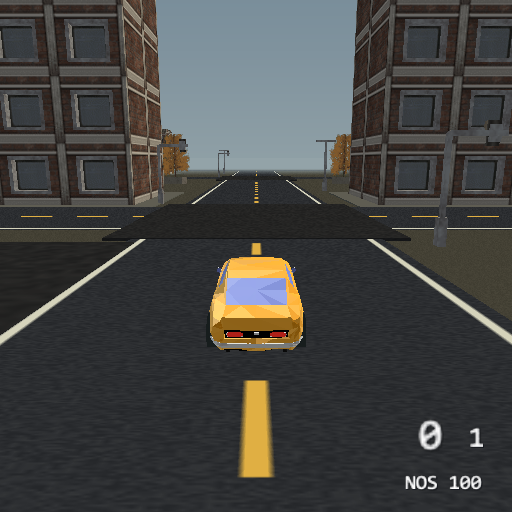

# Motor District — vehicle playground

A compact PS2 driving district with a connected street network, three driveable
car models and live scenery reflections. Open `vehicle-playground.tyra` in
TyraX, build and run, then press Square beside the gold coupe.



Actual software-renderer captures: [Tristar Racer](preview/tristar.png), [coupe](preview/coupe.png) and
[Rally 04](preview/rally.png). Night mode: [street](preview/night.png) and
[pause-menu selection](preview/night-menu.png).

## The district

- Seven spline roads: a wide perimeter loop, Garage Boulevard, two cross-city
  links, Market Street, a western service lane and the eastern crest run.
- Fourteen workshop, loft and tower blocks assembled from Kenney's Retro Urban
  Kit, with pavements, trees, benches, traffic signals, streetlights, dumpsters
  and barriers. The garage sign and road/ground textures are original assets.
- A garage apron and western yard for handbrake turns. Loose crates and pallets
  can be pushed; buildings, street furniture and perimeter walls collide.
- A flat city floor and gentle eastern crests. Roads and wheel contacts use the
  same terrain. The district fits within the existing 320 × 320 metre boundary.
- Five placed vehicles: the hero CC96 coupe, a parked orange Rally 04, a Tristar Racer and two AI
  patrols. The rivals remain driveable and resume their route after you get out.

The CC96 has a 29 m/s target speed before nitrous, more steering authority at
speed and a four-second refillable tank. Rally 04 is a lighter, deliberately
more slippery alternative with a longer wheelbase and more suspension travel.
These are arcade settings, not a real-world vehicle simulation.

The Tristar Racer parks west of the coupe, opposite the Rally. It has a 32 m/s
target speed, stronger grip and the same refillable nitrous controls. Its source
body stays at 2276 triangles; the vehicle bake reduces each symmetric wheel to
416 triangles (3940 total near geometry, versus the CC96's 4288). The prepared
GLB is 383,536 bytes. It uses a cheap blob shadow and a 48 m distance tier.

The five-speed boxes use a 1.28 spread, 0.10 s shifts and reduced ratio torque.
Body lean is 0.25 on the coupe/Tristar and 0.35 on the van. A 60 Hz flat-ground
full-throttle comparison against the previous settings measured:

| Vehicle | First upshift before → after | Largest shift pitch swing before → after |
|---|---|---|
| CC96 | 18.7 → 36.8 km/h | 3.94° → 1.24° |
| Rally 04 | 17.0 → 32.7 km/h | 3.93° → 1.60° |
| Tristar Racer | 20.4 → 41.0 km/h | 3.95° → 1.24° |

All three completed four clean upshifts. Target top speeds remain 29 / 26 / 32 m/s;
the lower gears are longer rather than the whole car becoming faster.

## Controls

| Input | Action |
|---|---|
| Start | Pause menu, including Day / Night |
| Square | Enter / leave the nearest vehicle |
| Left stick | Steer; vertical axis also supplies throttle / reverse |
| R2 / L2 | Throttle / brake |
| Circle | Handbrake |
| Cross | Nitrous |
| Triangle | Chase / bumper / far camera |
| Right stick / R3 | Look around / rear view |
| D-pad up | CC96 headlamps |

The coupe retains its engine/rev crossfade, tyre squeal, gear-shift sound,
brake lamps, suspension and projected silhouette. The parked Rally also uses
a projected silhouette; AI cars use cheaper blob shadows.

## Reflections and cost

All three definitions use the dynamic `@sky` paint map, rather than the former
`nfs-streaks.png`. Seven nearby building blocks have **Show in reflections**
enabled: their geometry is rendered into the live 128 × 128 environment target
along with the sky. Other scenery stays out of this extra pass. This is the
shared PS2 sphere-map approximation, refreshed every other frame; it is not
ray tracing, a cubemap or an accurate mirror of everything around the car.
The editor's sky-only approximation cannot prove scenery reflections: inspect
those in the running game.

The CC96 bake remains 1936 body triangles and 588 per wheel. Rally 04 has only
364 body triangles and 28 per wheel. Wheels share a submission within each vehicle definition; distinct models keep
their own texture bindings.
The GGBot source has disconnected wheel islands inside one mesh: preparation
separates them and gives each node a distinct material slot so the importer
retains ownership. The source texture and silhouettes are preserved.

Flat road spans now retain their sampled shoulders and discard redundant
interior vertices. A 13 m flat street uses 26 times fewer vertices per station;
crowns, banks and changing terrain retain the dense 0.5 m cross samples.
Chunk culling and the 1 m longitudinal sampling remain in place. This matters
for EE RAM as well as drawing: the initial dense district exhausted its budget.
The boot log reports `ROADS ... chunks ... vertices ...` for inspection.

## Reproduce and verify

The committed scene and assets are ready to build. To regenerate the district:

```
python authoring/build-district.py
```

Requires Python 3 and Pillow (including the sized default font API). It reads
only the bundled Kenney OBJ inputs, writes the deterministic terrain, textures,
building kitbashes and scene objects, and replaces authored roads / the former
pillar course. Keep hand-authored map changes separately before rerunning it.
Afterward use `tyrax-editor --resave <project>` and `--refresh-gen <project>`.

`authoring/prepare-ggbot.py` documents the optional Blender preparation from
the original `Car4.blend` and `car4_lightorange.png`; the resulting GLB is
already included, so Blender and `C:\Assets` are not build dependencies.

Run `python authoring/verify-road-twins.py` with g++ on PATH to compare the
actual editor tessellator against the extracted generated runtime, including
flat terrain, crowns with equal-height shoulders, slopes, saddles, curves and
scene revisits. Also run `tyrax-editor --vehicle-check`, build and boot the game,
then drive with `--pad` and capture with `--capture-frame`. Host checks alone
are not evidence of console frame rate or reflection correctness.

## Verified on Windows / PCSX2

The release editor and native PS2 game build successfully. The road twin oracle
and `--vehicle-check` pass; the game was booted and driven in PCSX2's software
renderer. The district uses 93,150 road vertices instead of 281,748 (66.9% fewer).
A stationary hide/show/restore probe changes 204 car pixels when reflected
buildings disappear and restores the original car image exactly. The embedded
128 × 128 Rally texture is preserved byte-for-byte. These are emulator checks,
not a hardware PS2 or Linux editor validation.
Both definitions were inspected together after separating their wheel batches:
the coupe retains its black/white tyres and Rally retains its textured wheels.
Throttle, nitrous, handbrake and braking were exercised with automated pad input.

## Day / night from the pause menu

Press **Start**, select **TIME OF DAY**, and use Cross or left/right to choose
**DAY** or **NIGHT**. Resume with Start or Triangle. The mood applies on resume
without reloading the scene or moving the player, cars or AI traffic.

The same district uses a live day/night ambience track pinned to noon or
midnight by `src/scripts/district_mood.cpp`. The menu writes the named
`district-night` save value. The script drives the existing sky, moon, stars,
fog and runtime world grade, then switches eight dynamic street/garage spots
and eleven emissive window/neon pieces together. One service lamp flickers
subtly. The day starts with the night dressing off.

Eight lights are the existing scene budget; their projected pools and coronas
provide local illumination without a second terrain or a second scene. Shadow
volumes are disabled on these lamps. The generated authoring header records the
night dressing indices; rerun the district authoring script after changing its
object order. Other scene objects keep their normal visibility.

This uses the hybrid runtime lighting path: geometry shading stays baked at
noon, while the world grade supplies the night brightness/tint and dynamic
spots supply local light. It does not claim separately baked night GI or
perfect moonlit shadows. See [Day and night cycle](../../docs/day-night-cycle.md).

`authoring/prepare-tristar.py` converts the supplied FBX with Blender, detaches
its wheel hierarchy while preserving world transforms, copies shared mesh data
and material slots, makes the rims visible from both sides of the repeated
wheel mesh, and exports GLB. The vehicle bake performs wheel reduction.
The model is included as part of this game example, not as a standalone asset
pack. See its usage notice below before reusing it elsewhere.

## Credits and licenses

- **Kenney** — Retro Urban Kit 2.0, CC0. Included source OBJ/MTL files, textures
  and `res/models/urban/LICENSE.txt`; building kitbashes are adaptations.
- **GGBotNet** — PSX Style Cars, Car 04, CC0. Wheels separated, source scaled to
  about 4.1 m long, orange texture retained. `res/models/ggbot-CC0.txt`.
- **designersoup** — Tristar Racer, Low Poly Car Starter Pack. Source: [author page](https://designersoup.itch.io/low-poly-car-pack-1). The page permits use and modification in games, but pairs its CC0 label with conflicting standalone redistribution restrictions. We do not describe this model as unambiguously CC0; see `res/models/tristar-USAGE.txt`.
- **CC96** — original coupe supplied with this example under CC0. The supplied
  license does not identify an author; `res/models/car1-CC0-licence.txt`.
- **TyraX contributors** — district layout, sign, asphalt and ground textures,
  preparation scripts and synthesized vehicle sounds.

The shipped `THIRD-PARTY-NOTICES.txt` repeats the asset credits. Tristar is a
game-use asset with the published terms recorded below; the other imported
district assets retain their CC0 notices.
