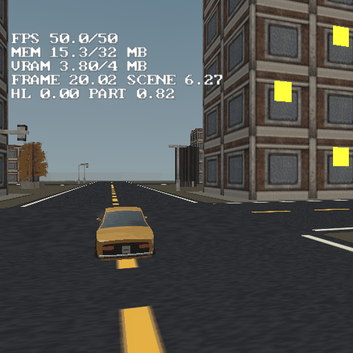
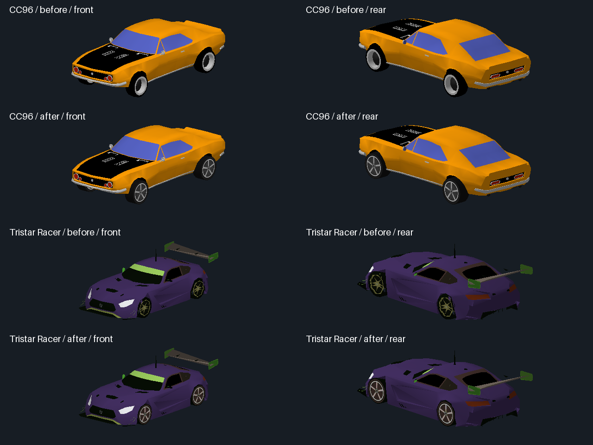
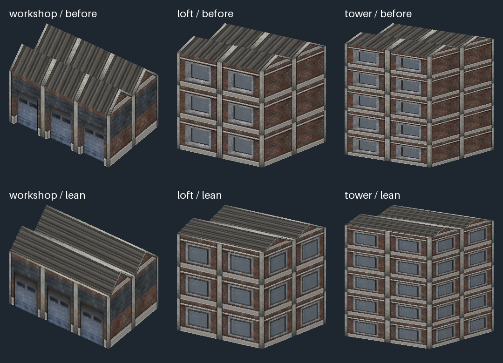
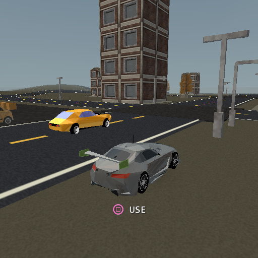
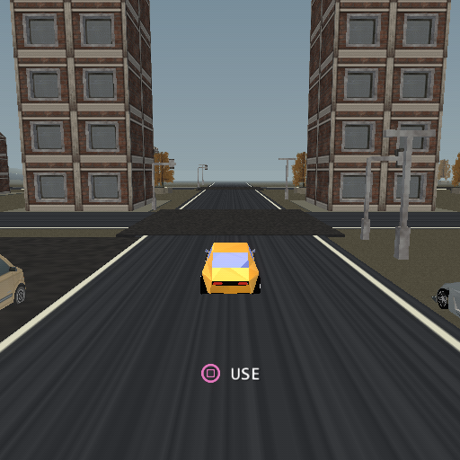

# Motor District — vehicle playground

A compact PS2 driving district with a connected street network, three parked
Blender-built cars and live scenery reflections. Open `vehicle-playground.tyra`
in TyraX, build and run: the game starts behind the wheel of the orange
Ravager, between the red Pica Turbo and the violet Strix V12 (Square gets out
and into the nearest car).


Historical software-renderer captures (before the efficient-wheel variants): [Tristar Racer](preview/tristar.png), [coupe](preview/coupe.png) and
[Rally 04](preview/rally.png). Night mode: [street](preview/night.png) and
[pause-menu selection](preview/night-menu.png).

## Two scenes

`main` is the district described below and the measurement reference.
`dense` is the same district with **107 more buildings** lining the streets
(towers, lofts and workshops, placed by a script clear of every road and
prop, 240 objects in all), for occlusion and city-density work. The game
starts in `main`; set the project's start scene to 1 to boot `dense`. The two
scenes keep separate object copies, so editing one does not touch the other.

## The district

- Seven spline roads: a wide perimeter loop, Garage Boulevard, two cross-city
  links, Market Street, a western service lane and the eastern crest run. The
  three eastern crossings use generated four-triangle asphalt junction patches;
  the older central/western crossings retain their deliberately larger drift
  aprons. Both road and junction surfaces are assigned through reusable `.mtl`
  assets; changing either material's `map_Kd` updates every road that uses it.
- Fourteen workshop, loft and tower blocks using lean exterior shells with
  baked Kenney Retro Urban Kit facades, with pavements, trees, benches, traffic
  signals, streetlights, dumpsters and barriers. Static batching keeps a building on the solo path unless every
  material part can be batched, so walls cannot disappear while a roof or its
  windows survive. The garage sign and road/ground textures are original assets.
- A garage apron and western yard for handbrake turns. Loose crates and pallets
  can be pushed; buildings, street furniture and perimeter walls collide.
- A flat city floor and gentle eastern crests. Roads and wheel contacts use the
  same terrain. The district fits within the existing 320 × 320 metre boundary.
- Three placed vehicles in `main`, side by side at (-4.5 / 0 / +4.5, -74): the
  Pica Turbo, the Ravager you start in, and the Strix V12. `dense` places the
  Ravager alone on the same spot. All three are driveable. The CC96, Rally 04
  and Tristar Racer definitions (and the Strata GT model) still ship, unplaced:
  the studies below were measured on them, and the authoring scripts that
  rebuild them read their definitions.

The CC96 has a 29 m/s target speed before nitrous, more steering authority at
speed and a four-second refillable tank. Rally 04 is a lighter, deliberately
more slippery alternative with a longer wheelbase and more suspension travel.
These are arcade settings, not a real-world vehicle simulation.

Rally 04's tyre smoke comes from the project's **particle library**: *Vehicle
Editor > Effects > Tyre smoke* names the "Rally dust" effect (*Tools >
Particle Editor*), a sandy tint over the library's generated smoke texture
with a two-frame flipbook, sized and timed like the built-in puff. The other
cars keep the built-in puff. See
[docs/particles.md](../../docs/particles.md), "Vehicle tyre smoke".

The Tristar Racer parks west of the coupe, opposite the Rally. It has a 32 m/s
target speed, stronger grip and the same refillable nitrous controls. Its original prepared source
body has 2276 triangles. The efficient game variant bakes to 789 body triangles and
76 per wheel (1093 total near geometry). The original and earlier lean
prepared GLBs remain available; the game uses `tristar-efficient.glb`. It uses a cheap
blob shadow and a 48 m distance tier.

An unplaced sixth body ships beside them: the **Strata GT**
(`res/models/strata-gt.glb`, [preview](preview/strata-gt.png)), a 90s coupe made
for this project by `authoring/make-strata-gt.py` (deterministic, no source
asset, no licence to track). It is built to the vehicle import's rules: the
wheels are four identical nodes found by shape, the untextured materials merge
into one palette part, and the lamp materials are named `headlights` / `rear
lights`. The bake measures wheelbase 2.540, track 1.520 and radius 0.325,
which is what the script built. The body is 2164 triangles in 2 parts
(paint + lamps), and each wheel is 143 triangles, because the wheels are what
the EE rebuilds per frame. That is 3 submits near and 1 past 40 units (the far
tier, 1134 triangles, wheels in). It has no definition in the scene yet.

The **Ravager** ([preview](preview/ravager.png)) is parked beside the gold
coupe in the main scene (object `ravager-1`, press Square next to it). It is an
original late-60s muscle coupe in the spirit of a '69 Charger, with a long hood,
a coke-bottle hip, a tunnel rear window between flying-buttress sails, a vinyl
roof, a bumblebee stripe, a full-width grille and Magnum-style wheels. It is
modelled by `authoring/make-ravager.py`, which runs in Blender
(`blender -b --factory-startup --python authoring/make-ravager.py -- --preview DIR`).
The script lofts eleven character lines per side, paints a 256x256 atlas in
world coordinates, bakes Cycles ambient occlusion into it and exports
`res/models/ravager.glb`.

It is the first car here with a minimal interior (tub, two buckets, bench, dash,
wheel) and **see-through glass** (Glass opacity 0.45,
[docs](../../docs/vehicles.md)). Its texture ships at **8 bits** through the
model's Texture depth, while the rest of the project stays at 4. The body is
1938 triangles in 3 parts (textured body, lamps, glass) and each wheel is 160,
because the wheel is symmetric. The runtime draws all four wheels from one
unmirrored mesh, so a dish on one face only would show the tyre's open back on
the right-hand side. That is 4 submits per car. PCSX2 holds 50 FPS beside the
coupe, with scene time 4 to 5 ms.

Far away, and whenever nobody drives it from 12 units, the Ravager swaps to a
**hand-built low-poly twin** ([contact sheet](preview/ravager-far.png), full on
the left; [in PCSX2](preview/ravager-far-ps2.png), full matte car left, far
model right): `res/models/ravager-far.glb`, 596 body triangles plus four
28-triangle wheels = 708 triangles in 2 submits (the tier and the lamps),
where the full car is 1938 + 4 x 160 in 4. `authoring/make-ravager-far.py`
builds it in Blender from the full model's own loft (18 stations, 8 of its 12
character lines) and wears the full model's atlas byte for byte, so it costs no
VRAM; run it after `make-ravager.py`
(`blender -b --factory-startup --python authoring/make-ravager-far.py -- --preview DIR`).
The definition names it as *Far model* with *Parked / AI cars from* 12
(docs/vehicles.md, "An authored far model"). What it saves on a physical PS2
is not measured yet.

### Pica Turbo and Strix V12

Two more original cars, built the Ravager's way (headless Blender, lofted
character lines, a world-space painted 256x256 atlas with Cycles AO, 8-bit
Texture depth, see-through glass over a minimal cabin) and each with its own
authored far model. The two design scripts keep only their design; the shared
loft, atlas, wheel, bake, preview and far-model plumbing is
`authoring/carkit.py`.

- **Pica Turbo** ([preview](preview/pica.png),
  [far model](preview/pica-far.png)), `authoring/make-pica.py`: a boxy mid-80s
  three-door hot hatch - short flat hood, twin square headlamps, a long door
  with a blacked-out B-pillar, a steep hatch under a roof spoiler, bolted-on
  arch flares, black bumpers and cladding with a red pinstripe, a sunroof and
  "pepper-pot" alloys. Glass opacity 0.6.
- **Strix V12** ([preview](preview/strix.png),
  [far model](preview/strix-far.png)), `authoring/make-strix.py`: a wide, low
  early-90s mid-engine wedge - a blunt nose with slim lamps between fender
  humps, a cab-forward glasshouse with deep tumblehome, a side intake scooped
  out of the flank, a louvred engine cover in a tunnel between flying
  buttresses, four round tail lamps in a black panel, a rear wing, five-spoke
  wheels. Glass opacity 0.45.

What the vehicle bake reports (`--refresh-gen`, the `[vehicle]` lines):

| | Body tris (parts) | Wheel tris | Paint strip | Glass strip | Submits near | Far model (wheels in) | Far tier strip |
|---|---|---|---|---|---|---|---|
| Pica Turbo | 1718 (3) | 150 | 4890 -> 2442 verts, 0.499x | 0.513x | 4 | 540 + 4 x 28 = 652 tris, 2 submits | 0.755x |
| Strix V12 | 1908 (3) | 160 | 5436 -> 2676 verts, 0.492x | 0.482x | 4 | 556 + 4 x 28 = 668 tris, 2 submits | 0.759x |
| Ravager, for scale | 1938 (3) | 160 | 5490 -> 2649 verts, 0.483x | 0.441x | 4 | 596 + 4 x 28 = 708 tris, 2 submits | 0.768x |

A far tier is about 28% of the near car's triangles (2318 -> 652 and 2548 ->
668, wheels in). Rebuild in this order (each far script reads its full model's
texture):

```
blender -b --factory-startup --python authoring/make-pica.py -- --preview DIR
blender -b --factory-startup --python authoring/make-pica-far.py -- --preview DIR
blender -b --factory-startup --python authoring/make-strix.py -- --preview DIR
blender -b --factory-startup --python authoring/make-strix-far.py -- --preview DIR
```

Their drive blocks are tuned to character: the Pica is light and nimble (27
m/s, 36 degrees of lock, 0.32 lean), the Strix fast and planted (34 m/s, grip
28, 0.2 lean).

[In PCSX2](preview/pica-strix-ps2.png) (the game's own `--capture-frame`): the
spawn, Ravager driven, 50 FPS with scene time ~4.3 ms; on the right the two
cars moved into the chase view on a scratch copy, full models on top and their
far tiers below (`trafficDistance` 3, `VEHLOD car N tier 2 swap at 3`). The far
tier gives up the body shine, which is why the full Pica reads pinker. No VIF
or DMA errors in the emulator log. Not measured on a physical PS2 yet.

The five-speed boxes use a 1.28 spread, 0.10 s shifts and reduced ratio torque.
Body lean is 0.25 on the coupe/Tristar and 0.35 on the van. A 60 Hz flat-ground
full-throttle comparison against the previous settings measured:

| Vehicle | First upshift before → after | Largest shift pitch swing before → after |
|---|---|---|
| CC96 | 18.7 → 36.8 km/h | 3.94° → 1.24° |
| Rally 04 | 17.0 → 32.7 km/h | 3.93° → 1.60° |
| Tristar Racer | 20.4 → 41.0 km/h | 3.95° → 1.24° |

All three completed four clean upshifts. Target top speeds remain 29 / 26 / 32 m/s;
the lower gears are longer rather than the whole car becoming faster.

## Controls

| Input | Action |
|---|---|
| Start | Pause menu, including Day / Night |
| Square | Enter / leave the nearest vehicle |
| Left stick | Steer; vertical axis also supplies throttle / reverse |
| R2 / L2 | Throttle / brake |
| Circle | Handbrake |
| Cross | Nitrous |
| Triangle | Chase / bumper / far camera |
| Right stick / R3 | Look around / rear view |
| D-pad up | Headlamps |

The coupe retains its engine/rev crossfade, tyre squeal, gear-shift sound,
brake lamps, suspension and projected silhouette. The parked Rally also uses
a projected silhouette; AI cars use cheaper blob shadows.

The district opens **behind the wheel**: `ravager-1` (the Ravager) is parked at
(0, -74) - the spot that held 25 FPS on a physical PS2 in September 2026, with
the CC96 on it then - and its flow graph runs `On Start -> Enter Vehicle`, so
every boot starts at the same pose (docs/vehicles.md, "From a flow graph").
Delete that graph to start on foot. The Ravager took the CC96's place (and
graph) in both scenes; measurements below that quote the CC96 as the player's
car predate that swap. The right-stick deadzone is 0.3 because the test pad
drifts; the car's glance camera reads it (it did not before 1.124.2).

## Hybrid colour and fast wheels

The project renders in the **hybrid** colour depth: every frame draws into one
32-bit buffer over a 32-bit z, and one dithered blit per frame shows it through
one 16-bit display buffer. That gives 512 KB of GS memory back at this
512x512 PAL mode without 16-bit banding in the blends (docs/gs-vram.md,
"Hybrid"). On a physical PS2 it measured neutral on the EE: `work`
-0.02 / -0.02 / +0.01 / -0.01 ms over the four benchmark poses.

**CC96** and **Rally 04** carry a **fast wheel** (`"@auto"`, 45 rad/s;
docs/vehicles.md, "A fast wheel"). Above that spin rate all four wheels swap to
a lower-resolution copy, and the `VEH` telemetry line ends in `fw 1`. Drive it
with
`tyrax-editor --pad <project> "hold r2; wait 7; release all"`; R2 is this
project's throttle. CC96's 76-triangle wheel cannot get smaller (material
seams), so on that car the swap is the mechanism with no saving. Rally 04's
300-triangle wheel is baked down to 60.

## Reflections and cost

All three definitions use the dynamic `@sky` paint map, rather than the former
`nfs-streaks.png`. Seven nearby building blocks have **Show in reflections**
and **Reflection box proxy** enabled: one 12-triangle, one-material bounds box
per building is rendered into the live 128 × 128 environment target along with
the sky. Their complete geometry remains in the main view, collision and
picking; other scenery stays out of this extra pass. This is the shared PS2
sphere-map approximation, refreshed at most every other frame; it is not ray
tracing, a cubemap or an accurate mirror of everything around the car.
The editor's sky-only approximation cannot prove scenery reflections: inspect
those in the running game. The target retains the level camera basis from its
own capture, so a skipped update cannot make reflected buildings swim when the
driver turns the camera. This fixture uses a four-pixel reflection reuse budget.
The published motion oracle for that budget reuses 84.2% of cadence beats while
driving straight and 80% at a 20-degree-per-second turn, but still re-captures
every beat at 90 degrees per second.

Against the existing garage-night inventory, the seven boxes reduce a full
probe refresh from **10,704 to 375 triangles**, **196 to 47 packages** and
**48 to 20 bags**. Those are exact generated-workload counts: 84 building-box
triangles plus 132 from the eleven night-window/trim boxes and 159 from the sky.
The native PS2 build and PCSX2 boot/capture pass. A fresh physical-console time
sample is still owed: the test session lost its resident IOP before the new ELF
reached the scene, so the older **17.662 ms** refresh sample must not be compared
with emulator milliseconds.



The active CC96 preserves the 3882-triangle body and uses 76 triangles per wheel
(4186 total), with addressable lamp ranges. The lower-detail remodeling trial
below remains an experiment, not the scene's default.
Rally 04 has only
364 body triangles and 28 per wheel. Wheels share a submission within each vehicle definition; distinct models keep
their own texture bindings.
The GGBot source has disconnected wheel islands inside one mesh: preparation
separates them and gives each node a distinct material slot so the importer
retains ownership. The source texture and silhouettes are preserved.

Road spans retain their sampled shoulders and discard redundant interior vertices
when a non-flat span lies on the same 3-D surface plane and its station pair is
affine, preserving texture coordinates exactly. The existing curved-flat
reduction remains unchanged. A 13 m planar street uses 26 times fewer vertices
per station; curved non-flat spans, crowns, banks, saddles and changing terrain
retain the dense 0.5 m cross samples.
Chunk culling and the 1 m longitudinal sampling remain in place. This matters
for EE RAM as well as drawing: the initial dense district exhausted its budget.
The boot log reports `ROADS ... chunks ... vertices ...` for inspection.

The editor also offers opt-in conservative occlusion culling for district-style
layouts. It generates inset solid proxies during code generation and tests
objects and procedural chunks against a 48x42 CPU visibility
buffer. It remains disabled in this fixture until a physical-console camera
sweep proves a net win; an open road can expose the fixed buffer cost without
hiding enough work. See [the occlusion-culling guide](../../docs/occlusion-culling.md).
Road chunks intentionally bypass both software occlusion and the generated
whole-AABB frustum pre-test: their long shallow bounds produced false hidden
results and visible gaps. StaPip still clips the geometry precisely, while
authored distance and split-screen-band tests remain.

The eight authored night-light receiver pools now cache their static road/terrain
lattices. At the same physical-console pose, the synchronized `Light_pools` row
fell from **17.740 ms** to **2.540–2.877 ms** (about 84%), while ordinary total
samples in the final road-safe build measured **25.292–25.458 ms**. The road
phase was **4.473–4.616 ms** with every road chunk entering StaPip instead of
risking a false whole-chunk rejection. A separate 43.850 ms sample included a
scheduled 17.662 ms shared reflection-probe refresh and is not attributed to the
lamps. Captured night frames and a three-angle road sweep kept the expected
light pools, beams and complete road surface.
The checked-in generated entry point also now matches this fixture's authored
interlaced display setting instead of retaining a stale progressive-mode line.

The current fixture now exercises the road's authored longitudinal spacing.
Foundry link, Market cross street, Skyline avenue, Garage boulevard and West
service lane use 2 m; the tighter Ring road and uneven East crest run retain the
1 m default. Against the all-1 m reference, the host oracle reports **21 286 ->
18 750 road triangles** and **338 -> 297 packages**. The worst sampled height
change is 0.0351 world units and both UV axes stay below one texel on the 128 px
road texture. On a physical PS2, the identical parked four-pose `quiet-debug`
A/B retained 25 / 16.67 / 50 / 25 median FPS for garage day/night and outer-road
day/night. The outer-road-day floor moved from 44 to 48 FPS, but only eight
samples were taken and the other ranges overlap. Treat this as accepted geometry
and package reduction, not a claimed frame-time improvement; driven crest/bend
inspection remains.

## Reproduce and verify

### Active CC96 strip study

[CC96 strip study](res/models/cc96-strip-study/README.md) is the indexed model
used by the scene's single driveable optimization-test car. It has an editable
quad-body OBJ, a 256x256 atlas and inspection views. Its
new 3,782-triangle body retains detailed panel grids and the existing efficient
wheel anchors. The unchanged host stripifier reduces the main body's vertex
stream from 11,058 to 4,212 with identical surface/normal/UV data. This is an
offline result is also exercised by the vehicle importer: the main body bakes
to 4,212 strip vertices in 57 packages, while ordered lamp ranges remain lists.
The manifest names this asset directly instead of hiding it behind the old
`cc96-efficient.glb` path, so the viewport and generated game resolve the same
source. Rally and Tristar remain available definitions but are not placed in
the canonical scene.

### Remodeled body experiment (not adopted)

The experimental assets are `res/models/cc96-remodeled.glb` and
`res/models/tristar-remodeled.glb`. They are not active in the scene: the lower
visual detail did not buy a garage FPS improvement, and does not meet the
requested Burnout 3 quality direction. The active sources remain the
`*-efficient.glb` variants below. These experimental bodies are newly authored
station/patch meshes, not decimated originals:
wheel arches are silhouette cuts with bevel strips, glazing has actual narrow
frames, the coupe retains four round headlights, and the GT retains a rear wing.
Panel gaps, handles, vents and grilles are drawn into a single opaque 256 × 256
atlas per car. A fixed 16-colour palette prevents dithering on the windows;
paint and glass still use the game's environment reflection pass. Each body
uses two parts: paint/glass/details and addressable lamps. Tiny dark floor and
wing-support surfaces intentionally share the paint pass to avoid another bag.
The wheel pivots and driving settings are unchanged. Rally remains the existing
364-triangle body with 28-triangle wheels: the trial replacement was more costly
and was rejected.

Reproduce from a baked original-source baseline with Python, NumPy and Pillow:

```
python authoring/remodel-vehicles.py BASELINE res/models
python authoring/verify-remodeled-vehicles.py BASELINE CANDIDATE OUTPUT
```

The verifier checks actual imported triangle/package counts, two-part bodies,
non-degenerate geometry, finite UVs/unit normals, unchanged wheel bounds and
driving settings, a conservative original body envelope, and byte-identical
Rally assets. Its paired host renders use the same camera and scale; they are
not game screenshots. Body budgets stay above the authored triangle count, so
the near model reaches the game without importer decimation.

| Vehicle | Body triangles before → after | Body packages before → after | Whole car packages with the earlier efficient wheels → remodeled |
|---|---:|---:|---:|
| CC96 | 3882 → 546 | 157 → 23 | 165 → 31 |
| Tristar | 789 → 570 | 32 → 24 | 40 → 32 |

These are resource counts, not a prediction of FPS. Paired host views are in
[the comparison](preview/remodeled-vehicles.png); real PS2 captures show the
[coupe](preview/remodeled-cc96-ps2.png) and [GT](preview/remodeled-tristar-ps2.png).

**The 60 FPS target is not yet met.** On physical PS2, Release, NTSC 512 × 448,
vsync on, parked traffic and the four fixed benchmark cameras, both the old
bodies with efficient wheels and the remodeled bodies measured median 29.97
FPS at the garage in day/night, and 59.94 FPS on the outer road. Raw samples,
ELF hashes and the exact measurement script are archived in
[remodeled-bodies-2026-09-20](authoring/remodeled-bodies-2026-09-20/results.json).
The separate instrumented candidate attributes roughly 2.77 ms to update,
16.83 ms to submission and 0.97 ms to finish at the daytime garage. Their
roughly 20.6 ms work sum misses the 16.68 ms NTSC budget; vsync then waits for
the next field. Submission includes pipeline waits and is not a pure EE or
GS timer. Profiling itself perturbs performance (the outer-night case crosses
a vsync boundary), so ordinary uninstrumented FPS and diagnostic timings are
recorded separately. These fixed views do not certify a moving race.

[Burnout 3 GS capture observations](authoring/remodeled-bodies-2026-09-20/burnout-gs-findings.md)
document the reference car's submitted geometry, indexed base texture and
additional render-target texture pass. These observations explain why the
low-detail experiment was rejected; they do not measure Burnout's EE/VU timing.

### Active efficient-wheel variants

The active source variants are `res/models/cc96-efficient.glb` and
`res/models/tristar-efficient.glb`, with a 76-triangle wheel budget each.
Those bodies intentionally keep their original appearance; only the five-spoke
wheels visibly change. Reopen a project already loaded before an
external asset edit; build again before running the updated game. Derived
`.res-baked/vehicles` and `bin/vehicles` files are local build products, not
the source assets.

`cc96-efficient.glb` and `tristar-efficient.glb` preserve the freshly baked
near-body geometry, smooth normals, glass, trim and lamp geometry of their
source vehicles. Their wheels are new regular 20-sided shells with original
five-spoke rim artwork, brake-disc and sidewall detail in an opaque texture.
This removes small rim geometry while retaining tyre diameter, width and hub
placement. A circular 20-sided tyre has at most 1.24% radial silhouette error;
rim depth/parallax is the deliberate close-up tradeoff. Rally retains its
already inexpensive 28-triangle wheels and its original assets unchanged.



This is a paired host render of the actual baked models with diffuse lighting,
not a PS2 screenshot or a reproduction of the game's environment reflections.
Burnout 3 is the requested visual direction, not a measured performance or
image-quality equivalence claim.

| Vehicle | Near triangles, body + four wheels | Packages, body + four wheels | Wheel packages each |
|---|---:|---:|---:|
| CC96 | 8506 → 4186 | 261 → 165 | 26 → 2 |
| Tristar Racer | 1345 → 1093 | 48 → 40 | 4 → 2 |
| Rally 04 | 476 → 476 | unchanged | unchanged |

The baseline is the current authored coupe budget (`bodyTris: 3938`,
`wheelTris: 1281`), not the older 1116/314 bake quoted in historical results.
These are full tier-zero resource counts: 75-vertex triangle-list packages or
the baked strip runs. Runtime wheel batching, frustum rejection, reflections
and projected-shadow replays are excluded. The number of near material parts
is unchanged; the saving is packages within the wheel parts. Detailed counts
and checks are in [authoring/efficient-vehicles.json](authoring/efficient-vehicles.json).

The coupe shares a 256 × 128, 4-bit body/wheel atlas (16 KiB texels plus CLUT),
in addition to its small matte palette. This trades some texture memory for
far less wheel geometry. Tristar's 128-pixel rim island fits in proved-unused
space in its existing 256 × 256 atlas, without growing texture dimensions or
changing sampled body texels. Original paint palette entries are retained;
the project still applies its ordinary texture quantization. Four distinct
wheel material slots in the GLB preserve node ownership during import; they
bake into the existing single wheel material. Far tiers still contain wheels.

To reproduce, copy the project to a scratch **baseline** directory, restore
the vehicle model references there to `res/models/car1.fbx` and
`res/models/tristar-lean.glb`, and retain the budgets above (Tristar:
`bodyTris: 1200`, `wheelTris: 700`). Refresh that copy with the editor, then:

```
python authoring/prepare-efficient-vehicles.py BASELINE res/models
```

This only writes the two derived GLBs; it requires Python 3, NumPy and Pillow.
It must read a baseline baked from the originals, not recursively process its
own output. The original source/licence files remain bundled. After refreshing
an isolated candidate project using the derived GLBs:

```
python authoring/verify-efficient-vehicles.py BASELINE CANDIDATE OUTPUT
```

The verifier checks body positions within 0.000001 unit, imported normals
within 0.0001, original body/wheel bounds, reflection ownership, lamp corner
order/colour, outward wheel faces, untouched driving settings, byte-identical
Rally models and paired body renders (maximum two channel levels of rounding).
Measured body render differences were zero for the coupe and at most one
channel level for Tristar. Native PS2 build and `--vehicle-check` also pass.
The candidate was also booted in PCSX2: actual GS self-captures show the
[coupe](preview/efficient-cc96-ps2.png) and
[Tristar](preview/efficient-tristar-ps2.png), including the new rims and the
game's paint reflections. A 60-unit view checks that the distant car retains
its wheels. A normal chase-camera drive checked entry, acceleration, steering
and braking; a captured brake application shows the rear lamps lit. A parked
night view also checked the headlamp toggle. Hardware frame-time/FPS comparison
with Burnout 3 is not measured.

### Lean buildings

The three building models share one opaque 256 × 256 facade atlas and one
material. Window frames, brickwork and garage-door details are baked from the
bundled Kenney modules; the two pitched roof ridges remain geometry. Hidden
internal walls and repeated floor caps are gone. Windows on the loft/tower
side walls make the new shells readable from every street. Close-up window
recess parallax is traded for the baked facade detail.



This is an orthographic asset comparison, not an emulator screenshot. Bounds,
origins and asset paths are unchanged, so placed objects keep their transforms
and bounding-box collision dimensions. The surface meshes are intentionally
different; triangle-level picking/collision follows the new shell.

| Asset | Source triangles, before → after | Baked material parts | VU1 packages, before → after |
|---|---:|---:|---:|
| Workshop | 576 → 22 | 5 → 1 | 19 → 1 |
| Loft | 1024 → 22 | 5 → 1 | 32 → 1 |
| Tower | 1600 → 22 | 5 → 1 | 50 → 1 |

Package counts are the full tier-zero `.tmdl` inventory: baked strip runs when
present, otherwise 75-vertex triangle-list packages. They exclude frustum
rejection, static batching and extra render passes; they are not per-frame
counts or hardware FPS measurements. Each new `.tmdl` is 2,368 bytes, versus
94,624 / 173,056 / 269,824 bytes respectively. The scene's texture bake can
quantize the shared atlas according to project preferences.

To regenerate **only these assets**, preserving hand-edited scene objects:

```
python authoring/build-lean-buildings.py
```

Requires Python 3, NumPy and Pillow. Inputs are the bundled original
`wall-a-window`, `wall-a-garage`, `wall-a-roof` OBJ/MTL files and their textures.
Rebuild the project afterward to regenerate `.tmdl` and the shipped texture.
The full district generator below calls the same asset generator.

Verified for this asset change: deterministic regeneration, finite UVs,
nondegenerate outward-facing geometry, identical original AABBs, baked model
part/package inspection and a successful native PS2 build in an isolated scene
copy. The editor used for that bake/build was 1.114.1; no importer or runtime
code changed. Both installed PCSX2 executables exited before creating a game
log, so an in-game visual check and physical-console FPS check remain pending.

The committed scene and assets are ready to build. To regenerate the district:

```
python authoring/build-district.py
```

Requires Python 3, NumPy and Pillow (including the sized default font API). It reads
only the bundled Kenney OBJ inputs, writes the deterministic terrain, textures,
lean building shells and scene objects, and replaces authored roads / the former
pillar course. Keep hand-authored map changes separately before rerunning it.
Afterward use `tyrax-editor --resave <project>` and `--refresh-gen <project>`.

`authoring/prepare-ggbot.py` documents the optional Blender preparation from
the original `Car4.blend` and `car4_lightorange.png`; the resulting GLB is
already included, so Blender and `C:\Assets` are not build dependencies.

Run `python authoring/verify-road-twins.py` with g++ on PATH to compare the
actual editor tessellator against the extracted generated runtime and a compiled
preserved baseline (flat collapse retained; non-flat spans dense), including flat
terrain, crowns with equal-height shoulders, slopes, saddles, curves, three
heightfield fixtures on the district's own 4-unit ground, and scene revisits.
It also pins the automatic-junction primitive: perpendicular centre lines
produce one finite 12-vertex patch, while a near-parallel pair produces none.
It prints its worst surface error, its worst UV drift in texels and its worst
T-vertex seam per fixture, so the numbers behind the lateral budget
([docs/roads.md](../../docs/roads.md)) can be read rather than trusted. Also run
`tyrax-editor --vehicle-check`, build and boot the game, then drive with `--pad`
and capture with `--capture-frame`. Host checks alone are not evidence of
console frame rate or reflection correctness.

For physical-console smoke testing, the game must reach its first idle frame
after the loading screen with empty tyre-smoke and skid pools and with the
parked vehicles' lights visible. This covers every fixed-capacity vehicle
effect buffer's scene-setup lifetime: PCSX2 maps address zero and can hide a
null `Vec4::set` that real hardware reports as a cause-3 TLB store miss.

`python authoring/road-lod-2026-09-16/road-budget-sweep.py` sweeps the road's
two lateral budgets over the district's REAL roads and heightfield and prices
each setting against a reference commit's surface. It reproduces the console's
own `ROADSTRIP` producer line exactly, so it is an oracle rather than an
estimate, and it needs neither a console nor an emulator.

`python authoring/make-lod-variants.py <empty-directory>` makes isolated
model-only and model-plus-terrain LOD candidates. The checked-in project keeps
both distances at zero until an equal-camera PCSX2 run verifies the vehicle
silhouettes, lights, reflections and every terrain-projected road crossing;
coarse terrain can otherwise appear through or over a road. That last risk is
now a number rather than a warning — `authoring/road-lod-2026-09-16/terrain-lod-burial.py`
measures the coarse ground against the road's 0.12-unit lift at every dense
sample of all seven roads — and so is the transition
(`terrain-lod-step.py`, 0.57 pixels at a 160-unit band). What is still missing
is the cost a parked fixture cannot see: the tile rebuild while the player
moves.

## Verified on Windows / PCSX2

The release editor and native PS2 game build successfully. The road twin oracle
and `--vehicle-check` pass; the game was booted and driven in PCSX2's software
renderer. The district uses 93,150 road vertices instead of 281,748 (66.9% fewer).
Bounded span packing reduces the runtime road chunk count from 171 to 90 while
preserving those vertices and UVs. Chunks contain at most 36 spans and target
1,800 vertices, keeping culling local on dense slopes. The seven terrain fixtures
in the road twin oracle still match the editor geometry, including scene revisits.
A stationary hide/show/restore probe changes 204 car pixels when reflected
buildings disappear and restores the original car image exactly. The embedded
128 × 128 Rally texture is preserved byte-for-byte. These are emulator checks,
not a hardware PS2 or Linux editor validation.
Both definitions were inspected together after separating their wheel batches:
the coupe retains its black/white tyres and Rally retains its textured wheels.
Throttle, nitrous, handbrake and braking were exercised with automated pad input.

### Performance check (2026-09-12)

The district combines bounded road chunks with the conservative whole-model
reject and cross-material transform cache from `codex/static-model-performance`
(`54703b12`, `2afe5566`). Assets, lights and reflections remain enabled.

At the unchanged on-foot spawn camera in PCSX2's software renderer (PAL,
512 x 512, debug build), medians of 12 fresh telemetry samples at 0.5-second
intervals were:

| Build | Day FPS | Night FPS |
|---|---:|---:|
| District after merging main (`0f35b451`) | 20.0 | 17.3 |
| Bounded road chunks (`bbf9ae96`) | 23.6 | 19.2 |
| Road chunks + static-model optimizations | 25.0 | 22.1 |

Samples were taken outside render-cost captures. Separate serialized day
captures reported Total 42.861 -> 36.562 ms; those instrumented timings are
attribution evidence, not ordinary frame times. The original and final day
GS images differed in **zero of 262,144 pixels**. A subsequent night drive
covered about 100 m, with the car body/wheels staying together and a working
streetlight visible after braking. These are short emulator comparisons with
active AI traffic, not a minimum FPS promise for the entire map or real PS2.

## Day / night from the pause menu

Press **Start**, select **TIME OF DAY**, and use Cross or left/right to choose
**DAY** or **NIGHT**. Resume with Start or Triangle. The mood applies on resume
without reloading the scene or moving the player, cars or AI traffic.

The same district uses a live day/night ambience track pinned to noon or
midnight by `src/scripts/district_mood.cpp`. The menu writes the named
`district-night` save value. The script drives the existing sky, moon, stars,
fog and runtime world grade, then switches eight dynamic street/garage spots
and eleven emissive window/neon pieces together. One service lamp flickers
subtly. The day starts with the night dressing off.

Eight lights are the existing scene budget; their projected pools and coronas
provide local illumination without a second terrain or a second scene. Shadow
volumes are disabled on these lamps. The generated authoring header records
stable FNV-1a hashes of the night dressing object IDs. The runtime resolves
those hashes against the active scene's ID table, so inserting or deleting an
unrelated object cannot make the day/night script hide the object that inherited
its old row index. Rerun the district authoring script after changing the
dressing IDs themselves. Other scene objects keep their normal visibility.

This uses the hybrid runtime lighting path: geometry shading stays baked at
noon, while the world grade supplies the night brightness/tint and dynamic
spots supply local light. It does not claim separately baked night GI or
perfect moonlit shadows. See [Day and night cycle](../../docs/day-night-cycle.md).

`authoring/prepare-tristar.py` converts the supplied FBX with Blender, detaches
its wheel hierarchy while preserving world transforms, copies shared mesh data
and material slots, makes the rims visible from both sides of the repeated
wheel mesh, and exports GLB. The vehicle bake performs wheel reduction.
The model is included as part of this game example, not as a standalone asset
pack. See its usage notice below before reusing it elsewhere.

## Hardware timeline tools

Build with the current engine and use [hardware-trace.py](../../tools/hardware-trace.py)
to arm a bounded boot capture and export HTML/Perfetto. Keep fixed cameras and
complete assets; capture after the benchmark window so trace export does not
contaminate the 960 timing rows. [Profiler guide](../../docs/hardware-profiler.md)
explains the VIF/GS interpretation limits and isolated raster/lighting probes.
The [seven physical controls](../../docs/hardware-profiler-results.md) identify
host I/O and EE-side static submission as priorities; suppressing GS raster area
alone saves only a small part of the missing frame budget.

## Physical full-asset recheck (2026-09-14)

The coordinator independently measured both experimental engine patches on PS2,
with 960 warmed frame samples per arm and a repeated baseline. Neither the
transform cache nor DMA clip-table candidate demonstrates a useful net gain.
Earlier agent fixtures lacked 66 PNGs and 11 TMDLs and are invalid as full-scene
evidence. Complete deployments and matching day-view GS captures correct that
failure. See [hardware recheck](../../docs/performance-hardware-recheck.md)
and [raw evidence](authoring/hardware-recheck-2026-09-14/).

## Repeating performance comparisons

`python authoring/benchmark-district.py <new-directory>` creates an isolated
fixture with parked traffic, fixed cameras and an identical sampler in debug
and release. Add `--profile quiet-debug` or `--profile release` to compare live
tooling overhead; add `--mesh-lod 64` and/or `--terrain-lod 96` for LOD trials.
The original example is never overwritten.

**`python authoring/inventory-frame.py <fixture>` answers a different question
from the frame-cost instrumenter**: not where the milliseconds go, but what the
frame is MADE OF. It brackets every producer in `renderScene` with a telemetry
drain — which is an exclusive split, because `takeTelemetry()` clears as it
reads — and writes `bin/frame-inventory.csv` with triangles, VU1 packages,
bags, vertices and packet flushes per producer, per pose, plus one row per solo
object and per object drawn into the reflection probe.
`python authoring/summarize_inventory.py <fixture> --phase 0` prints it. Counts
only: it is applied INSTEAD of `instrument-frame-cost.py`, PCSX2 is enough, and
its own milliseconds are meaningless by construction. The garage-day reading —
solo static models 44.8%, terrain 13.4%, the reflection probe 13.1%, roads
8.1% — is in
[the reflection-probe round's evidence](authoring/reflection-probe-2026-09-16/README.md).

For the lower-level packet language, build with `TYRA_FRAME_PROFILE=1`, capture
the physical ps2link output with `Tee-Object`, then run
`python authoring/summarize-packet-profile.py packet-console.log -o summary.csv`.
It converts the 50-frame `FTPKT` totals into per-frame medians by producer and
pose. The accepted 2026-09-22 capture, including the rejected 128-byte REF
alignment experiment, is in
[`authoring/packet-structure-2026-09-22/`](authoring/packet-structure-2026-09-22/README.md).
The later intra-bag GS-state pass is visible in the same rows as `reuse`: on a
physical PAL console the stable garage view reused 233 package headers/frame by
day and 248 by night. That removed 1,864/1,984 GS payload QW per frame, but only
about 0.04/0.20 ms respectively; it is a real packet reduction, not a route to
60 FPS by itself.

It also splits `proj_shadows` three ways — the caster's own bags, the receiver
patch and the torch's wall copy — because "projected shadows are badly packed"
turned out to be a statement about the CASTERS' models rather than about the
shadow. The split, and the packing round it settled, are in
[the wheel-strip round's evidence](authoring/wheel-strip-2026-09-17/README.md).
`python authoring/wheel-strip-2026-09-17/compare_packing.py ctl=<dir> ...`
prints any number of arms side by side, and
`wheel-strip-report.py <dir>/.res-baked/vehicles` says what the baked wheel
models actually carry — which a generated-source grep cannot see, because half
of that change lives in an asset.

**`authoring/world-visibility-2026-09-17/` asks what the frame is SEEN to draw**,
which the inventory above cannot say. `visibility-sampler.py` parks the camera
at the garage-day pose and hides objects named in a command file at runtime;
`probe-visibility.ps1` photographs one probe after another **from a single
boot** through the game's own `--capture-frame` channel, so the whole
142-object population costs one build and one boot instead of an hour per
object. An object whose removal changes **zero pixels** contributed nothing by
any path — silhouette, shadow, baked AO or reflection — and is free to cull.
`analyze_visibility.py` joins that with the counts arm's per-object rows and
prints **triangles per visible pixel**.

The garage-day answer: **the frame is not overdrawing.** Twelve of the fourteen
solo objects that submit triangles are seen; only Tower block 06 and the
pavement under it are strictly occluded (3 509 triangles, 51 packages, 6 bags).
But **6 532 triangles — 18.6% of the frame — buy 327 pixels between them**, and
that ratio, not "occluded", is what ranks the population.
[Raw evidence](authoring/world-visibility-2026-09-17/README.md).

**`authoring/impostor-threshold-2026-09-17/` builds the lever that finding
pointed at, and prices it in PACKAGES.** A VU1 package costs the EE about
19.5 us in garage day and 31.8 at night, measured on the console, so the
package column leads and the triangle column follows — in the round that
measured the rate, triangles ROSE while the frame got faster.
`set-impostors.py` assigns eight-view impostors to the district's two building
models and sets the switch distance; the two arms differ in that one number.
At **100 units** — placed in the gap between the furthest building the frame is
SEEN to draw (82) and the nearest one it is not (117) — garage day falls from
**750 to 670 packages (−10.7%)** and garage night from 803 to 723, while the
outer poses correctly do not move at all, because the same buildings are 32 and
44 units away there. `verify_scene_identity.py` proves collisions and picking
unchanged in the generated scene data, and `route-sampler.py` parks the camera
at stations along a drive-in approach and an orbit so the swap can be checked
for popping. [Raw evidence](authoring/impostor-threshold-2026-09-17/README.md).

**The camera is parked too, and that is the other half of the same hazard.**
`authoring/reflection-probe-2026-09-16/motion-sampler.py` and
`content-sampler.py` replace the fixture's sampler so the four phases become
four camera MOTION regimes (idle, straight, 20 deg/s, 90 deg/s) or four
INVALIDATION regimes (nothing changes, a reflected object hidden and shown, a
reflected object sliding, the day/night value flipping) with the camera still.
Both keep the 1440-frame window and the `bin/district-benchmark.csv` "safe to
write now" signal, so every other recipe on this page still applies. They were
built for the reflection reuse budget, which is exactly a
skip-when-unchanged change and could not honestly be measured on the parked
fixture alone.

**`--keep-routes` leaves the AI drivers driving**, and there is one class of
change that must not be measured without it. Parking the traffic is what makes
this fixture repeatable, but it also means every car is still, every frame,
forever — so any change that *skips work when an input did not change* scores a
perfect result here whether or not it would ever fire in a real district. Build
both fixtures, quote both numbers, and say which is which; a number from the
parked fixture alone is not evidence for such a change. The district has five
vehicles and **two** of them are routed, so even the moving fixture is a mixed
population rather than a worst case — read the per-car counters, not only the
milliseconds. `docs/wheel-rebake-skip.md` is the worked example. The moving
fixture is not deterministic, so a `--capture-frame` pixel A/B still belongs on
the parked one.

Build/run each fixture with the editor revision being tested. After 1,440 game
updates, `bin/district-benchmark.csv` contains 32 samples across garage/outer-road
day/night views. Each phase warms up for 120 updates; the sampler retains results
in memory and writes only after all measurement phases finish. Use the same
script with `--report` to summarize a completed fixture. These are rolling engine
FPS samples, not individual-frame percentiles. Remove that fixture's old CSV
before a repeat boot and alternate baseline/candidate runs without competing
builds. Visual and normal-traffic driving checks are separate acceptance steps.

## Integrated performance results (2026-09-12)

Frozen parked-camera measurements with the helper above, PCSX2 software rendering,
PAL 512x512, no competing builds. Values are medians of eight rolling FPS samples.

| Build / settings | Garage day | Garage night | Outer day | Outer night |
| --- | ---: | ---: | ---: | ---: |
| Baseline `1ce38d2b` | 25.00 | 20.37 | 50.00 | 50.00 |
| Integrated `af8e6762` | 25.00 | 25.00 | 50.00 | 50.00 |
| Integrated, quiet debug | 25.00 | 25.00 | 50.00 | 50.00 |
| Integrated, release | 25.00 | 25.00 | 50.00 | 50.00 |
| Integrated, model LOD 64 | 25.00 | 25.00 | 50.00 | 50.00 |
| Integrated, model LOD 64 + terrain LOD 96 | 25.00 | 25.00 | 50.00 | 50.00 |
| Baseline repeated after candidates | 25.00 | 20.00 | 50.00 | 50.00 |

The integrated build includes the latest main renderer submission improvements
as well as wheel batching/culling and reflection-basis correctness. These results
do not isolate each change's contribution. Shared reflections already updated
every second frame; this pass does not claim a new cadence saving. Both build
profiles use optimization; disabling live tools or using release did not raise
these median FPS values.

Both LOD trials are **rejected for the shipped map**: no observed FPS improvement
in these views. Their outer-road night captures retain the visible road surface,
but no full driving/crossing acceptance is claimed for these discarded settings.
Authoring keeps model and terrain LOD distances at zero. The additional exact
planar road optimization passes the geometry/UV oracle but leaves this district
at 93,150 road vertices and 90 chunks.

**Both of those paragraphs were re-measured on a physical PS2 on 2026-09-16, and
both of them understated what was there** — see
[the raw evidence](authoring/road-lod-2026-09-16/README.md). Displayed FPS could
not have separated the LOD trials: the frame was pinned to a vsync rung, so no
reduction in work could move it. Against frame `work` and the triangle counter,
mesh LOD 64 is 0.19 ms **slower** (the per-object tier selection costs more than
the geometry it saves) while terrain LOD is worth −0.44 ms of garage day at 96
and −0.38 at 160, which is the largest distance the district's terrain-glued
roads allow. And the road reduction that "leaves this district at 93,150
vertices" was all-or-nothing: merging maximal coplanar lateral runs instead
takes it to **21 252 road triangles in 337 packages** from 31 050 in 470, with
the surface and every seam exactly unchanged, for −0.358 ms of garage day and
−0.591 ms in the outer poses. Authored LOD distances still ship at zero, because
a parked fixture cannot see a terrain tile rebuild.

[Raw samples and fixture settings](authoring/performance-results.json) retain the
measurement evidence. PAL tops out at 50 FPS; the garage still misses that budget.
These parked-camera tests differ from the older active-traffic spawn comparison
above and do not establish a map-wide minimum or physical PS2 performance.

The regenerated 1.86.5 / format-52 example was also built and driven with normal
AI traffic: coupe and Tristar entry, acceleration, braking, steering and day/night menu
switching. This smoke test is separate from the frozen FPS measurements.

## Credits and licenses

- **Kenney** — Retro Urban Kit 2.0, CC0. Included source OBJ/MTL files, textures
  and `res/models/urban/LICENSE.txt`; building kitbashes are adaptations.
- **GGBotNet** — PSX Style Cars, Car 04, CC0. Wheels separated, source scaled to
  about 4.1 m long, orange texture retained. `res/models/ggbot-CC0.txt`.
- **designersoup** — Tristar Racer, Low Poly Car Starter Pack. Source: [author page](https://designersoup.itch.io/low-poly-car-pack-1). The page permits use and modification in games, but pairs its CC0 label with conflicting standalone redistribution restrictions. We do not describe this model as unambiguously CC0; see `res/models/tristar-USAGE.txt`.
- **CC96** — original coupe supplied with this example under CC0. The supplied
  license does not identify an author; `res/models/car1-CC0-licence.txt`.
- **TyraX contributors** — district layout, sign, asphalt and ground textures,
  preparation scripts and synthesized vehicle sounds.

The shipped `THIRD-PARTY-NOTICES.txt` repeats the asset credits. Tristar is a
game-use asset with the published terms recorded below; the other imported
district assets retain their CC0 notices.


## Lean vehicles (2026-09-14)

The authored budgets are CC96 body 1200 / wheel 480 and Tristar body 1200 /
wheel 700. Budgets are decimator inputs, not guaranteed output counts. Rally
already has only 476 triangles including its wheels and stays unchanged.

| Near vehicle | Previous triangles | Lean triangles | Reduction |
| --- | ---: | ---: | ---: |
| CC96 | 4288 | 2372 | 44.7% |
| Tristar Racer | 3940 | 1345 | 65.9% |
| Rally 04 | 476 | 476 | 0% |

CC96's more aggressive wheel trials (160 and 320 budget) reduced its baked
radius from about 0.232 to 0.190 and were rejected. The chosen wheel is about
0.228; the existing bake derives the runtime ride height from that geometry.
Tristar's source wheels resisted the runtime seam-preserving decimator, so
`reduce-tristar-wheels.py` performs a Blender collapse at 12% and restores each
wheel's local bounds. The baked radius is about 0.303. Reproduce with Blender:

```
blender -b --python authoring/reduce-tristar-wheels.py -- res/models/tristar-racer.glb res/models/tristar-lean.glb
```

The body remains in the original GLB and is reduced by the existing vehicle
bake. Lamps, paint/reflections, wheel nodes and vehicle handling parameters
remain supported. `build-district.py` retains the selected asset and budgets.
The near triangle reduction does not imply the same percentage FPS gain.

The native PS2 build succeeds and `--vehicle-check` passes. Close garage and
rear/side views were inspected in PCSX2's software renderer at PAL 512x512.
The retained silhouette, spoiler and rims remain recognizable; this is a
purposeful geometry/quality tradeoff, not pixel-identical output. A separate
normal-traffic coupe drive exercised entry, acceleration, steering and braking;
the body/wheels remained aligned. These visual checks do not validate console
performance. The Release editor compiles and links as `tyrax-editor-check.exe`.



### Per-frame cost fixture

`instrument-frame-cost.py FIXTURE` runs **after** `--refresh-gen` / the initial
build of an isolated `benchmark-district.py` fixture. Build its generated files
with `tools/toolchain/native-build.ps1` or `native-build.sh` directly; another
editor build regenerates and removes the instrumentation. Never apply it to the
checked-in example. The engine sources do not change.

It records 960 individual frames (240 after each 120-frame phase warmup), stores
them in RAM, and writes `bin/frame-cost.csv` after all four phases. No sampling
writes go over the host filesystem. Do not request captures during this window.
The existing 32 rolling FPS samples are a separate instrument.

Update, submission, finish and presentation are disjoint wall-clock buckets;
vehicle time is included in update. Finish includes pending pipeline work and
postprocessing and is **not a GS-only measurement**. Bounds, preparation,
dispatch, packet construction, DMA and VIF waits overlap their parent buckets
and each other. Triangle counts are submitted static-pipeline triangles, not
unique scene geometry. Texture uploads/reuploads are per-frame counter deltas.
The loop measurement excludes the engine's pad poll and info update outside
`TerrainGame::loop`; telemetry adds CPU overhead. Frame extrapolation, adaptive
resolution and external capture commands must remain disabled for this fixture.
Use repeated hardware runs and an uninstrumented control before claiming gains.

After the CSVs are complete, write `0`, `1`, `2` or `3` into
`bin/district-benchmark-pose.txt` to hold garage day, garage night, outer day or
outer night for separate render-cost captures. This command file is polled only
after sampling; it cannot alter the 1,440-update benchmark route. Do not use
post-benchmark FPS as an ordinary control, because pose polling adds host I/O.

**`submit_ms` is `beginFrame()`..`endFrame()`, not the static pipeline.** It
carries the post-process passes, the 2D HUD and every per-object test the
generated game's Objects loop runs, while `bounds`/`prepare`/`dispatch` cover
only `StaPipCore::render` — so the three do not add up to it and were never
meant to. `instrument-frame-cost.py FIXTURE --attribute` writes a second file,
`bin/frame-attrib.csv`, that brackets every `renderScene` phase, splits the
object loop into its submits and its tests, and splits the post-fx and HUD
blocks out; pair it with `TYRA_STAPIP_ATTRIB` = 1 (default 0, and it must never
ship on) for the engine's own per-bag split of the same frame. The method, the
hook cost and the measured table are in
[docs/render-submission-attribution.md](../../docs/render-submission-attribution.md).

### Initial attribution results (2026-09-14)

Clean baseline then lean runs, after all builds finished, PCSX2 software renderer,
PAL 512x512, 32bpp, native raster, parked traffic, identical telemetry. Earlier
exploratory runs were excluded because one overlapped compilation. Each row uses
240 individual frames after warmup. Work is update + submit + finish, excluding
presentation wait and the engine's outer pad/info processing.

| View | Baseline mean work | Lean mean work | Baseline / lean p95 work |
| --- | ---: | ---: | ---: |
| Garage day | 31.06 ms | 24.64 ms | 35.11 / 28.58 ms |
| Garage night | 35.23 ms | 28.64 ms | 39.07 / 32.22 ms |
| Outer day | 12.26 ms | 12.19 ms | 15.63 / 15.47 ms |
| Outer night | 14.69 ms | 14.46 ms | 17.44 / 17.34 ms |

The garage still presents at about 25 FPS; removing 6.4–6.6 ms does not reach
PAL's 20 ms field budget. Near-garage submission drops from 27.73 to 21.22 ms by
day and 31.87 to 25.22 ms by night. Update remains about 2.8 ms, including about
1.5 ms of vehicle update. There are no texture uploads/reuploads in the warmed
sample windows. These are emulator attribution results, not GS timings, a
hardware speedup, or a map-wide frame-rate guarantee. The normal-traffic drive
is a separate visual/handling smoke test, not this benchmark.

[Summary and configuration](authoring/frame-cost-2026-09-14.json) and
[raw per-frame CSVs](authoring/frame-cost-2026-09-14/) retain the evidence.

### Physical PS2 attribution (2026-09-14)

After restarting into ps2link, fresh advancing telemetry and completed CSVs
confirmed hardware execution on 192.168.100.150. These fixtures use the same
native PAL raster and parked traffic as above. Existing local generated files
enable adaptive plain BLSS despite the saved manifest disabling it; those files
were preserved and are not the configuration measured here.

| View | Old models work / median FPS | Lean models work / median FPS | Lean, live tools off work / median FPS |
| --- | ---: | ---: | ---: |
| Garage day | 57.50 ms / 15.14 | 48.80 ms / 16.33 | 41.65 ms / 19.64 |
| Garage night | 65.34 ms / 12.96 | 56.06 ms / 16.07 | 48.87 ms / 16.67 |
| Outer day | 26.45 ms / 22.54 | 26.22 ms / 22.22 | 20.63 ms / 33.33 |
| Outer night | 31.08 ms / 22.65 | 30.44 ms / 23.15 | 24.20 ms / 25.00 |

The lean column is the initial run; a repeated lean run is retained separately
in the hardware summary. FPS is the median of eight rolling engine samples per
phase, not the reciprocal of mean work. These short runs establish attribution,
not a guaranteed minimum FPS or a precise run-to-run speedup.

Removing live-tool channels lowers update from roughly 8 ms to 2.8 ms; vehicle
update itself is about 2.2 ms. Hardware VIF waits around the garage are roughly
7–8 ms with lean models, much larger than the emulator's approximately 0.1 ms.
They include downstream backpressure and do not isolate VU arithmetic from GS
work. Bounds processing costs roughly 7–8.5 ms there, including repeated passes.
All warmed sample windows have zero texture uploads and reuploads, so texture
thrashing is not the bottleneck in these views.

A separate serialized outer-night render capture measures 20.85 ms total,
including 8.00 ms procedural roads, 3.24 ms terrain and 5.56 ms objects. It is
phase attribution only. Next candidates are less frequent/asynchronous live-tool
polling, cheaper reusable bounds/preparation, and road submission/LOD; test each
independently before deciding on a renderer rewrite. No engine optimization is
implemented by this profiling pass.

The vehicle's headlight receiver and blob shadow now use compact 3x3 grids.
Both query the generated road/junction triangles at interior points, fixing the
physical-console case where the raised asphalt crossed a single large quad but
none of its four corners. Each effect remains within one VU1 package (54
vertices), so the fix adds triangles inside the existing submit rather than an
extra draw call.

The bounded headlight receiver now computes its shared 4x4 corner lattice once
instead of asking the road/junction surface query 36 times for nine cells. The
54 submitted vertices and picture stay unchanged. Render-cost captures expose
the work as `Vehicle_lights`; it is still included in the HUD's `PART` total.
On physical PS2 at the parked start view, four consecutive captures measured
1.17-1.21 ms after this change, down from 2.48-2.51 ms for the uncached control.

The headlight grid is now a dedicated textured projector using the flashlight
gobo, with warm Gouraud falloff and an eight-vehicle receiver cap. The player's
camera flashlight is suspended while driving, so it no longer lights the boot
lid or stacks an unbounded receiver under the car. A physical-PS2 capture from
the reported worst view attributed **125.06 ms of 147.07 ms** to `Light_pools`;
with the driver suppression active, a synchronized in-car capture measured
**0.026 ms** there and **19.51 ms total**. The latter is a single parked frame,
not a map-wide minimum or a claim that every view holds 50 FPS.

[Hardware summary](authoring/frame-cost-2026-09-14/hardware-summary.json) and
[raw evidence](authoring/frame-cost-2026-09-14/) retain the measured frames.

The repeated lean run measured 48.80 / 56.62 / 27.44 / 30.65 ms mean work
in phase order. Its garage FPS medians were 16.04 / 15.38, illustrating the
variation in these short network-debug runs. The quiet arm is still a debug
build with the same instrumentation, not a release-build claim.

Separate garage captures measured 40.00 ms day and 52.92 ms night; the latter
includes a 6.21 ms shared-reflection probe update that the day capture did not
contain. Wheels cost about 4.1 ms in both. Do not subtract these two single
captures to estimate lighting cost: their probe cadence differs.

Physical-console visual validation also exercised entry, acceleration, steering
and braking with normal traffic and without the per-frame instrument. The car
reached the outer roadside from the garage. Subsequent rolling FPS samples at
that roadside are retained separately, including attempted pad input; unchanged
before/after images mean they must not be presented as a moving-drive benchmark
or a matched uninstrumented control.



The subsequent generic bounds-cache experiment is recorded in the
[engine work plan](../../docs/motor-district-performance-plan.md#next-universal-experiment-indexed-bounds-cache-2026-09-14).
It uses the lean geometry and unchanged devkit cadence; do not merge its
results into the original model-reduction A/B above.

### Moving-view follow-up (2026-09-21)

A 32-frame physical-PAL hardware trace was captured while rotating the view
from the one-vehicle example. The captured expensive view held total frame time
at about 40 ms: Scene was 22.3–23.1 ms, with Roads at 8.2–8.6 ms, Terrain at
6.6–6.9 ms and Objects at 4.3–4.5 ms. Vehicle update itself was about 0.02 ms
in this right-stick-only arm. Bounds were 2.5–3.0 ms and total static-pipeline
dispatch 14.2–15.2 ms.

This rules out vehicle simulation as the source of the reported moving-only
drop. It does **not** yet prove that camera motion itself costs the whole gap:
the camera ended in a materially more expensive view, and the Remote Pad used
to make the capture adds periodic `host:` polling. The trace shows two real
targets — view-dependent road/terrain submission and roughly 2.5–3.0 ms of
moving-view bounds work — but a fixed-pose motion/idle replay is still required
before attributing a number to cache invalidation alone.

The hardware capture can also be inspected in **Debugger > Hardware timeline**
(1.92+), including frame selection and zoom. Detailed dispatch evidence and the
rejected classification-reuse experiment are under
`authoring/hardware-profiler-2026-09-14/dispatch-detail/`; see
[the updated hardware report](../../docs/hardware-profiler-results.md).

## Static submission batching (2026-09-14)

The generated main Objects pass now uses the engine's bounded resident-draw
submission scope. Reflected probes and serialized cost measurements close the
scope first. Vehicle assets, road geometry, render order and native raster are
unchanged by this step. See [the batching report](../../docs/static-submission-batching.md)
for physical PS2 measurements, rejected larger packets, and the complete
resource/image/lifetime acceptance evidence.

## VU1 and DMA cache cost (2026-09-15)

Seven physical-PS2 boots of this district priced the two remaining candidate
directions. Nothing in the example or the engine changed; both probes were
reverted.

A VU1 cycle per triangle is worth **0.0768 ms of garage-day frame time**, and
almost all of it shows up as VIF1 DMA wait, so arithmetic removed from the
colour microprograms comes straight off the frame. The per-submission
`FlushCache(0)` that ps2sdk performs is bounded at 2.36 ms of a 50 ms frame and
scales with the number of submissions, so batching removes it rather than an SDK
fork. Suppressing the flush outright hangs the console, because the memory that
needs coherency is the packet itself.

The garage poses also recorded 12.17 texture re-uploads per frame against zero
on September 14. **That figure was a stale fixture, not a regression** — see
below.

## GS VRAM in the garage (2026-09-15)

**First, the retraction.** `benchmark-district.py` copies this example's
*committed* generated sources, and those drift behind the editor. Every fixture
since regenerated with the editor under test records **0.000 re-uploads and 0
evictions in all four poses on the console**, and the stale build also showed
3.6 ms more submission than the regenerated one. A performance fixture built
from committed generated sources is measuring a different game; regenerate
before you measure. The script's docstring says so now.

What remains is not a thrash but a **cliff**, and it is worth knowing where it
is.

At `Pal576i` 512×512 and 32-bit colour, the two frame buffers and the z buffer
take 786 432 of the PS2's 1 048 576 words before a single texture loads, and
post-fx, the env-map target the three shiny car bodies need and the projected-
shadow slots take another 65 536. **The texture heap is 196 608 words
(0.75 MB)**, and the garage held 165 440 of them — 84% — in 27 allocations.

The census (`VRAMRES` lines, a debug build) says where they went:

| | words | share of the heap |
|---|---:|---:|
| `veh-tristarplay01-palette-image-0.png` (256×256 RGBA32) | 65 536 | 33% |
| the other two vehicle textures | 17 856 | 9% |
| HUD sprites (`loading`, `icons`, `flare-corona`, …) | 57 344 | 29% |
| **every building, tree, wall, sign and the terrain** | **24 704** | **13%** |

One car's body texture costs more than four times the entire city, because
`vehbake` ships the `.glb`'s embedded PNG verbatim and never meets the quantizer
that takes every `res/models/` texture to the project's declared 4-bit. That is
a real bug and **fixing it here is a trade, not a win** — palettizing the two
body images buys 280 KB of heap this scene does not currently need and costs GS
time it does. It has its own commit and its own measurements; see
[vehicles.md](../../docs/vehicles.md).

Two things the measurement ruled out rather than confirmed. **Nothing is
allocated per frame** — 4 440 frames performed 28 uploads and zero re-uploads —
and **the eviction policy was never the problem**, because parked in the garage
nothing is evicted at all. The scene simply sits 4% of VRAM from its ceiling:
pressing Start binds the pause menu's 40 960 words against 31 168 free, and the
reading drops to **`freeMB=0.0483`, `largestKB=25`, eight evictions** — the same
`freeMB=0.048` the console reported. That is where the cliff is, reproduced by
one button press.

Levers, cheapest first, and note that only the last one is free of a GS-time
cost: palettizing the pause menu (40 960 words at 32-bit against 5 248 at
4-bit), palettizing the vehicle bodies (71 552 words), and **`palFullHeight`,
worth 384 KB of texture heap for 64 scan lines and no sampling cost at all**.
See [gs-vram.md](../../docs/gs-vram.md).

See [the report](../../docs/vu1-and-dma-cache-cost.md) and
[the raw arms, probe sources and reproduction recipe](authoring/vu-cost-dma-cache-2026-09-15/README.md).

### The two EE-submission bounding probes (2026-09-16)

Physical PS2, six hashed ELFs, four parked poses, 240 recorded rows each, and a
0.135 ms repeatability floor from two boots of the control. Both probes **cap**
the direction they were aimed at, which is what they existed to do:

| garage day, frame `work` | |
| --- | ---: |
| what per-package frustum rejection BUYS | 2.60 ms |
| what per-package classification COSTS | 1.79 ms |
| what coarsening the classification costs | +4.59 ms |
| what `FlushCache` costs, refill included | 1.09 ms |
| what the cheapest legal way to stop calling it costs | +7.55 ms |

So the rejection pays for itself and the planned redesign must keep an
equivalent test; classifying more coarsely is a net loss; and the arm that
stopped calling `FlushCache` **corrupted the picture** — a 14-row band at the
horizon — even with the packet allocated in uncached memory and the qbuffer copy
pools still flushed.

Two things about that round's CONTROL, before its absolute numbers are quoted
anywhere: it runs `--profile debug`, so the live tools' per-frame `host:` polling
sits inside the `update` bracket and costs **4.79 ms of `update` / 6.44 ms of
`work`** (a `quiet-debug` control boot then matches the branch-tip table to
0.35 ms of `work`); and it is a **72-run fixture** — `ROADSTRIP ... packages 526`
against the branch tip's 470 — because the editor binary that regenerated it was
built two hours before the commit that raised the ceiling to 75. Every arm shares
both, so the deltas stand. **The garage-day capture hash matched anyway, which is
why a capture hash is a picture check and never a fixture check.**

See [the plan and what the probes changed in it](../../docs/ee-submission-rearchitecture.md)
and [the raw arms, patches, captures and reproduction recipe](authoring/ee-probes-2026-09-16/README.md).

## The road height query (2026-09-22)

A render-cost capture on the physical console showed `Blob_shadows` at
**12.2 ms of a 44.7 ms night frame** — for a scene that registers exactly ONE
blob shadow, a 54-vertex quad under the player's car (`PROBE blob shadows
registered: 1`). The cost was not the quad. Bisected on hardware at a frozen
day vantage six units behind the car:

| arm | `Blob_shadows` |
|---|---:|
| as shipped | 1.148 ms |
| submission removed, all EE work kept | 0.980 ms |
| `roadSurfaceAt` returning "no road" | 0.237 ms |
| the walk kept, the barycentric test replaced by a compare | 0.730 ms |

So the submission was 0.17 ms and the **road height lookup was 0.91 ms**, split
roughly in half between walking the vertices and the arithmetic. The same
mechanism was under `Vehicle_lights` (1.436 → 0.347) and `Particles`
(1.453 → 0.365), because each of those builds its own 4x4 receiver lattice.

The fix is a uniform XZ grid over the road triangles (docs/roads.md, "Road
height queries"): `Blob_shadows` 1.148 → **0.383 ms**, `Vehicle_lights` 1.436 →
**0.524**, `Particles` 1.453 → **0.542**, whole render 18.708 → **17.341 ms**.

Three things this round is worth remembering for:

- **Every earlier result in this hunt was fiction, and nothing said so.** The
  probes were `return;` statements edited into the example's generated
  `src/terrain_game.cpp`, and `--build` regenerates that file before compiling
  — so three "arms" were built, deployed and measured, and all three were the
  same code. They agreed to 0.05 ms on every row, which read as a stable
  measurement rather than as the bug it was. Patch AFTER `--refresh-gen` and
  compile with `tools/toolchain/native-build.ps1` directly.
- **A reboot changes the scene, not just the camera.** Day/night here is a save
  value toggled from the pause menu, and it survives nothing: the first probe
  arm came back at 15.5 ms against a 44.7 ms reference and looked like a
  triumph. It was daylight. Drive the toggle with `--pad` and read
  `Light_pools` to confirm which one you are in.
- **The example's authored player start is the reproducible fixture.** Freezing
  it (`walkSpeed`/`lookSpeed` 0) at a chosen vantage makes every boot render the
  same frame, which is what made a 0.9 ms effect readable at all. Restore the
  object afterwards — it is a committed example.
