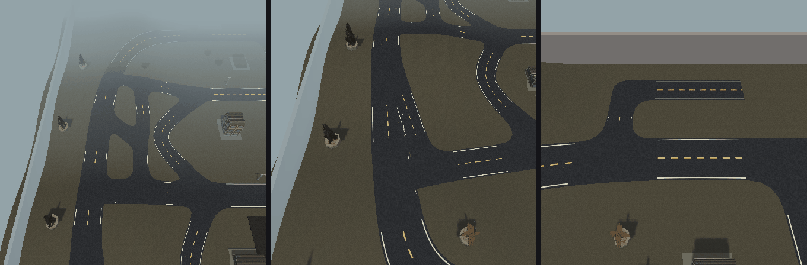

# Motor District

A playable PS2 district for TyraX vehicles. Open `vehicle-playground.tyra` in
TyraX and build the project. The main scene starts in the Ravager; press
**Square** to get out and enter the nearby Pica Turbo or Strix V12. The first
time you sit in each car a controls card lists its buttons with their glyphs,
dimming each one as you try it ([Controls card](../../docs/vehicles.md#controls-card));
**Select** hides it. **D-pad down** repairs the car you are driving (the
Ravager's flow graph, a *Repair Vehicle* node).

For native build timing, use a scratch copy of this example and warm the cache
with one build before timing unchanged, script-only and scene-edit iterations.
Unchanged builds keep the ELF timestamp; scene-table edits can still recompile
the large generated `terrain_game.cpp`. See [native builds](../../docs/native-toolchain.md#incremental-builds).
On a warmed Windows/WSL debug build, a one-script comment edit measured 50.5 s
with the old Windows-path build and 12.8 s with the WSL cache; unchanged native
builds measured 6.7-7.6 s. This excludes editor generation/baking and cold setup.


## What's in the project

- **main** is the driving district: thirteen roads and a railway, a garage, a cobbled crossing,
  dirt service lane, buildings, lights, pushable props and three cars. Every
  place roads meet is a [road node](../../docs/roads.md) with rounded corners,
  and six of the roads exist to show the kinds: **Orchard lane** leaves Market
  cross street as a T and splits into a Y (**Orchard north** ends on Skyline
  avenue, **Orchard east** on the ring road), **Service ramp** peels off the
  east side of the ring at a shallow angle and drops onto Foundry link, and
  **Quarry road** leaves the north side of the ring and turns a corner into
  **Quarry spur**. Every node is painted (edge lines carried round its corners, stop
  lines where a road gives way), and **Skyline avenue** asks for zebra
  crossings too. The
  twelve asphalt streets have
  [kerbs](../../docs/roads.md#kerbs-format-95), which run around every
  junction's rounded corners. The dirt West service lane has none. Their
  tops are solid: a car that clips one bumps up over it. The four downtown
  streets (Skyline avenue, Garage boulevard, Market cross street, Foundry
  link) have 2.5-unit [pavements](../../docs/roads.md#pavements-format-97)
  of paving slabs behind the kerbs (`res/materials/roads/district-pavement`,
  a generated texture with its `.roadtex` recipe).
  **Freight line** is a double-track
  [railway](../../docs/roads.md#rails-and-tram-tracks-format-98) at x = -110
  that crosses Market cross street at a level crossing, and **Garage
  boulevard** carries two flush tram tracks down its middle, through every
  node it passes, the plaza included.
  **Service lane flyover** is a [bridge](../../docs/roads.md#bridges-format-100):
  it leaves the west side of the ring road as a T, climbs to 6 units, passes
  OVER the West service lane on wall piers (no junction there - an overpass)
  and comes down onto Foundry link as another T. Its points carry heights
  `0, 3, 6, 6, 3, 0` (Properties > Points with *Bridge* ticked). The twelve
  kerbed
  streets carry [road details](../../docs/roads.md#road-details-format-99) at
  density 0.8 - manhole covers, gullies at the kerb, repair patches, cracks
  and oil stains, from the generated `res/materials/roads/road-details.png`
  atlas; nodes and their zebras stay clean.
  The same four downtown streets carry [street furniture](../../docs/roads.md#street-furniture-format-101):
  lamps every 12 units on alternating sides, trees every 16 on both walks,
  a give-way sign at each of their stop lines and traffic lights on Garage
  boulevard's nodes - its three four-way crossings and, since format 108, the
  two T's where it ends at the ring road - 132 instances generated at build
  (none of them scene objects), merged into 26 chunks; the poles and trunks
  are solid.
  At night (pause menu > TIME OF DAY) the 50 lamps [light the street](../../docs/weather.md):
  a baked pool of light under each, a halo round each head. Set a scene's
  weather to Rain in Scene Preferences (or fire a Set Weather node) for wet
  asphalt and the lamps' reflections streaking across it.

  **Road traffic** ([docs/traffic.md](../../docs/traffic.md)) drives the
  streets: six AI cars (Ravager, Pica, Strix in turn) spawned out of view
  around the player, stopping at the stop lines, giving way, and obeying the
  five signalised nodes on Garage boulevard, whose heads show their phase (the
  two T's run three phases, one arm at a time). At night (pause menu > TIME OF
  DAY) their lamps come on. Run a red light in the Ravager and Garage
  boulevard's flow graph - On Red Light Run -> Number To Text (formatted) ->
  Display Text - prints "RED LIGHT! You ran it at N" for 3 seconds.
  View > Lanes draws the lane graph; `--road-lanes examples/vehicle-playground`
  prints it. Measured in PCSX2: +2.2 MB of EE RAM for the six cars, the vehicle
  step 0.5-0.6 ms a frame with the far cars on their cheap path, 60 FPS.

  

  
- **dense** adds buildings for a busier drive.
- **procedural** demonstrates painted building and tree placement. Open its
  Procedural layout to inspect the saved graph.

The three vehicle definitions use Blender-built full and far models. Their
shared defaults provide engine loops, tyre squeal, shift sound, headlights and
damage. Open **Tools > Vehicle Editor** to inspect each model, tune driving,
disable visual or performance damage, preview the wheels and audition the
engine. The high-rev recording can be switched off while the idle recording
continues to follow RPM.

The buildings and props cast baked sun shadows. On the ground they come from
one 4-bit shadow map per terrain chunk (128 px). On roads, walls and plinths
they come from decals (64 px per shadow). See *Ambience Editor > Baked
lighting* and [docs/shadows.md](../../docs/shadows.md).

The sky is a painted panorama (FreeStylized Skybox 131) on the ambience
preset, tinted by the day/night cycle - see [docs/sky-texture.md](../../docs/sky-texture.md).

## Make your own vehicle

Start with the [Blender vehicle tutorial](../../docs/blender-vehicle-modeling.md).
It covers wheel objects, axes, materials, export and inspection. The editable
[`ravager.blend`](authoring/ravager.blend) and
[`make-ravager.py`](authoring/make-ravager.py) show two ways to start. The
current cars are generated by `make-ravager.py`, `make-pica.py` and
`make-strix.py`; their `-far.py` companions build distant models from the same
atlas. `carkit.py` is shared by Pica and Strix.

Run the scripts from the project directory with Blender. Generate each full
model before its far companion, then reopen the project and rebuild so TyraX
rebakes the imported assets. For example:

```sh
blender -b --factory-startup --python authoring/make-ravager.py
blender -b --factory-startup --python authoring/make-ravager-far.py
```

`authoring/add-fast-wheels.py` makes the optional fast-wheel variants, and
`authoring/add-exhaust-markers.py` writes each car's `exhaust` empties (its
`EXHAUSTS` list) into the shipped GLB without re-exporting it - the nitrous
flame, the upshift pop and the exhaust smoke come out of those
([Exhaust pipes](../../docs/vehicles.md#exhaust-pipes)). The
district and procedural scene have their own `build-district.py`,
`make-plaza.py` and `make-procedural-scene.py` sources. Run scene authoring
scripts on a copy when you want to replace an edited scene.

For model import, driving controls, damage and sounds, see the
[vehicle guide](../../docs/vehicles.md). Road editing is covered in
[Roads](../../docs/roads.md), and scatter placement in
[Procedural generation](../../docs/procedural-generation.md).

## Credits

The shipped [third-party notices](THIRD-PARTY-NOTICES.txt) list the engine and
assets used by this project. Keep them with redistributed builds.

Generated object values live in `src/gen/scene_objects.gen.cpp`;
`inc/scene_data.hpp` keeps stable declarations. Counts and object IDs live in
the same data file, so ordinary moves, color edits, additions and removals can
rebuild it alone. Changes to features or derived tables can still rebuild consumers.

Generated game methods are split between `src/terrain_game.cpp` and the
`src/gen/game_*.gen.cpp` subsystems, with shared inline helpers/state in
`inc/game_runtime.gen.hpp`. Header changes can compile these units in parallel.
The main file remains user-ownable; generated subsystem files refresh on build.
