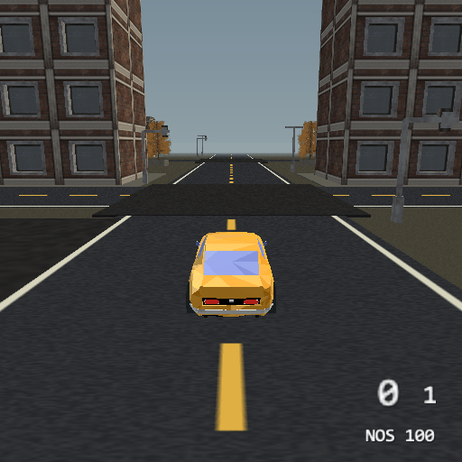

# Motor District

A playable PS2 district for TyraX vehicles. Open `vehicle-playground.tyra` in
TyraX and build the project. The main scene starts in the Ravager; press
**Square** to get out and enter the nearby Pica Turbo or Strix V12.



## What's in the project

- **main** is the driving district: seven roads, a garage, a cobbled crossing,
  dirt service lane, buildings, lights, pushable props and three cars.
- **dense** adds buildings for a busier drive.
- **procedural** demonstrates painted building and tree placement. Open its
  Procedural layout to inspect the saved graph.

The three vehicle definitions use Blender-built full and far models. Their
shared defaults provide engine loops, tyre squeal, shift sound, headlights and
damage. Open **Tools > Vehicle Editor** to inspect each model, tune driving,
disable visual or performance damage, preview the wheels and audition the
engine. The high-rev recording can be switched off while the idle recording
continues to follow RPM.

## Make your own vehicle

Start with the [Blender vehicle tutorial](../../docs/blender-vehicle-modeling.md).
It covers wheel objects, axes, materials, export and inspection. The editable
[`ravager.blend`](authoring/ravager.blend) and
[`make-ravager.py`](authoring/make-ravager.py) show two ways to start. The
current cars are generated by `make-ravager.py`, `make-pica.py` and
`make-strix.py`; their `-far.py` companions build distant models from the same
atlas. `carkit.py` is shared by Pica and Strix.

Run the scripts from the project directory with Blender. Generate each full
model before its far companion, then reopen the project and rebuild so TyraX
rebakes the imported assets. For example:

```sh
blender -b --factory-startup --python authoring/make-ravager.py
blender -b --factory-startup --python authoring/make-ravager-far.py
```

`authoring/add-fast-wheels.py` makes the optional fast-wheel variants. The
district and procedural scene have their own `build-district.py`,
`make-plaza.py` and `make-procedural-scene.py` sources. Run scene authoring
scripts on a copy when you want to replace an edited scene.

For model import, driving controls, damage and sounds, see the
[vehicle guide](../../docs/vehicles.md). Road editing is covered in
[Roads](../../docs/roads.md), and scatter placement in
[Procedural generation](../../docs/procedural-generation.md).

## Credits

The shipped [third-party notices](THIRD-PARTY-NOTICES.txt) list the engine and
assets used by this project. Keep them with redistributed builds.
