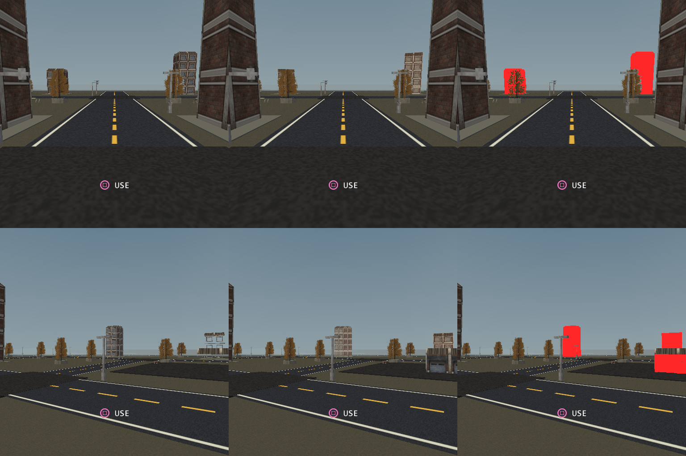

# Raw evidence: the impostor threshold, priced in PACKAGES

Measured in **PCSX2** (software renderer, PAL 512x512 native), 2026-09-17,
against [docs/ee-submission-rearchitecture.md](../../../../docs/ee-submission-rearchitecture.md),
"Order of work" item 5 — world visibility.

**No console was used in this round and none was available.** Every number here
is a COUNT or a PIXEL. The one place a millisecond appears it is a **conversion**
through a rate somebody else measured, and it is labelled as one everywhere it
is printed.

## What this round is, and what the previous one settled

The [visibility round](../world-visibility-2026-09-17/README.md) asked whether
the garage frame is overdrawing and found that it is not: twelve of the fourteen
solo objects that submit triangles paint pixels, and only one tower plus the
pavement slab under it are strictly occluded. What it *did* find was a ratio
nobody had computed — **triangles per visible pixel** — and a clean split in it:
the two near towers pay ~0.10, while four distant objects pay between 2.4 and
infinity. That is a representation problem, and the plan's own fallback for it
is impostors.

This round builds that threshold and prices it. **In packages, not triangles**,
because the console has since measured what a package costs.

## Why packages, and why a triangle count would have misled

A VU1 package costs the EE about **19.5 us in garage day and 31.8 us at night**,
measured end to end on hardware — eight times the 2.362 us that packet
construction alone had priced it at, so the whole `dispatch` bracket follows the
package count
([the wheel-strip round](../wheel-strip-2026-09-17/README.md)).

In that same round **triangles ROSE by 1 807 while the frame got 0.449 ms
faster.** The triangle column can point the wrong way entirely. So every table
below leads with packages.

## The change

Eight-view impostors baked for the district's two building models and assigned
to all ten instances, with a switch distance of **100 world units**.

The threshold is not a guess and not a multiple of the model size. It is placed
in the gap the previous round *measured* between the furthest building the frame
is seen to draw and the nearest one it is not:

| object | distance | visible pixels (2026-09-17) | at threshold 100 |
| --- | ---: | ---: | --- |
| Tower block 03 | 48 | 33 385 | full model |
| Tower block 04 | 48 | 35 074 | full model |
| Loft block 05 | 82 | 610 | full model |
| **Tower block 06** | **117** | **0** (fully occluded) | **impostor** |
| **Loft block 07** | **118** | **128** | **impostor** |

The hysteresis band is 90% of the threshold, i.e. 90..100 units, and no object
in the scene sits inside it in any of the four fixture poses.

## Fixture identity

`pcsx2/counts-ctl/ARM.json`, `pcsx2/counts-cand/ARM.json`:

| | |
| --- | ---: |
| editor sha256 (built from this worktree, this commit) | `6406cd08d1a976f5c3aef703e793facb10e428e998ea027a6ec30ed24c896c18` |
| commit | `ae616f8e` |
| `stripRun` in the generated source | **75** |
| control `impostorDistance` | **0** (replacement disabled) |
| candidate `impostorDistance` | **100** |

**Nothing was built in the tree.** The example was copied to a `C:` root, the
impostors were baked there, and every fixture was built beside it — because WSL
`make` replaces the example's `bin`/`obj` junctions with real directories on the
(full) `D:` drive and the linker then dies with "Input/output error".

**What the control actually is, verified in the generated output rather than
assumed.** At distance 0 the baker drops the far models from the model table
altogether: `model_data.gen.hpp` has 17 entries in the control and 19 in the
candidate. So the control is **the frame exactly as it ships today**, and the
candidate's delta includes the two extra resident models the change brings with
it rather than hiding them in a shared baseline. That is the more honest of the
two controls, but it means a RAM claim cannot be read from this pair.

## Packages removed, per pose

`pcsx2/packages-per-pose.txt`. 240 recorded frames per pose, parked fixture.

| pose | pkg control | pkg candidate | **delta** | % | tri control | tri candidate | tri delta |
| --- | ---: | ---: | ---: | ---: | ---: | ---: | ---: |
| **garage day** | 750.0 | 670.0 | **−80.0** | **−10.7%** | 38 440 | 32 710 | −5 730 |
| **garage night** | 803.0 | 723.0 | **−80.0** | **−10.0%** | 39 044 | 33 314 | −5 730 |
| outer day | 175.0 | 175.0 | **0** | 0.0% | 11 452 | 11 452 | 0 |
| outer night | 192.0 | 192.0 | **0** | 0.0% | 11 784 | 11 784 | 0 |

Bags fall by 10 in the garage poses and by 1 in the outer ones.

**Converted — and this is a CONVERSION, not a measurement:** at the console's
19.5 us/package (day) and 31.8 us/package (night), 80 packages is **1.560 ms in
garage day and 2.544 ms in garage night**. Nothing in this round has been on
hardware, and the rate's own caveat applies — it was measured on a change that
removed packages *and* vertices together, which this one also does, but the
bracket split behind it does not support a pure per-package model.

### Which objects moved, and the prediction that was right

Exactly two objects change in the garage poses, in both day and night:

| object | packages | triangles |
| --- | ---: | ---: |
| **40 Tower block 06** | 50 → **1** | 3 497 → **2** |
| **42 Loft block 07** | 32 → **1** | 2 237 → **2** |

**The strictly-occluded object is captured by the threshold, as predicted.**
Tower block 06 — the one object the visibility round proved contributes zero
pixels — drops from 50 packages to 1. A distance rule reached it without any
occlusion machinery, which was the whole argument for preferring this lever.

**One half of that prediction was wrong and should not be quietly dropped.** The
previous round said a threshold "captures both strictly-occluded objects". It
captures one. The other is *Pavement 06*, a **box primitive**, and impostors
apply only to static OBJ models — there is no asset to bake. It is 12 triangles
and 1 package, so the error costs nothing numerically, but the claim was wrong
and a PVS would still have taken it.

### Why the outer poses gain nothing, and why that is correct

The same buildings are 32 and 44 units away in the outer poses, so the threshold
correctly leaves them as full models. `object_submit` there is only 9 packages
in total. **This lever is worth exactly nothing outside the garage**, and that
is a property of the scene rather than a defect of the threshold — a distance
rule cannot save work that is not being spent.

## The quality gates

### Collisions and picking — PASS, by source rather than by picture

`pcsx2/scene-identity.txt` (`verify_scene_identity.py`). This is a stronger
check than a capture: it covers every object in the scene at once instead of
only the poses somebody thought to photograph.

The naive version of it FAILS, for a reason worth recording. Assigning impostors
adds two entries to the model table and the baker inserts each far model
directly after its source, so **every model index above them shifts by two** and
a plain diff reports a change on most rows in the file. The coupe's `model` goes
11 → 13 and it is the same vehicle body. The check therefore resolves indices to
**names** before comparing.

After that remap, across 142 objects and 69 fields each:

- 10 rows differ in the impostor fields — the ten buildings, as authored;
- 5 objects also lose `batchStatic`, which is a **consequence** of the
  assignment, for the same documented reason catch-area objects are excluded
  from static batching: a batched member has no bag of its own, so there would
  be nothing to swap for a card. `static_batches` does not move in the
  measurement (89 packages in both arms), so nothing migrated between producers;
- **every other field on every object is identical** — positions, scales,
  collision boxes, `pickable`, `usable`.

Collision and bounds are keyed on the original `model` by design
([impostors.md](../../../../docs/impostors.md): *"the original owns collision"*),
and this confirms it in the generated data.

### Popping and late geometry — the drive

`pcsx2/route-analysis.txt`. A threshold validated only at the parked pose is
rejected, and for a specific reason: an impostor swap is invisible in a still
frame by construction, because the arm showing a card shows it in *both*
captures. So the camera was parked at **20 stations** — 12 walking the garage
approach from 117 units in to 45, and 8 orbiting the switched object at a
constant 110 — and both arms were photographed at every one. Stations rather
than a moving camera because the capture path freezes the game, so two arms'
`--capture-frame` calls never land on the same frame of a moving route.

**Repeatability.** The control re-visits station 0 at the end of its run at
**0 px**. The candidate re-visits at **28 px, worst channel delta 10**, in a
thin band along the horizon. That is a **noise floor, not a dead run** — it
means nothing below about 30 px should be read as a difference. Every number
below except one is more than fifty times that.

#### What the card costs, by distance

| station | eye z | distance | cand vs ctl | % screen |
| ---: | ---: | ---: | ---: | ---: |
| 0 | −32 | 117 | **123** | 0.05% |
| 1 | −20 | 105 | 660 | 0.25% |
| 2 | −12 | 98 | 2 496 | 0.95% |
| 3 | −8 | 94 | 3 958 | 1.51% |
| 4 | −6 | 92 | 4 836 | 1.84% |
| 5 | −4 | **90** | **5 297** | **2.02%** |
| 6 | −2 | 88 | **0** | 0.00% |
| 7..11 | 0..40 | 87..52 | 0 | 0.00% |

Two things to read here. **At the canonical garage pose the whole 80-package
saving costs 123 pixels** — 0.05% of the screen — because the object it removes
is the one the previous round proved contributes nothing. And the **hysteresis
is doing exactly what it is for**: the card is held all the way down from 117 to
90 (90% of the threshold) and the full model returns at 88.

#### The pop, and the honest size of it

The swap happens between stations 5 and 6. Everything the card was getting wrong
at 90 units reverts in a single step, so **the pop is 5 297 pixels, 2.02% of the
screen**, concentrated on one building.

Measured against camera motion it disappears: moving the eye the 2 units from
station 5 to station 6 changes **173 137** pixels in the control and **173 005**
in the candidate — a ratio of **1.00**. Every step on the route is 1.00.

**But that ratio flatters the swap and should not be quoted on its own.** The
stations are 2 world units apart, which is far more than one frame of driving
moves. Pixels-changed scales roughly linearly with distance travelled over
these small steps (~90 000 px per unit here), so one frame at a plausible
20 units/s covers ~0.33 units and changes ~30 000 px — which would make the
swap about **18% of a frame's change** rather than 3%. That is an
**extrapolation from the station spacing, not a measurement**, and the way to
settle it is a station set spaced at one frame of travel.

#### The orbit: the other kind of pop

At a constant 110 units — always a card in the candidate — the error swings
wildly with azimuth, because an 8-view card is up to 22.5 degrees off its
captured view:

| orbit | 120° | 133° | 146° | 159° | 172° | 185° | 198° | 211° |
| --- | ---: | ---: | ---: | ---: | ---: | ---: | ---: | ---: |
| cand vs ctl px | 0 | 2 537 | 89 | 1 680 | 2 343 | 3 480 | 4 498 | **7 150** |

**The worst case is 7 150 px, 2.73% of the screen, and it is larger than the
distance pop.** The 0 at 120 degrees is not the threshold failing: the tower is
completely hidden behind another building from that camera, which is an
incidental second confirmation of the visibility round's finding.



Left is the full model, middle the card, right the difference in red. Top row is
station 5, the last card before the swap; bottom row is the worst orbit station.
The bottom row is the honest picture of what an 8-view card costs: at 211
degrees the difference covers most of the building's silhouette rather than
being a shading nuance. **16 views would halve the angular error** at the cost
of a larger atlas, and that is the obvious first move if this is judged too
visible.

**Nothing appears late.** There is no station where the candidate shows *less*
than the control — the card is present wherever the model was, so no geometry
arrives after the camera turns. What changes is its fidelity, not its presence.

## Reproducing

```powershell
# the editor, from the worktree under test (NOT the one sitting in build/)
./build.ps1

# an OUT-OF-TREE copy of the example - never build a game in the tree
robocopy examples\vehicle-playground C:\tyra-imp-0917\project /E /XD bin obj .res-baked preview

# bake the two building impostors into the copy, assign them, bake the assets
build\tyrax-editor.exe --bake-impostor C:\tyra-imp-0917\project `
    res/models/urban/district-tower.obj res/models/impostors/district-tower-far 8 --gpu
build\tyrax-editor.exe --bake-impostor C:\tyra-imp-0917\project `
    res/models/urban/district-loft.obj  res/models/impostors/district-loft-far  8 --gpu
python set-impostors.py C:\tyra-imp-0917\project --distance 100
build\tyrax-editor.exe --build C:\tyra-imp-0917\project

# the arms. Never an editor --build on a fixture: it regenerates the
# instrumentation away.
./build-imp-arm.ps1 -Editor <exe> -Arm counts-ctl  -Distance 0   -Kind counts
./build-imp-arm.ps1 -Editor <exe> -Arm counts-cand -Distance 100 -Kind counts
../reflection-probe-2026-09-16/run-pcsx2-arm.ps1 -Fixture <root>/arms/counts-ctl  -Out <res>/counts-ctl
../reflection-probe-2026-09-16/run-pcsx2-arm.ps1 -Fixture <root>/arms/counts-cand -Out <res>/counts-cand
python compare_packages.py ctl=<res>/counts-ctl cand=<res>/counts-cand
python verify_scene_identity.py <root>/arms/counts-ctl <root>/arms/counts-cand

# the drive gate
./build-imp-arm.ps1 -Editor <exe> -Arm route-ctl  -Distance 0   -Kind pixels -Route -Profile debug
./build-imp-arm.ps1 -Editor <exe> -Arm route-cand -Distance 100 -Kind pixels -Route -Profile debug
../world-visibility-2026-09-17/probe-visibility.ps1 -Fixture <root>/arms/route-ctl `
    -Out <res>/route-ctl -Editor <exe> -Probes (0..19 | % { "s$_=$_" }) + @('s0rep=0') -Repeats 1
python analyze_route.py ctl=<res>/route-ctl cand=<res>/route-cand
```

**THE EMULATOR IS A SHARED RESOURCE.** Never `--build --run`, which reaps other
worktrees' emulators.

## What is settled by counts, and what still owes hardware

**Settled, and it is counts and pixels only:**

- **−80 VU1 packages in both garage poses, 0 in both outer poses**, from an
  instrumented PCSX2 run of 240 frames per pose per arm. PCSX2's counters are
  exact even though its milliseconds are not.
- **Which objects move and why**: Tower block 06 50 packages → 1, Loft block 07
  32 → 1, and the strictly-occluded object captured by a pure distance rule.
- **Collisions and picking unchanged**, proved across all 142 objects in the
  generated scene data rather than by sampling poses.
- **The quality cost, in pixels, at 20 camera positions**: 123 px at the garage
  pose, a 5 297 px pop at the swap, and a worst-case 7 150 px card error on the
  orbit.

**Owed, and nothing here should be read as having it:**

- **A HARDWARE ARM.** No console was available this round. The only
  milliseconds on this page are **conversions** through the wheel-strip round's
  19.5 / 31.8 us per package, and that rate carries its own caveat: the bracket
  split behind it does not support a pure per-package model, `bounds` rose while
  the frame fell, and most of the saving sat in an unbracketed region. A
  four-pose `frame-cost.csv` A/B of `counts-ctl` against `counts-cand` is the
  one thing that would turn −80 packages into a number.
- **A per-frame-spaced station set**, to replace the extrapolation that turns
  the swap from 3% of a station step into ~18% of a frame step.
- **A judgement call this round cannot make**: whether a 2.7%-of-screen card
  error at 110 units is acceptable for this game's look. That is a decision, not
  a measurement, and 16 views is the lever if the answer is no.

**Headroom deliberately left**: the two distant streetlights and the far park
tree are another ~9 packages the same threshold would take. They were left out
because thin geometry on a billboard is a different quality risk from a
building and deserves its own look rather than being bundled in here.
