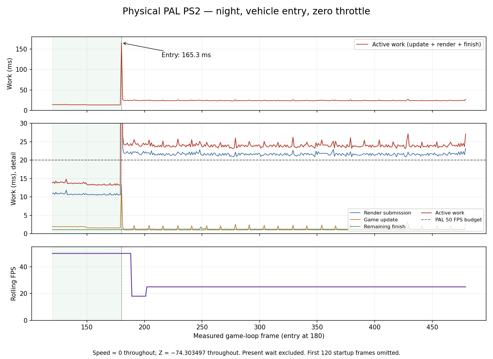

# Physical PS2: night entry and full-throttle driving, 2026-09-28

The reported dip is reproduced on a physical PAL PS2 at the Ravager's garage
start (X 0, Z -74.3035), at night, with the normal mode-0 chase camera.
**No acceleration is needed: entering the stationary car changes 50 FPS to
25 FPS.** This is a different workload from the earlier moving-camera sweep.

[Follow-up causal probes](causal/README.md) isolate the full-body/reflective-prefix
bbox cache collision, price headlights and coat removal, and test a bounded
count-variant candidate without removing the coat.

[Accepted fix and further pipeline probes](fix/README.md) retain both bbox
count variants in the engine after canonical-bounds and lifecycle acceptance,
then validate the production engine and driving/traffic scenarios. The cache
fix saves about 2.6 ms; the stationary night view still exceeds 20 ms.

All fixtures were regenerated from editor commit `4be1d46b`, used complete
current baked assets and `quiet-debug`, and parked the other traffic. Remote
Pad, Live Debugger, Live Link, Live Logic, Time Machine and Input Recorder were
not polling. Entry and throttle were supplied at the regular script/input
boundary in the isolated fixture. Gameplay physics, camera and rendering ran
normally; these overrides are not changes to the shipped example.

## Stationary entry: continuous capture, zero throttle

The test holds the walking camera for 180 updates, enters `ravager-1`
(runtime object 132) in frame 180, and never applies throttle, brake, steering,
handbrake or nitro. Headlights are on. The capture records 480 consecutive
frames, including the exact entry frame. Every speed value is **0.000000**;
X is 0 and Z remains **-74.303497** throughout. RAM buffers are exported only
after timing has ended, with the pose export deferred to the next update.

| Window | Median FPS | Median active work | Update | Render submission | Finish | Present wait |
|---|---:|---:|---:|---:|---:|---:|
| Walking, frames 120–179 | 50.000 | 13.615 ms | 1.736 ms | 10.665 ms | 1.092 ms | 6.344 ms |
| First 30 frames after entry, 180–209 | 25.000 | 24.233 ms | 1.022 ms | 21.960 ms | 1.242 ms | 15.718 ms |
| Warm seated car, 181–479 | 25.000 | 23.923 ms | 1.030 ms | 21.561 ms | 1.227 ms | 16.018 ms |

Active work is `update + submit + finish`, not the full loop and not pure EE
execution: it includes renderer/DMA waits. Each column's median is computed
independently. Present wait is separate; missing PAL's 20 ms period makes the
loop about **39.959 ms** and leaves roughly 16 ms until the following field.
All 299 warm seated frames exceed 20 ms of active work (p95 **25.185 ms**,
max **27.175 ms**), versus zero of the 60 walking control frames.

The warm seated render block is the sustained bottleneck:

| Inclusive phase or subset | Median |
|---|---:|
| Objects, including interleaved road/static work | 13.375 ms |
| Direct object-part submission, subset of Objects | 7.375 ms |
| Terrain draw | 2.295 ms |
| Night light/shadow effects | 1.995 ms |
| Wheels, including their submission | 1.230 ms |
| HUD | 0.599 ms |
| Vehicle update, subset of Update | 0.615 ms |

The chase view submits **46,096 triangles**, versus **22,425** in the walking
control. Pipeline bounds cost 4.598 ms, preparation 4.419 ms and dispatch
8.592 ms; VIF1 DMA wait **5.651 ms** is included inside submission/dispatch.
These inclusive counters overlap and must not be summed as a frame. There
are no texture uploads or reuploads in the 299 warm seated frames. The
physics/update budget is small; accelerating is not what makes this view
miss the budget. EE-side submission remains substantial, but the VIF waits
mean this capture cannot identify an exclusively EE, VU1 or GS limit.
Engine `TYRA_STAPIP_ATTRIB` is off, so the deeper `sp*`, `bd*` and `ds*`
columns intentionally contain zeros.

### The exact entry frame is a separate hitch

Frame 180 costs **165.300 ms active work**: update **13.231 ms**, render
submission **150.948 ms**, finish **1.121 ms**. The broad Objects phase is
63.571 ms and HUD **57.195 ms**. The log records `fonts/atlas-default.png`
and `hud/icons.png` being read from `host:` immediately after entry, and the
frame records one texture upload. The runtime's `drawFontText` initializes
its atlas on first use and requests `iconSheetSprite` even when the speed,
gear and NOS strings contain no icon token. Moving these loads out of the
first vehicle HUD draw is a concrete candidate for reducing this hitch.
This does not account for the entire 165 ms: first-visible geometry caches,
reflection work, audio startup and their logs also occur here. It does not
explain the sustained 25 FPS after the assets are warm.



## Full throttle, measurement after about five metres

The ordinary-FPS control enters at boot, waits 120 updates, then applies
full throttle without nitro. `baseline-drive-pose.csv` starts at Z -68.94952
(5.35 m from the authored start) and retains 120 consecutive position/FPS
rows through Z -6.62483. Rolling FPS begins at **25**, rises through 32–44,
and reaches about **50** near the end.

The continuous profiled drive delays entry to frame 180 and throttle to 210.
Its first 120 frames after Z >= -69 are **229–348**, Z -68.94956…-0.30316:
median active work **18.722 ms**, p95 **22.036 ms**, max **23.241 ms**;
**29/120** frames exceed 20 ms. Median render submission is **16.152 ms**,
update **1.241 ms**, including vehicle update **0.875 ms**, and finish
**1.193 ms**. All these driving frames have zero texture uploads/reuploads.
Objects remain the largest named render phase at **7.877 ms**, including
**3.774 ms** of direct part submission. VIF wait is **2.362 ms** included.

The two controls differ in entry timing and automatic renderer tuning history;
compare the same road window, not frame numbers or a single rolling-FPS value.
The stationary entry hitch briefly pulls the rolling FPS counter to **17.999**
before it settles at 25. Engine FPS is reused across many CSV rows, not 120 independent
instantaneous samples. Per-frame work is the COP0 measurement. The first
continuous drive's pose exporter overlapped its final frame 479: that row is
omitted from both archived timing CSVs. None of the reported drive or entry
windows includes it. The reproducer now defers that export; the stationary
capture has all 480 clean timing rows.

## Reproduce

From the repo root, create a new short-path fixture and replace its parked
camera sampler before building complete current assets:

```powershell
python examples/vehicle-playground/authoring/benchmark-district.py C:/tyra-vq/night-entry --profile quiet-debug
python examples/vehicle-playground/authoring/night-drive-2026-09-28.py C:/tyra-vq/night-entry --stage prepare
build/tyrax-editor.exe --build C:/tyra-vq/night-entry
python examples/vehicle-playground/authoring/night-drive-2026-09-28.py C:/tyra-vq/night-entry --stage input
```

Build with `tools/toolchain/native-build.ps1` (or `.sh`) directly, using the
configured engine/cache/toolchain paths. Deploy with a verified absolute
`bin/ps2link.run` resident-IOP marker and keep the ps2client host server alive
until `drive-pose.csv` is complete. This is the ordinary driving control.
For a profiled five-metre driving window, apply `--stage profile` and rebuild
natively. For the continuous entry/drive capture, then apply `--stage entry`.
For the **zero-throttle entry test**, apply `--stage stationary` after entry
and rebuild natively. Collect `frame-cost.csv`, `frame-attrib.csv` and
`drive-pose.csv`. Do not regenerate after the overrides: it removes them.

The reproducer's stages were checked on a separate freshly regenerated
fixture; their final runtime code matches the tested fixture ignoring
comments and whitespace. The stationary ELF built natively and booted on hardware;
`fixture.json` preserves its SHA-256, settings and source revision. Both
entry logs preserve `loadelf:`, entry, HUD reads and vehicle telemetry.
`stationary-statistics.json` and `drive-statistics.json` hold the stated
windows and medians. CSVs and normalized host logs are alongside this report.

This establishes a repeatable slow garage chase view with parked traffic.
It does not establish a map-wide minimum or normal moving-AI performance.
The next optimization must improve this exact seated view, not just the
previous camera sweep, and keep a separate first-entry hitch control.

## HUD preparation follow-up

The [same-ELF HUD A/B](hud-entry/README.md) removes 58–61 ms from the entry
frame after the bounded cache fix. The remaining first-entry frame still
costs 109 ms and warm garage work remains about 21.17 ms / 25 FPS. Cold 3D
preparation and sustained frame costs are tracked separately.
