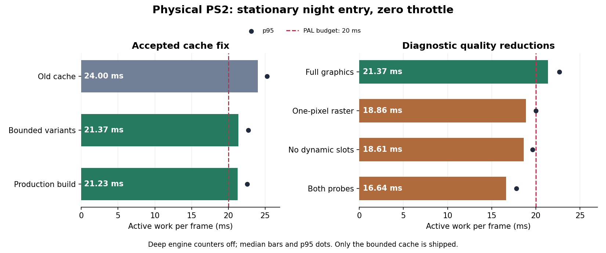

# Bounded bbox count variants: accepted fix and remaining night-view cost

Physical PAL PS2, 2026-09-28, pinned native PS2DEV/OpenVCL. The engine now keeps
at most **two vertex-count variants per vertex-pointer/VU-package-size key**.
The full vehicle body and painted reflective prefix can both reuse their
package bounds. A third count replaces the least recently touched variant;
content versions still invalidate in place and expiry remains 250 frames.
No vertices, lighting, quality settings, VU programs or DMA ordering change.
The diagnostic switches and oracle are absent from the production engine;
`TYRA_STAPIP_ATTRIB` remains **0**.

This implements the cache fix identified by the [initial causal probes](../causal/README.md).
It saves about **2.6 ms** in the stationary night garage chase view. It does
**not** yet make that view fit PAL's 20 ms budget or resolve the first-entry
HUD-loading hitch. Further renderer changes need their own measurements.

## Deep counters off: same-ELF hardware A/B

The first group uses one ELF and a boot-only mask. Deep engine attribution
and per-object snapshots are absent; the outer COP0 frame timer and the
game's phase brackets remain, as in the original 23.923 ms entry capture.
Each arm has all 480 aligned rows, zero Ravager speed, X 0 / Z -74.303497,
night, normal chase camera and parked traffic. Tables use frames **240–479**.
Warm frames have no texture uploads/reuploads. All rows retain **46,096
submitted primitives**, including strip degenerates.

| Arm | Mask | Median active work | p95 | Frames >20 ms | Median rolling FPS |
|---|---:|---:|---:|---:|---:|
| Old-cache control | 0 | 23.995 ms | 25.253 ms | 240/240 | 25.000 |
| Bounded count variants | 128 | 21.372 ms | 22.674 ms | 240/240 | 25.000 |
| Old-cache repeat | 0 | 23.933 ms | 25.273 ms | 240/240 | 25.000 |
| Count variants, one-pixel engine scissors | 640 | 18.862 ms | 20.012 ms | 15/240 | 48.000 |
| Count variants, scene dynamic-light slots removed | 192 | 18.610 ms | 19.629 ms | 5/240 | 49.998 |
| Count variants, both suppression probes | 704 | 16.639 ms | 17.781 ms | 0/240 | 50.000 |
| Count variants, legacy lighting bags removed | 384 | 21.323 ms | 22.585 ms | 240/240 | 25.000 |

Active work is update + render submission + finish, excluding presentation
wait; it includes DMA/pipeline waits. Columns are independent medians.
Automatic interleaving stays enabled. The old-cache repeat differs by only
0.063 ms; the count-variant gain is **2.560–2.623 ms**. Raster masks are
applied to every engine scissor write while retaining argument evaluation,
projection, submitted geometry and VU programs. These images are unusable
by design; the raster probe is never a production setting.

### What remains expensive

Dynamic scene-light removal saves **2.762 ms** with normal rasterization and
**2.223 ms** with rasterization constrained to one pixel. Its cost therefore
includes work upstream of pixel fill: EE selection/transformation/uniforms
and the dynamic-light path in VU1. It changes light-slot data and shader work,
so it is not a pure VU instruction benchmark. Removing legacy
`StaPipLightingBag` pointers hardly changes this fixture; it does not disable
the separate dynamic-light path, which uses the modern colour programs.

Raster suppression saves **2.510 ms** with dynamic lights and **1.971 ms**
without them. With lights retained, submission drops 19.104 → 17.791 ms and
finish drops 1.159 → 0.195 ms; VIF wait drops 5.882 → 4.880 ms. Thus GS
pixel/raster work is material in this view, and about 4.880 ms of included VIF
wait remains even with one-pixel scissors. This does not isolate primitive
setup, bandwidth or exact VU1/GS utilization. Faster FPS also reduces physics
substep work (update 1.041 → 0.861 ms); total-work subtraction must not assign
that entire delta to rasterization. The two probes' savings are not additive.

The next useful targets are dynamic-light setup/shader cost and submission
overlap or raster work that can be reduced **without changing the picture**.
Globally disabling lights, effects or roads is not the shipped fix. The
original entry hitch's lazy font/icon reads remain a separate loading issue.

## Correctness and cache lifecycle acceptance

The physical correctness arm compares the actual cached result against a
fresh canonical `StaPipBagPackagesBBox`: main box, every child box, merged
min/max ranges and coarse bounds, including all vector coordinates.

- **52,273 comparisons, zero mismatches:** 3,470 lifecycle requests followed
  by 48,803 live game requests through the continuous stationary entry.
- Two full/prefix counts over **1,000 simulated frames:** exactly two fresh
  entries and 1,998 hits, with no recurring replacements.
- Thirty content-version changes in the same buffer: 60 recalculations, two
  retained count variants, every result matching fresh bounds.
- Nine hundred changing counts: the key never exceeds two entries.
- Different VU package capacities retain independent splits; reused-address
  content versions refresh their bounds correctly.
- All entries expire after 250 unused frames. Partial expiry rebuilds the
  hash index correctly while active entries continue to hit.

`validation/bbox-check.csv` and `bbox-oracle.csv` preserve these gates. This
arm allocates fresh reference bounds on every request; its frame times are
**correctness-only**, never performance evidence. Production contains no
oracle or experimental cache switch.

## Production-engine end-to-end scenarios

The final native build uses a source-identical copy of the shipped engine,
without the A/B, raster, legacy-light or oracle hooks. Its isolated game
records 960 frames and selects a boot-only scenario: stationary entry,
full throttle after frame 210, or two moving AI cars while Ravager stays
seated and stationary. Traffic position/speed exports check the actual state.
The driving window starts from the first recorded position at least five
metres forward and includes the next 120 frames. These scenarios exercise
the running game with preserved graphics; they do not replace the same-ELF
cache subtraction above or establish a map-wide minimum.

The generated [production results](production-results.md) contain the final
numbers and ELF hashes. The AI paths are two explicitly recorded scratch
circuits, not a claim about every traffic layout. Two preliminary scenario
runs were rejected: the route override ran before the initial scene had
created its vehicles, and AI moved in nominal parked controls. The traffic
oracle caught that error. The override now runs at the vehicle-simulation
boundary after scene creation; only repeated, validated captures are archived.

## Reproduce and inspect

`release-*` contains complete CSVs, actual masks, host logs and summaries for
the first group. All seven arms use the same ELF SHA-256. Deployed asset
hashes match all 156 complete parent-fixture PNG/TMDL/MTL/ADPCM files.
`production-*` contains the three 960-frame scenarios and actual traffic
telemetry. No exports run inside their timing windows.

Start with the parent's freshly built stationary fixture. For the release
A/B engine, use an isolated copy of the engine from commit **bb854323**, then
apply `release-engine.patch` from its `engine/` directory and
`release-game.patch` from the fixture root. Keep a separate native cache.
Build directly using `tools/toolchain/native-build.ps1` / `.sh`; do not run
editor regeneration after instrumentation. Write the table's mask to
`bin/budget-probe.cfg` before a physical resident-IOP deployment. Collect
`frame-cost`, `frame-attrib`, `drive-pose` and `budget-probe` CSVs after sampling.

For the correctness arm, first apply the parent's `causal/engine-probe.patch`
and `game-probe.patch` to their original copies; then apply `oracle-engine.patch`
and `oracle-game.patch` and copy `bbox_validation.cpp` into the fixture's
`src/`. Compile with deep attribution on in both engine and game. Set mask
384 and collect `bbox-check.csv` and `bbox-oracle.csv` along with the parent
capture files. This arm never supplies performance numbers.

For final scenarios, use the shipped engine with deep attribution off and
apply `production-scenarios.patch` to the original stationary game fixture.
Set `bin/budget-scenario.cfg` to 0, 1 or 2. Collect `frame-cost`, `frame-attrib`,
`drive-pose`, `scenario` and `traffic` CSVs. Rebuild after source changes and
use fresh game objects whenever the engine class layout or attribution macro
changes. The reproduced startup/route bug is documented above to prevent a
false parked control. Unified patch context markers intentionally contain
spaces; other archived text has normalized line endings.
