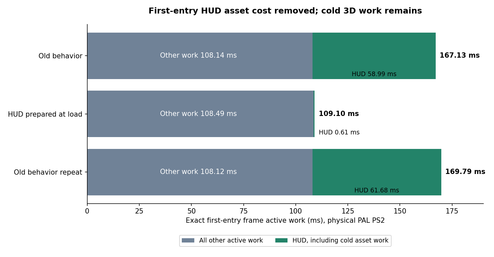

# First-entry HUD preparation on physical PS2 (2026-09-28)

Version 1.150.1 prepares the driveable vehicle's HUD font during scene loading,
including its first GS upload. The same persistent glyph sprite is reused.
The texture remains normally evictable; no VRAM pinning is introduced. Numeric
HUD text no longer opens the icon sheet. A resolved foreground icon opens it
on demand; unknown placeholders remain literal text.

## Same-ELF control / fix / repeated control

Stationary night entry into the Ravager at frame 180, with parked traffic and
zero throttle. All three boots use ELF SHA-256
`5505cbc60dfbd9b68111903f84a3163e1d2413fec5ace0a2a8ce1b99c03e74f6`.
`hud-entry-fix.cfg` selects old behavior (0) or the shipping fix (1) once at
boot, outside measured frames. Deep attribution is off. All 960 aligned rows
per arm are retained, including driver state, speed, position and traffic.

| Physical PS2 arm | Exact entry work | HUD included | Entry uploads | Warm work, frames 240–479 | Rolling FPS |
| --- | ---: | ---: | ---: | ---: | ---: |
| Old behavior | 167.132 ms | 58.987 ms | 1 | 21.175 ms | 25 |
| HUD prepared at load | 109.105 ms | 0.612 ms | 0 | 21.166 ms | 25 |
| Old behavior repeat | 169.790 ms | 61.675 ms | 1 | 21.173 ms | 25 |



The fix removes **58.0–60.7 ms** of total first-entry work in these three
boots. This is three individual entry observations, not a hitch percentile.
Each boot reads the font once: the fixed arm does so during loading. Neither
entry nor any other measured fixed-arm frame reads the icon sheet. Both old
arms read the font and icons at entry. Warm frames retain 46,096 submitted
primitives and no uploads/reuploads; every sampled warm frame still exceeds
20 ms. The tiny warm median difference is noise, not an FPS improvement.

## Remaining first-entry work

**The whole first-entry hitch is not fixed.** The fixed frame still costs
109.105 ms: update 13.745 ms (vehicle update 12.362 ms included), render
submission 94.111 ms and finish 1.248 ms. Scene rendering is 93.357 ms,
including Objects 63.280 ms, terrain 9.877 ms, wheels 8.523 ms and environment
probe 3.875 ms. Bounds 18.995 ms, dispatch 50.893 ms and packet construction
23.412 ms are nested attribution scopes: do not add them to those phases.
VIF wait is only 1.416 ms included. The first chase view still triggers cold
3D preparation and first driven update work; it submits 47,092 primitives.
Further preparation must cover those paths rather than just the HUD atlas.

For the sustained budget, concrete scene costs and the limits of TyraX2,
see [current-view analysis](../../../../../docs/ee-submission-rearchitecture.md#stationary-night-vehicle-entry-what-tyrax2-would-and-would-not-solve-2026-09-28)
and the [accepted bounds cache fix and causal probes](../fix/README.md).

## Reproduce and audit

Start with the instrumented production fixture documented in
[the bounds fix](../fix/README.md), before this HUD change. Apply
`hud-entry.patch` to its generated `src/terrain_game.cpp`; do not regenerate
after applying it. Build once with the native toolchain and deep attribution
off. Set `budget-scenario.cfg` to 0 and `hud-entry-fix.cfg` to 0, 1, then 0 for three
separate boots. Deploy with a verified resident-IOP marker and keep the host
server alive until all captures finish. Record the same ELF hash each time.
No quality, scene, vehicle geometry or engine changes are made between arms.
`asset-audit.json` retains the 156-file production asset inventory.

```powershell
python examples/vehicle-playground/authoring/night-entry-hardware-2026-09-28/hud-entry/analyze.py examples/vehicle-playground/authoring/night-entry-hardware-2026-09-28/hud-entry/fixed
```

Repeat for `control` and `repeat`; optionally pass the built ELF as the second
argument to verify its hash. The analyzer validates pose/driver/traffic
alignment, boot selection, font/icon read counts and all 960 timing rows.
The archives contain raw CSVs, normalized host logs and computed summaries.

Emulator timings are not used for these hardware claims. A separately built,
fully baked non-vehicle orbit project checks the other generated camera path.

## Lifecycle verification scope

The later physical scene-revisit launch stopped in `freepad: DMA Busy` before
game startup. A forced full-scene reload probe in PCSX2 also did not finish
its first transition; it is not accepted as scene-revisit evidence. This does
not invalidate the completed three-boot hardware A/B. Full scene-revisit
acceptance remains open; no completed scene-revisit gate is claimed here.

The separate [font lifetime probe](lifetime/hud-lifecycle.csv) passes **nine
checks with zero errors** in PCSX2: one atlas and the same sprite/texture
identity across repeated calls to the actual font preparation code, invalid
indices, VRAM eviction/reupload, unknown placeholders, and first/repeated
resolved icon drawing. Repository texture count stays 55 until the first
valid icon, then stays 56. Eviction is exercised after scene submission
inside an active render frame, before its end; the between-frame mutation
probe stalled and is not accepted. This proves these font paths, not a full
scene switch. No engine workaround is shipped.

`lifetime/lifetime.patch` applies on top of the A/B fixture. For this
correctness-only probe, append `CFLAGS += -O1` after the Makefile's base
include and rebuild the changed game object; engine and other objects retain
-O3. Select HUD fix 1 and scenario 0. The probe runs after all timing exports
and writes `hud-lifecycle.csv`; none of its emulator timings are used. Logs,
ELF hash and the incomplete forced-scene log are archived alongside it.
