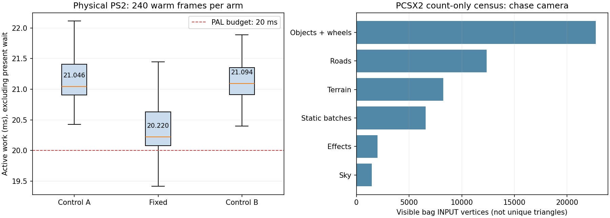
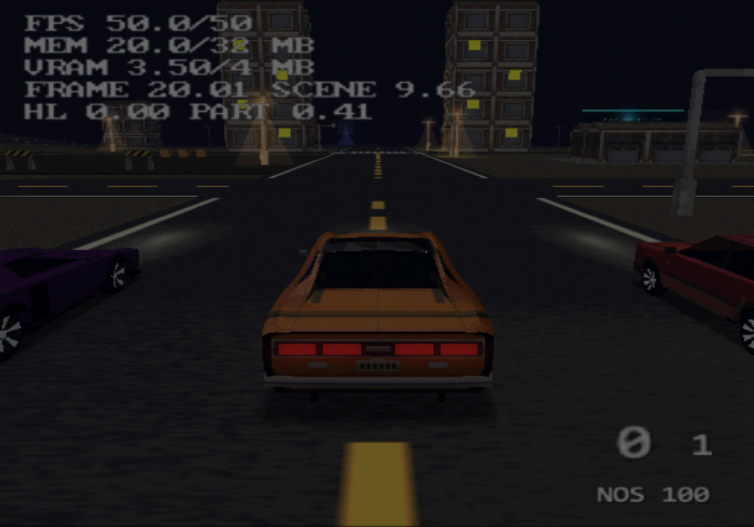

# Night chase lighting eligibility and geometry census

This investigation measures the ordinary stationary night view immediately
after entering the Ravager, separates EE light setup from shader eligibility,
and ships a conservative zero-contribution rejection in TyraX **1.150.2**.
All milliseconds below come from the physical PAL PS2. PCSX2 supplies counts,
vertex-oracle checks and visual inspection, never performance claims.

## Accepted production result

One native **-O3** ELF, control / fixed / control, 960 frames per boot. The
night driver enters at frame 180, never accelerates, and leaves Pica/Strix
parked. The warm window is frames **720–959**. `active work = total_ms -
present_ms`; the roughly 40 ms presented period is not active rendering work.
Deep attribution, diagnostic light counters and cache experiments are absent
from this group. The engine differs from shipping only by one test-only
boolean around the new eligibility condition; it is read from a file once,
before measured frames. Production carries no configuration switch.

| arm | median work | p95 | max | warm frames over 20 ms |
| --- | ---: | ---: | ---: | ---: |
| control A | 21.046 ms | 22.392 ms | 23.650 ms | 240/240 |
| fixed | **20.220 ms** | **21.498 ms** | 22.095 ms | **199/240** |
| control B | 21.094 ms | 22.211 ms | 23.502 ms | 240/240 |

Saving: **0.825–0.874 ms**, about 4% against the two controls. This is a useful
reduction, **not stable PAL 50 FPS**. The fixed median remains above 20 ms,
and the tail still needs 1.5 ms just to bring p95 below that boundary. A
practical 18–19 ms target needs additional headroom. 60 Hz needs 16.667 ms
plus headroom: about 3.55 ms below the current median.

| included phase | control A | fixed | control B |
| --- | ---: | ---: | ---: |
| game update | 1.053 ms | 1.040 ms | 1.048 ms |
| render submission | 18.830 ms | **18.036 ms** | 18.882 ms |
| VIF1 wait, included in submission | 5.970 ms | **4.925 ms** | 5.971 ms |
| finish, excluding present wait | 1.143 ms | 1.142 ms | 1.142 ms |

Medians of nested phases must not be added. The wait reduction is downstream
backpressure visible to the EE, not an isolated VU1 cycle/GS utilization
measurement. The predicate and its uniform changes also affect command work
and overlap. All warm arms retain **46,096 submitted primitives**, the same
parked position and zero speed. These primitive counts include strip
degenerates and repeated passes. All **156 fixture assets** retain their
previous HUD-acceptance hashes; geometry, textures and effects are unchanged.
Raw rows, logs and ELF SHA-256 are in `production/`, with `summary.json` at
this level. Run `python analyze.py` to recompute the warm work statistics.

## What changed

`StaPipCore` passes its existing versioned **local bag AABB** to the qbuffer
renderer. After selecting and transforming the light, the renderer checks
`stapip_spot_bounds.hpp` using the SAME object-space constants that the VU1
and EE clipper consume. It disables that bag's light only when its entire
expanded box receives zero from either radial falloff or the cone.

For each expanded interval, the closest possible coordinate gives a lower
bound on `dist2`; the support corner in the light direction gives an upper
bound on `t`. If even those bounds cannot produce a positive cone/range
term, no contained vertex can receive the selected light. A 0.1% interval
expansion, plus radial/cone slack, keeps boundary cases lit. This is not a
brightness cutoff. Nonuniform transforms use the shader's own object-space
range, rather than the picker's approximate world sphere.

Selection, the picker's soft cone ranking, flicker and brightness updates
remain as before. The existing unlit colour program and EE clipper gate skip
zero work; **no VU program changes**. Stock colour clamping remains on both
lit and unlit paths. Unknown bounds, billboard descriptors and custom VU
program overrides preserve their original light/uniform contract. Bounds
are borrowed during immediate uniform preparation, never retained by DMA.
There is no new persistent light cache, scene-generation cache or heap growth.

## Why the first cache proposal was rejected

The diagnostic same-ELF group times each setup stage separately. Warm
selection performs **104 picks**, including 39 with no in-range candidate.
Object-space light preparation is called 127 times, including disabled slots.
Its individual cost is not a measurement of VU lighting.

| measured EE light stage, control | median per frame |
| --- | ---: |
| choose a slot | 0.473 ms |
| transform light to object space | 0.278 ms |
| register eight scene lamps | 0.014 ms |

A bounded full transformed-light cache retained exact matrices/light geometry,
updated colour separately, and had **65 hits / zero misses** in each warm
frame. It still raised transform time to **0.446 ms**, and full work to
**21.436 ms**, versus 21.196/21.320 ms in the controls. It held **24 KiB**.
Comparisons/copies/cache traffic were more expensive than the saved work in
this implementation. Its correctness checks pass; its performance does not.
Neither that cache nor the small registry-preparation cache ships.

The zero-influence diagnostic arm instead reaches **20.476 ms**, about
0.72–0.84 ms below those controls. At frame 600 it identifies **36 bags /
20,256 input vertices** with zero selected-light contribution. This includes
matcap passes that already do not execute the spot macro; therefore this
vertex total is not a count of newly skipped VU shader executions. It also
allows omission of unused stock light constants. The lower-overhead
production result above is the acceptance number.

Raw diagnostic arms, source patches and ELF hash are in `diagnostic/`.
The initial incomplete transform-counter experiment is excluded: its missing
runtime bracket produced zero calls and cannot support a transform/cache A/B.

## What the chase view submits

The count-only PCSX2 fixture records every bag at frame 600 and maps object
bag pointers to authored object/material passes. Producer stamps are explicit
and work with the normal frame profiler disabled. `visible` means the bag
survived the pipeline's whole-bag rejection; packages may still be clipped or
rejected. Counts below are **bag input vertices**, not unique mesh triangles,
post-clip VU vertices, rasterized pixels or per-producer GPU times.

| producer | entered bags | surviving bags | input vertices |
| --- | ---: | ---: | ---: |
| objects, including wheels | 52 | 52 | 22,734 |
| roads | 32 | 32 | 12,360 |
| terrain | 14 | 14 | 8,232 |
| static batches | 14 | 14 | 6,567 |
| effects | 11 | 11 | 1,992 |
| sky | 5 | 4 | 1,464 |
| total | **128** | **127** | **53,349** |

Roads plus terrain are **38.6%** of these inputs. A flat-looking scene still
pays for their tessellation, package preparation and vertex processing.
Changing sampling/merging requires preserving height, STs and baked colour
interpolation, and measuring the trade between fewer vertices and more bags.
Existing culling and static batching are active; this inventory does not prove
which batch would benefit from subdivision.

The three garage cars are deliberately close to the chase camera and all show
**far tier 0**. Existing far models have not been forgotten: these cars are
inside their authored thresholds. Their visible body/coat inputs total
**14,856 vertices**, with wheels/other passes additional:

| car / object | base inputs | coat inputs | far tier |
| --- | ---: | ---: | ---: |
| Ravager / 132 | 3,714 | 2,025 | 0 |
| Pica / 133 | 3,468 | 1,725 | 0 |
| Strix / 134 | 3,924 | 0 | 0 |

All Ravager/Strix base inputs and the Ravager coat's selected light contribute
zero in this pose; Pica's does contribute. The proof is per current bounds and
light, not a permanent model flag. It follows the moving car and lamp state.
No LOD threshold or reflection budget is changed by this fix.

## Correctness acceptance

The census fixture uses the **shipping bounds predicate**, -O3 engine, and an
-O1 terrain-game translation unit for correctness/count turnaround. Its
milliseconds are intentionally unusable for performance comparison.

- **8,192 synthetic boxes**, 125 points each: 4,247 rejected boxes, zero lit
  sample points in rejected boxes. Point lights, front/behind-cone placements,
  varying ranges, sizes and cutoff constants are included.
- **Positive falsification control:** treating every box as rejected detects
  2,961 boxes with lit points. The oracle therefore cannot pass by evaluating
  an always-zero light.
- **Stationary live scene:** 29,172 rejected bag requests, 16,166,379 checked
  input vertices, zero false rejections.
- **Driving with moving traffic:** 9,316 rejected bag requests, 4,569,702
  checked vertices, zero false rejections. The car travels from z=-74.303497
  to z=148.274002, with peak speed 29.972488.
- **Driving, traffic, night → day → night:** 7,381 rejected requests,
  3,553,269 checked vertices, zero false rejections. Registry calls go
  8 → 0 → 8. Logs confirm both mood transitions; the oracle continues across
  changes in matrices, light choice, LOD and registry contents.
- The rejected cache additionally passes 6,144 exact-result comparisons and
  2,048 registry preparation checks. Passing them did not override its timing
  regression.

Logs/CSV, screenshots, hashes and the oracle delta are under `census/`.
There are **45,869 live rejected requests / 24,289,350 checked input vertices**
across the three live oracle runs. All have zero false rejection reports.

## Reproduction

Use an isolated checkout of source head
`155e4a0bcd9c5b5f59f9a7d26fd301edc25c0faa` (before this fix). Each group has
`engine.patch` and `game.patch` against that head. Apply the production pair
for the shipping-code A/B, or the diagnostic pair for light-stage counters
and cache exploration. The patches include the night/entry driver. Preserve
the normal baked assets from vehicle-playground; build/bake before applying
the patches, then compile with `tools/toolchain/native-build.ps1` directly so
code generation does not overwrite the diagnostic game source.

For production, write `bin/hud-entry-fix.cfg = 1`,
`bin/budget-scenario.cfg = 0`, and `bin/spot-bounds-fix.cfg = 0/1/0` for the
three arms. For diagnostics, `bin/light-work.cfg` is 0/8/5/0 for
control/eligible/cache/repeat. It is read once before the measurement window.
All timing game/engine objects are native -O3.

For the census/oracle, layer `census/oracle.patch` over the diagnostic pair
and copy the shipping `stapip_spot_bounds.hpp` into the engine. Put
`CFLAGS += -O1` **after** the Makefile.base include in the count-only game
Makefile. Set `light-work.cfg = 10` (eligibility + per-vertex oracle); scenario
0 is parked, 3 enables throttle and moving traffic. The final switching run
uses the small driver change recorded in `census/daynight/night-switch.txt`.
Never read this fixture's clocks as PS2 performance.

Physical launch requires sole ownership of `ps2client`, an absolute verified
`bin/ps2link.run` marker and a file server kept alive until all CSVs have
finished writing. Normalize Windows PCSX2 `-elf`/`-logfile` arguments to
backslashes; this PCSX2 2.9.84 rejected an existing forward-slash ELF path.
Remove the resident-IOP marker before emulator launch. For isolated Windows
`-datapath <parent>`, this build created `<parent>/PCSX2/inis/PCSX2.ini`.
The emulator must enable HostFs and use the owner's existing BIOS.

## Remaining budget work

1. Price **per-package** light eligibility for a partially lit bag, including
   the extra option/uniform traffic, before proposing another shader change.
2. Price road/terrain sampling and static-batch granularity on this exact
   chase view. Earlier car/traffic tiers are a quality decision, not the
   current preserve-image fix. Low effect vertex counts do not prove low fill:
   the earlier one-pixel diagnostic still prices raster work at about 2.5 ms.
3. Re-run the **GPU-hold/segment census in this pose** before attaching a
   numeric benefit to TyraX2. Reduced VIF waits prove a downstream dependency;
   they do not establish how much a frame pipeline can hide. The older sweep
   table is not the bound for this view.

The separate first-entry font/loading and full scene-revisit acceptance work
is documented in [HUD entry](../hud-entry/README.md); this warm lighting result
does not close the remaining cold 3D-entry or scene-revisit gates.
