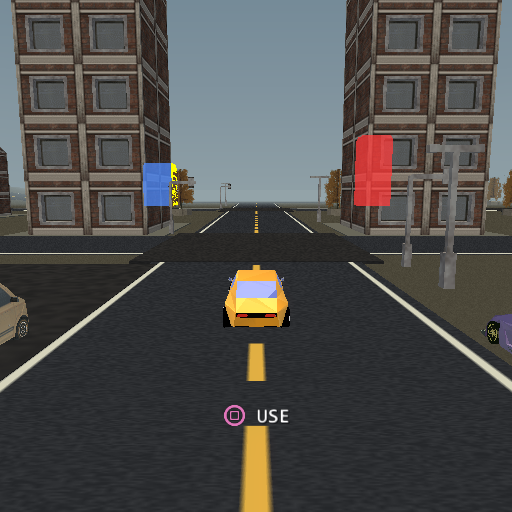

# Raw evidence: what the garage-day frame is SEEN to draw

Measured in **PCSX2** (software renderer, PAL 512x512 native), 2026-09-17,
against [docs/ee-submission-rearchitecture.md](../../../../docs/ee-submission-rearchitecture.md),
"Order of work" item 5 — world visibility.

The [2026-09-16 inventory](../reflection-probe-2026-09-16/README.md) established
what the garage-day frame **submits**, per producer and per object. It could not
say what any of it is **seen** to contribute, and item 5 was promoted on the
strength of a sentence that only sounds like evidence: *"there is no occlusion
culling of any kind in a scene made of buildings."* That is true. It is not a
reason to build one.

This round asks the question that has to come first — **is the garage
overdrawing, or is it all visible?** — and answers it before any scheme is
designed. The answer turned out to be mostly "it is visible", which redirects
the front rather than cancelling it.

Everything here is a **COUNT or a PIXEL**. PCSX2 emulates no EE data cache, so
its milliseconds are not admissible; its counters and its framebuffer are exact
and they are all this round quotes. **No console was used and none was needed**,
and the console was left free.

## The instrument: ask by REMOVAL

`visibility-sampler.py` replaces the fixture's sampler with a probe that parks
the camera at the fixture's garage-day pose and reads a command file naming
objects to **hide** at runtime. `probe-visibility.ps1` then photographs one
probe after another **from a single boot**, using the game's own
`--capture-frame` channel.

    hide exactly one object, photograph the frame, diff it against the control.

    pixels changed == 0  ->  the object contributed NOTHING the player can see.
                             Every triangle it submitted was drawn behind
                             something. It is free to cull.
    pixels changed  > 0  ->  it is visible, and the count is its exact
                             on-screen contribution.

Two properties make this the right instrument rather than merely a convenient
one. **The verdict is total**: a zero needs no decomposition into silhouette,
shadow, baked AO or reflection, because nothing in the frame depended on the
object by *any* path. And **it needs no new engine counter and no engine edit** —
runtime `visible` toggling is the primitive
[content-sampler.py](../reflection-probe-2026-09-16/content-sampler.py)
established in the reflection round.

It is also what makes the round cheap. One fixture per object — each with its
own native build and its own PCSX2 boot — is roughly an hour per object. This is
**one build and one boot for the whole population**: 19 probes, 38 captures,
about twenty minutes.

## Fixture identity

`pcsx2/vis-pixels/ARM.json`, `pcsx2/vis-counts/ARM.json`:

| | |
| --- | ---: |
| editor sha256 (built from this worktree, this commit) | `583755c2c786563d8dd9e4c3f4b169ea3f4014d0755b8016d74e0cf49f876aac` |
| commit | `428e2c59` |
| `stripRun` in the generated source | **75** |
| `ROADSTRIP` / `TERRAINSTRIP` producer lines | present, unchanged |
| pixels arm profile | `debug` (the self-capture channel needs the Live Debugger) |
| counts arm profile | `quiet-debug` (as every earlier round on this fixture) |

**And the counts arm reproduces the published inventory exactly.** The producer
split was re-measured at this commit, 168 commits after the one the 2026-09-16
table was taken at:

| producer | this commit | 2026-09-16 | delta |
| --- | ---: | ---: | ---: |
| `object_submit` | **18 087** | 18 087 | **0** |
| `terrain` | 5 416 | 5 416 | 0 |
| `static_batches` | 5 159 | 5 159 | 0 |
| `roads` | 3 276 | 3 276 | 0 |
| `proj_shadows` | 1 544 | 1 544 | 0 |
| `wheels` | 1 506 | 1 506 | 0 |
| `sky`, `particles`, `blob_shadows` | 67 / 4 / 2 | 67 / 4 / 2 | 0 |
| `env_probe_objs` | **0** | 5 206.5 | −5 206.5 |
| `env_probe_sky` | **0** | 79.5 | −79.5 |
| **TOTAL** | **35 061** | 40 347 | −5 286 |

Every row is identical except the two `env_probe_*` rows, which the shipped
reflection reuse budget zeroes on a parked fixture — exactly the behaviour it
was designed for, and exactly what the 2026-09-16 page predicted it would move
("the reuse budget moves the two `env_probe_*` rows and nothing else"). That is
a fixture check, an independent re-validation of the reuse budget, and the
reason **the garage-day frame at this commit is 35 061 triangles, 711 packages
and 206 bags**, which is the denominator everything below uses.

## The run is clean, and that is established before any zero is read

The order is not negotiable, because every claim here is a claim about a zero
and a zero is exactly what a broken instrument also produces.

1. **Within-probe repeatability** — all **19 probes bit-identical** across their
   two repeats.
2. **Control drift** — the control was photographed first and again last, at
   opposite ends of the same boot: **0 pixels, worst channel delta 0**. A run
   whose control drifts is dead, because its zeros would be indistinguishable
   from a frame that had not settled.
3. **The positive control** — see below. This is the one the round would have
   been worthless without.

No capture failed. `PROBES.txt` records `FAILED:` empty.

### The positive control, which is what a lone zero cannot give you

A zero is ambiguous on its own: it cannot distinguish *"the object was
invisible"* from *"the hide never reached that index"*. So each suspected
occluded object was also photographed with its suspected **occluder removed
too**:

| comparison | pixels | what it proves |
| --- | ---: | --- |
| `o34` vs `p3440` (both hide Tower 03; `p3440` also hides Tower 06) | **2 575** | Tower 06 is reachable by the hide, and paints a 2 575-pixel silhouette the moment Tower 03 stops covering it |
| `o36` vs `p3642` (both hide Tower 04; `p3642` also hides Loft 07) | **1 270** | Loft 07's silhouette is 1 270 px, of which only 128 escape Tower 04 |

Counted against the control instead, `p3440` and `o34` are both 33 385 — the
*same count* of *different pixels*, because both change the same screen region.
**That is the trap this comparison exists to avoid**: reading the pair against
the control would have said "no change" and quietly confirmed nothing.

And hiding the pair **together** (`z4042`) changes 128 pixels — exactly what
Loft 07 changes alone. Two objects can each be individually redundant while
their union is not; here the union is additive, so the set is safe to cull as a
set.

## The garage-day frame, by what each object is SEEN to contribute

512x512 = 262 144 pixels. `pcsx2/vis-pixels/visibility.csv` is this table.

| idx | object | model | dist | tri/f | pkg | bags | visible px | % screen | tri/px | verdict |
| ---: | --- | --- | ---: | ---: | ---: | ---: | ---: | ---: | ---: | --- |
| 34 | Tower block 03 | district-tower | 48 | 3 497 | 50 | 5 | 33 385 | 12.74% | 0.10 | SEEN |
| 36 | Tower block 04 | district-tower | 48 | 3 497 | 50 | 5 | 35 074 | 13.38% | 0.10 | SEEN |
| **40** | **Tower block 06** | district-tower | 117 | **3 497** | **50** | **5** | **0** | **0.00%** | — | **OCCLUDED** |
| 42 | Loft block 07 | district-loft | 118 | 2 237 | 32 | 5 | 128 | 0.05% | **17.5** | marginal |
| 1 | coupe (player) | vehicle | 15 | 1 876 | 76 | 4 | 3 832 | 1.46% | 0.49 | SEEN |
| 121 | Tristar Racer | vehicle | 13 | 942 | 38 | 4 | 1 069 | 0.41% | 0.88 | SEEN |
| 120 | Rally 04 | vehicle | 13 | 628 | 26 | 2 | 1 294 | 0.49% | 0.49 | SEEN |
| 38 | Loft block 05 | district-loft | 82 | 511 | 7 | 5 | 610 | 0.23% | 0.84 | SEEN |
| 60 | Streetlight -9 24 | detail-light-double | 57 | 399 | 6 | 1 | 163 | 0.06% | 2.45 | marginal |
| 61 | Streetlight 9 83 | detail-light-double | 115 | 399 | 6 | 1 | 36 | 0.01% | **11.1** | marginal |
| 76 | Park tree 14 40 | tree-park-large | 74 | 290 | 5 | 3 | 808 | 0.31% | 0.36 | SEEN |
| 79 | Park tree -72 87 | tree-park-large | 139 | 290 | 5 | 3 | 357 | 0.14% | 0.81 | SEEN |
| 35 | Pavement 03 | box | 48 | 12 | 2 | 1 | 426 | 0.16% | 0.03 | SEEN |
| **41** | **Pavement 06** | box | 117 | **12** | **1** | **1** | **0** | **0.00%** | — | **OCCLUDED** |
| | **TOTAL** | | | **18 087** | **354** | | | | | |

The triangle, package and bag columns are the counts arm's own per-object rows
and **sum to 18 087 / 354**, which is `object_submit` exactly. The probed set is
therefore the whole solo-object population, not a sample of it.



Red is Tower block 06's 2 575-pixel footprint, drawn where it *would* land —
entirely inside a nearer tower. Blue is Loft block 07's 1 270-pixel footprint,
and the yellow specks are the 128 pixels of it that actually reach the screen.
The control frame itself is `pcsx2/garage-day-control.png`.

## The answer

**The garage is NOT overdrawing. It is genuinely visible, and the exception is
one building.**

- **Strictly occluded: 3 509 triangles, 51 VU1 packages, 6 bags** — Tower block
  06 and the pavement slab underneath it. That is **10.0% of the frame's 35 061
  triangles and 7.2% of its 711 packages**, and removing it is **provably free
  of quality cost in this pose**: the picture is bit-identical.
- **Everything else in `object_submit` is seen.** Twelve of the fourteen objects
  paint pixels, and the solo objects together paint 77 182 of the frame's
  262 144 — a little under a third of the screen.
- The population a pure occlusion scheme could work on is therefore **two
  objects out of 142**, not the 142 the plan's "no occlusion culling in a scene
  made of buildings" sentence implies.

**The number that ranks the work is not "occluded" but triangles per visible
pixel**, and this round is the first time it has existed:

| tri/px | objects | triangles |
| ---: | --- | ---: |
| ~0.1 | the two near towers | 6 994 |
| 0.3 – 0.9 | the vehicles, trees, near loft, pavement | 5 049 |
| 2.4 – ∞ | **Tower 06, Loft 07, both streetlights** | **6 532** |

The bottom row is the finding. **6 532 triangles — 18.6% of the frame — buy 327
pixels between them, 0.12% of the screen.** Those four objects are all beyond
110 units except one streetlight at 57. They are not a culling problem; they are
a *representation* problem, and the frame pays roughly twenty times the
triangles per pixel for them that it pays for the buildings you can actually
see.

## What this redirects

Against [the plan's](../../../../docs/ee-submission-rearchitecture.md) own
decision rule for item 5 — *"if it is genuinely visible, then it is impostors or
per-object LOD that does not multiply bags"* — the measurement points away from
baked sectors and a PVS:

- **A PVS or portal scheme buys 3 509 triangles in this pose**, needs an
  authoring concept, a baker and a per-object runtime test paid by all 142
  objects every frame, and buys **almost nothing in the outer-road poses**,
  where `object_submit` is only 502 triangles in total. Its prize is real, free
  of quality cost, and small, and it lives in one pose.
- **Impostors already exist** ([docs/impostors.md](../../../../docs/impostors.md)),
  are distance-driven so they work in every pose and while driving, and
  explicitly **do not multiply bags** — the card is six vertices updated in
  place, "without rebuilding the tree or allocating bags", which is the exact
  failure mode that killed mesh LOD twice (+0.19 and +0.27 ms of `prepare`).
  A distance threshold placed between 48 and 115 units captures the whole
  bottom row of the table above, **including both strictly-occluded objects**,
  because they are the most distant things in it.

So the impostor lever **contains** the occlusion lever here, at a fraction of
the machinery. That is the ranking this round hands to item 5, and it is a
redirection rather than a refutation: occlusion culling is not wrong, it is
simply worth less than the thing next to it on the same population.

## Reproducing

```powershell
# the editor, from the worktree under test (NOT the one sitting in build/)
./build.ps1

# the example's baked asset tree, once
build/tyrax-editor.exe --build examples/vehicle-playground
git checkout -- examples/vehicle-playground/inc examples/vehicle-playground/res `
                examples/vehicle-playground/src

# the two arms. Never an editor --build: it runs its own --refresh-gen and
# would regenerate the instrumentation away.
./build-visibility.ps1 -Editor <abs path>/build/tyrax-editor.exe -Kind pixels
./build-visibility.ps1 -Editor <abs path>/build/tyrax-editor.exe -Kind counts

# the whole population, ONE boot
./probe-visibility.ps1 -Fixture <root>/arms/vis-pixels `
                       -Out <results>/vis-pixels -Editor <exe>

# the submission half, at the same commit
../reflection-probe-2026-09-16/run-pcsx2-arm.ps1 -Fixture <root>/arms/vis-counts `
                       -Out <results>/vis-counts

python analyze_visibility.py --captures <results>/vis-pixels `
       --inventory <results>/vis-counts/frame-inventory.csv `
       --scene examples/vehicle-playground/vehicle-playground.tyra
```

**THE EMULATOR AND THE CONSOLE ARE SHARED RESOURCES.** `probe-visibility.ps1`
launches PCSX2 itself on this arm's ELF and stops only that process; never
`--build --run`, which reaps other worktrees' emulators. The console was checked
free before this round and left free — it was not needed, because this is a
question about counts and pixels.

## What this does not establish

**Not one measured millisecond.** Every figure here is a count or a pixel. The
conversion to time is the plan's, not this round's, and both of its constants
cut against a naive estimate: **a removed triangle is worth about 0.4 of its
cycle count**, and **per-bag cost does not shrink with triangles**. 3 509
triangles and 51 packages are what this round proved; what they are worth on
hardware is an A/B nobody has run.

**One pose.** The whole table is the fixture's parked garage-day pose. Occlusion
is a property of a viewpoint, and this viewpoint is the most favourable one in
the scene for it — a forecourt with two towers framing a corridor. **Nothing
here says how much of Tower 06 stays hidden while the player drives**, and a
visibility scheme that is right only for the parked pose is worth nothing. The
natural next check is the same probe set under
`../reflection-probe-2026-09-16/motion-sampler.py`'s regimes, or a
`motion-gate.ps1` run, hiding object 40 along a route and asking whether the
picture ever differs. **Until that exists, the 3 509 triangles are an upper
bound that applies to a parked camera.**

**Only `object_submit` was probed.** `terrain` (5 416), `static_batches`
(5 159) and `roads` (3 276) were not, and together they are a larger share of
the frame than the solo objects. Static batch members have no bag of their own,
so per-object hiding cannot address them at all, and the same removal method
would need a different handle for the procedural producers.

**The night poses are not pixel-comparable on this fixture** — authored lamp
flicker and twinkling stars mean three captures of one arm differ from each
other. Everything here is garage DAY.
